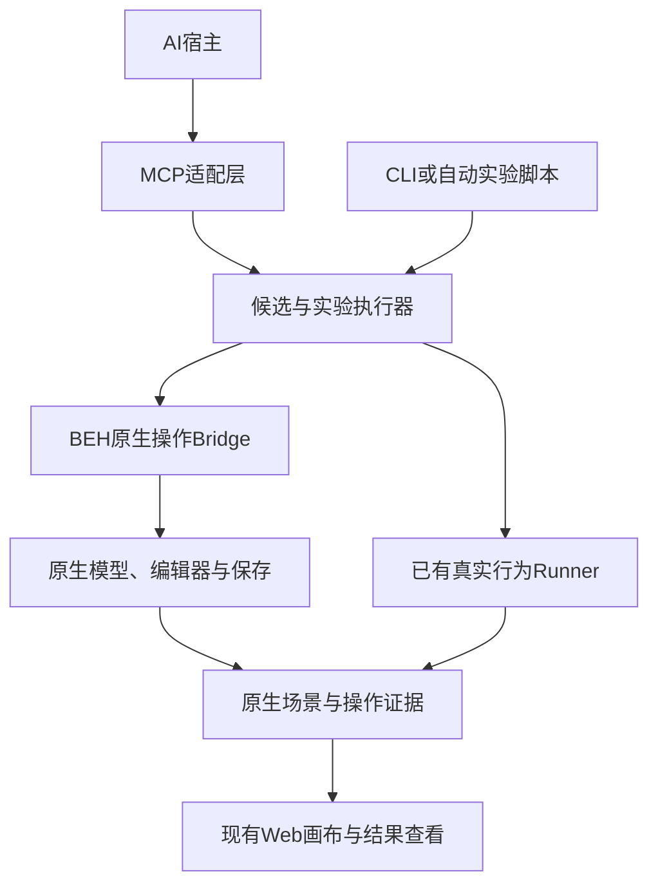

> 工作区归档说明（2026-09-17）：本文件继承原有技术内容与验证范围；本文可识别的文件引用已适配新目录。当前模块入口见 [模块导航](../README.md)。资料归档不代表产品功能或实机验证已经完成。

# BEH 第一阶段 MCP 实施指导

## 原生接口发现、自动实验、GUI 一致性与最小 AI 开发接入

| 项目 | 内容 |
|---|---|
| 版本 | v1.0 |
| 编写日期 | 2026-09-05，按本会话环境 UTC 日期记录 |
| 文档性质 | 基于本聊天完整讨论的实施指导；不是工程完成报告 |
| 适用项目 | BEH 图源与代码分析工作台及其原生工具接入 |
| 主要读者 | 用户、本地开发 AI、BEH 工具开发者、测试与接口维护者 |
| 第一阶段目标 | 查明并复用真实原生编辑能力，在限定范围内证明与 GUI 一致，再通过 MCP 供 AI 调用 |
| 第一阶段交付边界 | 候选工程副本内的创建、参数修改、连接、保存重载、可视化与相关验证；不自动提交正式工程 |

> **本阶段最重要的判断：测试是原生接口发现的驱动手段，也是辅助验证手段；测试通过不能单独证明选中的接口就是 GUI 使用的完整入口，也不能证明覆盖了所有行为。**

---

## 阅读路线

- 想先看懂整体：读第 1～3 章。
- 准备本地实施：按第 4～12 章顺序执行。
- 实现 MCP 与实时画布：读第 13～15 章。
- 安排第一轮任务和验收：读第 16～20 章。
- 交给开发 AI：连同本地源码路径及已有测试入口，提供第 21 章启动指令。
- 查依据与来源：读第 22 章。

## 1. 用大白话说明我们第一阶段要做什么

目标是给 AI 一套可以实际使用 BEH 的工具。AI 能查图元、创建图元、改参数、接线，在副本里看到实际结果，并调用现有测试。用户可以看到候选画布的变化、提出修改意见，最终确认经过验证的结果。

实施顺序如下：

1. **查家底：** 源码、原生运行环境、图元定义、组件注册、现有测试入口分别在哪里。
2. **找入口：** 人在 GUI 添加图元、连接端口时，原工具到底调用哪套命令和处理流程。
3. **自动观察：** 利用现有测试以及新增的自动编辑场景，触发真实行为，记录调用和数据变化。
4. **做对照：** 同一项操作分别从 GUI 和候选接口执行，比较结构、位置、尺寸、连线路径、保存结果与相关行为。
5. **封装能力：** 把已验证的入口整理成小而稳定的操作接口。
6. **接 MCP：** AI 通过 MCP 调用上述能力；在工程副本中完成一个可观察、可复现的开发任务。

人的主要工作是提供必要环境、明确真正有歧义的业务要求、查看异常和最终候选。源码检索、重复实验、记录整理和常规检查应由 AI 与程序连续完成。不需要用户亲手演示几百次。

MCP 是连接方式，原生编辑接口才是真正执行创建和连接的部分。CLI、现有测试脚本和 Web 也应复用同一层能力。允许先用 CLI 验证一条原生操作路径，再接 MCP；但只交付 CLI 不能宣称“第一阶段 MCP 已完成”。

## 2. 到目前为止，我们做了什么、没有证明什么

### 2.1 当前事实与状态

| 项目 | 当前证据 | 本指南如何使用 |
|---|---|---|
| BEH 源码 | 用户在本聊天明确表示已经获得工具源码 | 以源码可供本地调查为前提；路径、提交、构建方式仍需本地检查 |
| AI 解释 | 用户反馈基本能够使用 | 复用现有解释能力；不凭这句话推断所有组件解释准确 |
| AI 测试 | 用户反馈已有图元测试能够自动连续运行 | 优先复用现有 Runner 和真实 Runtime；首轮核对实际日志与适用范围 |
| FB、Custom Block 等覆盖 | 用户明确指出其他类别还有未开展的部分 | 不能从部分 FB 成功推断全部类别可测试或可创建；名称与分类以实际注册和定义为准 |
| 原工具技术 | 已读资料明确涉及 Java、JRE/OpenJDK、JAR、POU XML；运行链涉及 BEH/Ptolemy | 作为调查起点，不在没有证据时填写版本号 |
| Eclipse/RCP/OSGi、Diva 等 | 工程约束和架构资料中有线索 | 具体模块、依赖及实际编辑框架需核实；不能默认采用 GEF/SWT/Swing 中某一种 |
| Headless 场景 | 2026-08-19 当前入口文档将 Full Scene 可行写为已确认；更早资料曾列为待验证 | 以较新记录作为方向依据，但当前安装版本的导出物、完整性和重现能力仍需检查 |
| MCP 服务、编辑 Bridge、操作观察器 | 本聊天已讨论方案 | 本会话未访问本地 BEH 源码、未实现或运行这些能力 |
| GUI 与接口等价 | 已明确需要对照 | 尚无本会话可核验的双路径对照报告 |
| 实时画布 | 已明确产品目标 | 本聊天的可行性讨论不等于已实现或已测 |

**已经完成的是需求澄清、方法比较、资料阅读和本指导文档；未完成的是本地工程实现与验收。** 报告不得把“计划采用”改写成“已经具备”。

### 2.2 本聊天确定的关键方向

| 讨论点 | 采用的方向 |
|---|---|
| 靠测试保证 AI 开发正确 | 测试仅承担适用范围内的验证；增加源码、调用追踪、原生 GUI、持久化等独立证据 |
| 靠人示范学习接口 | 人工示范作为少量补充；自动实验、GUI 自动化和源码调查作为主力 |
| 找到一个函数就封装 | 必须识别完整操作入口、前置条件和后续维护，防止只截取底层方法 |
| 不想依赖手工启动 EXE | 优先沿用现有自动测试的原生启动方式；允许必要的原生插件/GUI 宿主自动运行 |
| 一直在内存里操作 | 候选必须保存、重载，验证工程确实可被原工具使用 |
| 希望看见 AI 实时搭图 | 候选副本与画布共享原生模型版本；按操作完成事件刷新 |
| 第一阶段支持所有图元 | 先盘点可发现的类别，选代表完成闭环；不把全类别覆盖作为首次接入前置条件 |
| 用什么模型或协议 | 第一阶段默认围绕实际 DeepSeek Harness 环境；兼容宿主是能力适配问题，不依赖模型品牌 |

### 2.3 与既有阶段文档的关系

既有项目阶段 0～6 包含查看、解释、代码关联、候选开发、原生应用、一体化等。本指南的“第一阶段”是 **MCP 子项目的第一阶段**，不等于旧文档中的“阶段1：Web 查看圈选”。不要混用编号。

原方案阶段4主要交付候选和静态验证，阶段5执行原生应用。本指南提出在 MCP 子项目中提前验证“候选副本内的原生应用”，以便 AI 能真实试做；不因此开放正式工程自动写入，也不宣称旧阶段均已完成。必要的前置条件仍应依证据确认。

本文件是新增指导，不覆盖已有来源文件。原有 Runner 的大规模重构、引入新 FB 的既有审批边界，不能因为编写本指南就自动消失。可以先对已成功样本做只读复核及新增实验设计，再依现有授权进入实现。

## 3. 第一阶段范围、成功定义与后置工作

### 3.1 必须完成的最小闭环

选择两种现有、可真实加载运行、端口关系清楚的组件，或两个同类型但允许互连的实例。组件名称不能由本指南虚构。

**AI 通过 MCP 查询组件与范围 → 创建候选副本 → 新增两个原生实例 → 设置参数和适用的布局属性 → 连接合法端口 → 保存并重载 → 取得原生场景 → 执行已有相关测试 → 取得差异与证据报告。**

完整验收同时要求：

- 所调用入口与原生编辑流程有可追溯关联；
- 至少这一闭环所包含的创建、设置和连接操作有 GUI 对照证据；
- 模型与画布显示的候选版本一致；
- 错误参数/过期版本等情况得到明确拒绝，不造成隐藏的半完成修改；
- 实际 AI 宿主能调用，不只是在脚本里模拟 MCP 请求；
- 正式工程未受候选实验影响。

若只完成参数修改，记录为子里程碑。若只有运行时创建而无编辑器一致性证据，记录为“运行时构造能力”，不能写成 GUI 等价编辑接口。

### 3.2 能力分层

| 范围 | 第一阶段要求 |
|---|---|
| 组件目录与版本信息 | 形成可发现目录及未知项，记录来源范围；不承诺穷尽所有动态插件 |
| 查询、创建、设置参数、连接、保存重载 | 核心闭环必需 |
| 移动、调整尺寸、路由和标签 | 对代表组件验证其实际支持的原生行为；不强制每种组件均可改宽高 |
| 断开、删除、撤销/重做 | 在核心闭环后按已发现能力扩展；批次失败隔离或候选丢弃能力为必需 |
| Custom Block 等其他类别 | 必须纳入盘点；选择下一类代表需遵守既有执行范围 |
| 定义全新 Custom Block 类型 | 与“实例化已注册组件”分开，通常后置，可能涉及注册、资源、代码与构建 |
| C/C++ | 若最小样本依赖原生生成链，则必须验证相关生成与构建；任意 C/C++ 业务修改后置 |
| Web 实时画布 | 复用现有页面实现最小刷新与状态显示；复杂动效、主题和审批系统后置 |
| 正式工程应用 | 可输出候选包与应用依据；本阶段默认不暴露自动正式提交工具 |
| 全自动业务需求开发 | 后续阶段；首阶段证明执行基础与证据路径 |

### 3.3 不得扩成的大项目

不重新实现 BEH Runtime、Renderer、完整图编辑器或整套测试平台；不为每个图元重写 Runner；不在入口未验证时暴露整个 Java 内部方法集合；不把“做完所有图元测试”设为 MCP 首个闭环前提；不以海量日志或实验次数充当进展。

## 4. 第一轮先检查本地家底

### 4.1 必须取得的信息

由开发 AI 优先从现有配置、源码与脚本读取，不要求用户手工填写所有字段。只有找不到且会影响继续执行的内容，才集中向用户询问。

| 信息 | 检查内容 | 缺失时处理 |
|---|---|---|
| 源码基线 | 仓库路径、提交、未提交修改、组件定义和资源路径 | 保留未提交修改；不能擅自清理工作区 |
| 运行基线 | 实际 JAR/Bundle、来源、Hash、配置和插件集合 | 区分源码版本与实际加载版本 |
| 构建 | 原项目入口、JDK、构建工具、Profile、Target Platform、生成步骤 | 沿用成功构建；不猜一个通用命令替代 |
| 已有测试 | Runner 路径、启动命令、真实样本、PASS/FAIL 日志、适配限制 | 能复用就复用；先评估通用化，不立即重构 |
| GUI | 启动方式、插件与编辑框架、是否有自动化或命令监听入口 | 记录实际识别依据 |
| 场景输出 | 原生 scene.svg、scene.json、hit-map 或等效数据 | 检查版本、完整性与真实页面显示 |
| AI 宿主 | 当前 Harness 名称、MCP 支持、传输方式、运行边界 | API Key 可用不代表宿主支持 MCP |
| 工作副本 | 允许实验的目录、依赖隔离、输出路径 | 不把正式工程作为实验目录 |

### 4.2 源码与运行物必须对齐

用户已获得真实源码，这是相对于早期反编译参考的重要进展。真实源码可用于定位实现，但只有当它与加载的运行物版本对应时，才能解释这次运行的行为。

早期 CFR 等输出继续标为 `Recovered Java Reference`，不可冒称原始源码。若开发版加入追踪点，应记录开发版与基线差异，并用追踪关闭/开启的代表操作比较，检查记录器是否改变结果。不能把任意重编译版本的行为自动称为原始发布版行为。

Headless 表示无需人工操作可见窗口，不意味着删除原生插件、Editor Context 或 GUI 相关依赖。优先复用当前已成功的运行环境；如编辑操作必须进入原生 GUI 宿主，允许自动启动该宿主。不要为追求无窗口而拼一个假的 BEH。

## 5. 先盘点组件，再盘点操作

### 5.1 组件目录

联合检查：组件注册表/插件声明、侧边栏目录、工厂方法、XML 定义、已有工程、原生加载后的运行类型和现有测试。

必须区分：

- 源码类、抽象父类与可创建的组件类型；
- 组件定义与组件实例；
- 实例化已有组件与新增一种组件定义；
- 纯装饰图形与具有运行语义的图元；
- XML 组合组件、原生代码组件、动态插件或自定义组件。

“添加矩形”在聊天中是例子。落地时必须先确定它是装饰矩形、图元外形，还是某种具体组件，不能以创建一个普通绘图矩形证明已经能创建业务图元。

目录每项至少记录：`type_ref、显示名称、定义/源码来源、原生运行类型、创建入口候选、输入输出、参数、容器限制、资源依赖、执行方式、已有样本、已验证范围、未知项`。

目录声明检索范围、插件版本和刷新时间。没有识别到动态生成项时写“尚未覆盖”，不能写“源码类扫描完成，全部图元已发现”。

### 5.2 操作目录

对目标组件建立操作能力表：查询、创建、参数设置、移动、尺寸修改、连接、断开、删除、保存、重载、刷新、执行。每项独立记录支持条件。

例如某组件能创建，但原生不支持自由缩放，则 `RESIZE` 应为“不适用/不支持”，不能让 AI 随意改隐藏的 width/height 字段。

## 6. 如何找到真正的原生编辑入口

### 6.1 首先区分三条路径

| 路径 | 可以证明什么 | 不能直接证明什么 |
|---|---|---|
| 文件加载/解析路径 | 原生如何从已有定义创建运行对象、端口和连接 | 用户在编辑器中创建、撤销、路由与保存的完整过程 |
| GUI 编辑命令路径 | 用户操作如何进入命令、模型修改与界面刷新 | 未观察分支或其他版本下仍完全相同 |
| 执行引擎路径 | 图元如何初始化、执行、保存运行状态和输出 | 编辑器布局、几何、持久化信息均已正确维护 |

现有行为测试通常更接近第一和第三条路径。它们是重要线索，但不能代替第二条路径。

### 6.2 调查顺序

1. 从目标组件在面板中的注册位置和拖放处理出发，定位命令/Handler/工厂候选。
2. 检查其他原生调用方：复制粘贴、菜单创建、导入等。判断是否共用某个高层入口。
3. 追踪入口前后：容器定位、类型校验、坐标换算、默认值、ID分配、端口初始化、关系维护、布局/路由、事件通知、撤销记录、保存脏标记。
4. 用实际运行记录核实候选入口是否真的执行，检查具体参数、对象来源与异步后续步骤。
5. 选择最接近完整用户语义、可复用且适合自动调用的入口；必要时保留编辑器宿主。

示例性语义链：`拖入组件 → 原生创建命令 → 模型插入 → 默认参数/端口处理 → 原生布局和通知 → 保存`。这里的描述不是实际类名，开发 AI 必须补充真实出处。

不能仅因某个底层 `connect` 方法存在，就跳过上层的合法性检查、Relation管理和路由更新。若高层命令依赖GUI上下文，应提供最小上下文适配；不要凭猜测手写一套业务维护逻辑替代它。

### 6.3 缺少公开入口时

优先级为：原生公开操作/扩展点 → 已有内部完整命令加薄适配 → 在真实源码中新增调用门面，复用原有逻辑。仅在原生能力确实无法覆盖且证据充分时，才评估原生模板的最小修改；不能全量重写未知XML。

## 7. 操作观察器：记录什么、如何避免误判

### 7.1 推荐实现方式

先检查已有日志、事件监听和插件入口；不足时，在开发版本关键位置加入可开关记录点。该模式叫“操作追踪模式”，普通Debug日志不自动等于已经具备这些记录。

Eclipse 的 `IExecutionListener` 可以观察经过其命令机制的执行事件，但拖放不一定经过该机制。需依据实际版本和编辑框架决定监听点，不能安装一个监听器就宣称覆盖所有操作。[Eclipse官方文档](https://help.eclipse.org/latest/ntopic/org.eclipse.platform.doc.isv/reference/api/org/eclipse/core/commands/IExecutionListener.html)

采样式性能记录可以辅助定位热点或线程，但漏采样不能证明方法未执行。关键调用应使用适当的事件监听、明确埋点或限定范围的方法追踪；不要求全进程全方法跟踪。

### 7.2 最小记录内容

| 记录 | 用途 |
|---|---|
| 操作编号、会话、基线与候选版本 | 关联一次操作及其结果 |
| 触发来源：GUI/CLI/MCP/测试 | 区分不同路径 |
| 命令标识、实际类/方法、运行物来源 | 证明实际调用入口 |
| 关键参数、目标容器、组件与端口引用 | 解释操作对象 |
| 开始、完成、失败、异步任务父子关系 | 确定操作边界 |
| 修改前后模型与几何快照引用 | 对照结构与布局 |
| 保存、重载、场景导出结果引用 | 对照持久化和显示 |
| 追踪是否完整、被过滤或丢弃的事件 | 防止不完整记录冒充完整调用链 |

无需记录所有内存对象或全部源码。对象引用必须能映射到相应快照，避免仅留下易变的Java对象地址。

### 7.3 异步与干扰控制

时间接近不等于因果关联。使用操作编号、任务父子关系及模型版本关联异步保存、路由和刷新。对没有追踪到的异步环节明确标记缺口。

操作完成点应基于真实命令/任务状态及必要的场景更新条件。避免仅用“等待一秒”判断稳定。追踪点不得私自改参数、吞异常、跳过校验或代替原生操作。

### 7.4 观察结果的身份

一次真实记录形成 `OBSERVED` 证据，并不自动形成通用工具。只有结合源码解释、必要环境、重复执行及后续GUI/持久化验证，才能提高该入口在指定范围内的可信度。

## 8. 与现有 AI 测试结合：自动实验如何连续运行

### 8.1 现有测试有两种价值

**发现价值：** 用真实测试驱动加载、初始化、端口访问及执行，记录调用链，从已成功路径定位原生工厂、注册机制和运行约束。

**验证价值：** 对自动创建或修改后的候选执行相关行为用例，发现接错端口、参数不生效、状态或时序异常。

测试没有经过的编辑入口，必须补充专门的自动编辑场景。把新接口生成的产物再次交给同一个接口解释，得到一致结果，只能证明内部自洽；需要原生重载、GUI和独立行为依据补充。

### 8.2 自动实验的分工

| 角色 | 工作 |
|---|---|
| AI | 查源码、选候选入口、设计实验、分析失败类别、提出下一步 |
| 确定性执行脚本 | 批量选择参数和动作序列，驱动真实BEH，管理副本和超时 |
| 操作观察器 | 保存调用、输入、前后模型、运行版本和追踪完整性 |
| 原生模型/编辑器/Writer | 执行原有创建、连接、布局、保存机制 |
| 已有Runner | 驱动真实行为，输出已有格式的结果与必要轨迹 |
| 比较器 | 比较结构、几何、GUI、持久化和行为，分别给出结论 |
| 用户 | 处理少数业务歧义、无法自动取得的环境信息及最终候选决策 |

重复执行主要由脚本完成，无需每次实验都调用模型。AI按批次读取聚合结果及代表性失败，避免把所有日志反复塞入上下文。

### 8.3 每批实验的流程

1. 明确要回答的一个问题，例如“这一创建入口是否正确处理目标容器和默认端口”。
2. 固定源码/运行物/资源版本、样本基线、操作范围和比较规则。
3. 从全新副本或已验证的干净状态开始，每个实验保留可复现参数和随机种子。
4. 执行结构化操作；记录完整结果，包括被拒绝、失败和未完成的情况。
5. 保存重载，执行本批所需的对照与行为检查。
6. 按根因归类；减少同类重复日志，保留原始记录和索引。
7. 对失败尝试缩短动作序列，找出最小复现；缩短后仍须使用相同原生语义和明确初态。
8. AI分析未覆盖条件和新发现，决定复用、增加有限适配或报告阻塞。

一开始可采用少量参数组合验证执行器，再逐步提高批量。成百上千次是运行规模，不是质量指标。每批必须报告新增了哪些入口证据、条件覆盖或失败类别。

### 8.4 有价值的变化维度

优先使用组件/端口类型、默认与边界参数、父容器、位置与尺寸策略、创建顺序、分支连接、重复命令、保存重载。对要求类型匹配的连接，分别验证合法连接和非法连接被正确拒绝。

复杂动作序列可借鉴基于规则的状态测试：以创建、修改、连接、删除等基本动作自动组成序列，在每一步检查模型约束。Hypothesis提供该方法的实例，但本指南不指定它必须成为Java项目依赖。[方法参考](https://hypothesis.readthedocs.io/en/latest/stateful.html)

### 8.5 连续运行、暂停与恢复

执行器至少支持实验次数/运行时长预算、单次超时、取消、检查点和结果查询。首次实现可以只允许单候选串行执行，不要求并发编辑。

出现以下情形应停止当前类别，继续处理可独立完成的其他工作，或输出阻塞：

- 基线无法恢复、正式路径出现意外写入、候选版本无法确定；
- 原生操作持续挂起或崩溃，已保留最小复现；
- 多批没有新信息，只有同一种缺失依赖；
- Expected或业务规则不明确，无法判断正确行为。

超时不代表操作没有发生。恢复时先核对候选状态和请求记录，不自动重做可能已生效的创建/连接。取消可能只能在原生操作的安全边界完成，不能把强制中断后的对象状态标为可用。

### 8.6 可选的修复能力实验

在原生操作入口得到一定验证后，可对已验证FB副本制造“仍能加载运行、但行为错误”的参数或连接变更，让AI依据需求与失败轨迹修复。这有助于评估定位和修正能力。

该实验不能代替接口发现，也不能以“修回后测试全绿”证明GUI一致。开发AI不能直接读取正确版本差异抄答案；验收仍以需求、允许范围、GUI/结构及回归证据分别判断。

## 9. GUI 与接口是否一致：双路径对照协议

### 9.1 建立公平的对照条件

路径A：由GUI自动化或少量人工操作真实编辑器。路径B：由候选Bridge调用已定位的原生编辑入口。两边从同一份未操作基线的独立副本开始。

共同固定：组件版本、工程资源、父容器、参数、网格/吸附/自动布局配置、画布坐标目标、组件尺寸策略、路由配置；进行像素比较时再固定窗口大小、DPI、缩放、平移、字体和主题。

**GUI路径必须真正经过界面事件和对应处理。** 如果所谓GUI自动化直接调用了待测Bridge，再与Bridge结果比较，就不是独立的GUI对照。可以在GUI路径采集原生命令证据，但不能用同一路径替换对照路径。

### 9.2 GUI自动化选择

先识别实际界面框架，再选择原生测试入口、可访问性/控件自动化或电脑操作工具。对无法暴露为控件的自绘画布，可能需要真实鼠标动作、截图和模型事件联合定位。

Web工作台可用Playwright检查真实DOM/SVG和交互；Playwright并不能据此证明原生桌面BEH已经受控。原生GUI自动化的选择应由源码与实际窗口证据决定。

记录GUI工具是否成功选中了目标、动作是否到达正确容器以及画布最终是否稳定。GUI自动化自身失败应单独分类，不能把“拖拽未成功”算成原生接口不等价。

### 9.3 需要比较的六类结果

| 层面 | 检查项 | 典型遗漏 |
|---|---|---|
| 组件结构 | 类型、数量、层次、参数、默认端口 | 只创建外形，没有注册完整组件 |
| 逻辑连接 | 端口身份、方向、通道/顺序（适用时）、分支及Relation成员 | 连到同名但不同作用域的端口 |
| 几何布局 | 位置、宽高、端口锚点、折点、箭头、标签位置、层级变换 | 漏掉吸附、容器变换或原生路由 |
| 原生显示 | 相同视角截图、遮挡、裁剪、重叠、线与文字 | SVG存在但端口、箭头错位 |
| 持久化 | 原生保存、重新加载、再次导出、未知元数据变化 | 内存正确，重开后连接丢失 |
| 执行行为 | 输入输出、状态、时序和相关生成代码 | 画面有线，实际未连接 |

六类结论分别输出。结构一致不得自动填充为视觉一致，视觉一致不得自动填充为业务正确。

### 9.4 坐标、尺寸与连线路径

- 区分屏幕坐标、视口坐标、画布坐标、容器局部坐标、缩放和DPI。接口应使用明确的原生/画布坐标契约，不接受含义不明的x/y。
- GUI吸附后的最终位置可以不同于鼠标释放位置。两条路径须采用同一原生规则，不能只比较鼠标坐标。
- 参数引起图元尺寸变化、固定尺寸组件、可缩放装饰图形分别处理；禁止强改不支持的宽高字段。
- 连线通常由端口位置和原生路由规则决定。复用路由器，检查端点、折点及障碍处理；不能为了截图相似让AI或Web补画一根假线。
- 对自动路由，先重复执行原生GUI路径确定基线稳定性。若原生在相同条件下也会变化，明确差异原因与允许条件；不能看到失败后再放宽规则。

### 9.5 ID、噪声与比较器本身

不同副本中ID可能由原生系统重新分配。可以依据操作身份、稳定引用和组件对应关系建立映射，再比较引用图；不能要求所有ID字节相同，也不能简单删除全部ID后比较。

允许归一化的时间戳、无语义排序等字段须提前列出理由。未知隐藏字段保持原始差异，未经说明不能忽略。对于连线或端口，不能用静默去重、合并、删线使结果“通过”。

比较器需要少量有针对性的敏感性检查：人为制造位置偏移、合法端口接错、尺寸变化或保存字段丢失，确认比较器能发现对应差异。两条路径共用有缺陷的导出器时，可能共同漏项，因此保留原生截图、文件差异和运行记录交叉检查。

### 9.6 对照结论的表达

每项使用：`MATCH / MISMATCH / NOT_APPLICABLE / NOT_TESTED / INCONCLUSIVE`，附适用范围及证据。

允许结论示例：

> 在指定BEH版本、组件A、容器B与配置C下，创建与连接操作的结构、几何、保存重载和原生视图对照一致；现有行为用例通过。其他组件和配置尚未验证。

不允许结论：

> 已找到connect函数，所有接线效果均与GUI完全一致。

## 10. 测试能证明什么，以及不能证明什么

### 10.1 四类证据共同组成判断

| 证据 | 回答的问题 |
|---|---|
| 版本对齐的真实源码及调用方 | 设计上这一操作包含哪些步骤 |
| 真实运行追踪 | 在这个场景下实际走过哪些步骤 |
| GUI、模型、几何与保存对照 | 自动接口是否保留原生编辑效果 |
| 相关行为测试 | 在已定义输入和规则下，功能是否符合预期 |

既不能只信AI读源码的推断，也不能只信测试数量。原生GUI本身可能存在缺陷：GUI等价只证明遵循原生编辑机制，业务是否满足需求仍需独立判断。发现原生缺陷时列为冲突，不通过悄悄偏离原生流程把它隐藏掉。

### 10.2 Expected与测试来源

Expected应来自需求/规格、数学定义、独立计算、可信既有Golden或独立参考模型。阅读当前实现获得的输出，只能作为观察或回归快照，不能直接升格为业务正确性的依据。

测试来源独立比“换一个AI写测试”更重要。即使换模型，若仍从同一错误实现推导Expected，也会形成循环。

### 10.3 抓错能力的检查

已有规范区分了两件事：故意改错Expected能FAIL，证明断言链有效；故意改坏图元仍能被测试发现，才证明对该类行为错误敏感。

复用已有Mutation、Property和独立验收用例，不为本阶段重新建设平台。Mutation须仍能合法加载运行且确实改变目标语义；等价、未到达或无效变异分别记录，不能混算成有效抓错或简单判为测试漏检。

如果使用隐藏用例，必须有实际的文件/上下文隔离。已经给开发AI看的用例不再是隐藏用例，应转为回归并补充新的独立验收。开发循环不得修改冻结Expected、Runner或Golden来适配候选；合法需求变更需另建版本和依据。

## 11. 把发现沉淀成可复用能力

### 11.1 每项能力保留一份简短说明

| 字段 | 内容 |
|---|---|
| 能力名 | 如“创建某类原生组件”，不要冒充真实方法名 |
| 原生入口 | 实际命令/类/方法、源码位置、对应运行物 |
| 前置条件 | 容器、初始化、线程、插件、执行模式、资源 |
| 输入契约 | 组件引用、端口引用、参数、坐标语义 |
| 原生副作用 | ID、默认端口、路由、通知、保存标志和撤销 |
| 证据 | GUI调用、自动调用、前后快照、保存重载、行为结果 |
| 支持范围 | 组件、容器、配置与已验证版本 |
| 未覆盖/阻塞 | 不支持的类别及原因 |

说明可以存在一个JSON目录和简短Markdown中，不需要知识图谱或训练平台。模型换代后，这些接口与证据仍可复用。

### 11.2 避免一个模糊的“VERIFIED”

至少分别记录以下维度，取值为 `PASS / FAIL / NOT_TESTED / NOT_APPLICABLE / INCONCLUSIVE`：

`native_entry、runtime_replay、gui_structure、gui_geometry、gui_visual、persistence、behavior、host_integration`。

组件目录的“已发现”不等于“已支持编辑”，一次操作成功不等于所有调用条件均已验证。新增版本或插件变化时，优先重跑受影响能力的代表性对照，不一律全量重测，也不无条件沿用旧认证。

## 12. 最小架构与代码组织

### 12.1 四个逻辑部分，允许同进程实现

| 部分 | 职责 |
|---|---|
| Native Bridge | 复用真实BEH命令、模型、Writer、Renderer及执行入口 |
| Experiment Runner | 副本、追踪、批量实验、比较和任务状态；适配既有测试Runner |
| MCP Adapter | 工具发现、输入校验、调用转发、结构化结果 |
| Existing Workbench | 显示候选原生场景、进度、差异和验证状态 |

这不是要求新建四个服务或四个仓库。优先在现有工程添加最少模块。Java侧操作可运行在原生插件内，也可在已验证的独立宿主中；外部通信采用已有且适用的本地接口。MCP层不承担原生业务算法。

### 12.2 调用关系



### 12.3 建议新增结构

以下仅作职责示例，应合入现有目录，不能复制建立平行平台：

```text
beh-ai-integration/
  bridge/             原生编辑入口适配
  tracing/            可开关操作追踪
  experiments/        实验配置、GUI对照、比较器
  mcp/                MCP适配与契约
  contracts/          候选、操作、任务、能力定义
  docs/               入口依据与支持范围
```

现有FB Runner通过适配被调用，不复制一个新版本。工程副本、日志和截图放在实验工作区，原生依赖与密钥不进入任务说明或公开输出。

## 13. 第一版MCP工具面

### 13.1 接入选择

选用与实际语言和客户端兼容的成熟MCP SDK，不手写整套协议。先核实实际宿主支持的协议版本及传输方式。单机优先选择宿主支持的本地方式；若使用stdio，协议输出与日志严格分开。涉及跨WSL/Windows进程时，明确原生运行在哪边、路径如何映射，不默认两边共享同一进程环境。

MCP Tasks等扩展是否采用取决于实际SDK和客户端协商结果。第一版可通过应用层 `job_id` 查询长任务，不能把这一自定义机制标成已实现MCP Tasks扩展。

以下工具名与字段均为**拟议契约**，不是已经存在的工具。可以合并或改名，但必须保持职责和验证语义。

### 13.2 建议工具集合

| 工具 | 输入重点 | 返回重点 | 是否改变候选 |
|---|---|---|---|
| `beh_get_environment` | 已配置工作区引用 | 基线、运行版本、宿主与能力状态 | 否 |
| `beh_list_components` | 范围、过滤、分页 | 真实组件引用、端口参数摘要、支持条件 | 否 |
| `beh_inspect_scope` | 候选/基线引用、范围、预期版本 | 模型、连接、几何和证据引用 | 否 |
| `beh_create_candidate` | 基线、请求幂等标识 | 副本标识、初始版本、来源 | 创建隔离副本 |
| `beh_apply_operations` | 候选、预期版本、操作列表 | 原生操作结果、版本、临时ID映射、差异 | 是 |
| `beh_start_validation` | 候选版本、允许的验证Profile | 任务标识、候选固定版本 | 可保存/重载候选；不改业务Expected |
| `beh_get_job` | 任务标识、结果游标 | 状态、进度、摘要、失败与产物引用 | 否 |
| `beh_cancel_job` | 任务标识 | 取消是否接受、实际停止状态 | 控制任务 |
| `beh_get_scene` | 候选版本、范围 | 原生场景、版本、hit-map及必要缩略图 | 否 |
| `beh_discard_candidate` | 明确候选引用与版本 | 丢弃结果，不作用于正式工程 | 丢弃候选 |

第一版不提供不受约束的“执行任意Java/Python”或“任意写文件”工具。需要复杂开发时，允许AI组合结构化操作，不为每一种业务需求新增工具。

### 13.3 操作契约的语义

基础操作可沿用既有 `CREATE_NODE、SET_PARAMETER、CONNECT、MOVE_NODE` 等定义。Resize、Disconnect、Delete等在支持范围明确后启用。

- 组件、容器和现有端口引用来自查询结果，不能由模型猜原生ID。
- 新节点可用临时引用；最终ID、Relation及隐藏元数据由原生操作生成并返回映射。
- 参数类型、单位、允许范围、坐标系、默认值来源必须明确。
- CONNECT包含完整端口身份；对多端口、多通道或有序连接，补充必要索引和规则。
- 图形参数使用“原生默认”或“显式受支持值”；未知字段拒绝，不能静默忽略。
- 每组操作声明依赖与预期候选版本。局部接受或删掉某一步后，重新检查依赖。

### 13.4 请求示例

下面的类型和引用是占位示例，不能复制成真实BEH调用。`SOURCE_TYPE_FROM_REGISTRY`等必须替换为工具实际返回的引用。

```json
{
  "schema_version": "1.0",
  "candidate_id": "candidate-example",
  "expected_revision": 0,
  "request_id": "request-example-001",
  "operations": [
    {
      "operation_id": "op1",
      "op": "CREATE_NODE",
      "temp_ref": "new-a",
      "component_ref": "SOURCE_TYPE_FROM_REGISTRY",
      "container_ref": "CONTAINER_FROM_INSPECTION",
      "geometry": {"policy": "native_default"}
    },
    {
      "operation_id": "op2",
      "op": "CREATE_NODE",
      "temp_ref": "new-b",
      "component_ref": "TARGET_TYPE_FROM_REGISTRY",
      "container_ref": "CONTAINER_FROM_INSPECTION",
      "geometry": {"policy": "native_default"}
    },
    {
      "operation_id": "op3",
      "op": "CONNECT",
      "source": {"node_ref": "new-a", "port_ref": "OUTPUT_FROM_REGISTRY"},
      "target": {"node_ref": "new-b", "port_ref": "INPUT_FROM_REGISTRY"},
      "routing_policy": "native_default"
    }
  ]
}
```

### 13.5 返回结果须避免含混

操作响应至少包含：`request_id、candidate_id、base_revision、result_revision、operation_status、id_mapping、diff_ref、evidence_refs、diagnostics`。验证响应另外列出各验证维度，不能用一个 `success:true`代替。

`APPLIED`只表示该操作已在候选生效；不表示GUI一致、行为通过或正式工程已应用。MCP请求处理失败使用规范兼容错误方式；业务测试FAIL作为结构化验证结果返回。工具调用正常返回不等于业务验证PASS。

首版输入Schema至少对未知字段、缺少引用、错误类型、越界参数与过期版本做明确校验。服务端执行范围限制，不能仅依赖提示词。

## 14. 候选、版本、事务和长任务

### 14.1 候选生命周期

候选创建后可经历修改、验证、继续修改、导出或丢弃。验证绑定某一不可变候选快照；验证后再修改，旧结果仍作为历史保存，但不能显示为当前版本已通过。

第一版允许验证期间锁定该候选不再编辑；也可以复制快照执行验证。两者选择一种即可，不必同时实现。部分操作不可回滚时，保留可丢弃的实验副本，并将候选标记为不可继续使用，不能假装原子事务成功。

### 14.2 请求重复与并发

同一 `request_id`、同一请求内容只执行一次；相同ID不同内容应拒绝。请求日志记录开始和结束，进程崩溃后可核对实际状态。仅在操作结束后缓存成功结果不足以防止“已创建但响应丢失”的重复。

每个候选按实际BEH线程和锁规则串行修改。发生用户或其他进程修改时，用版本检查拒绝过期操作，保留差异，不直接覆盖。

### 14.3 长任务的完成含义

应用层可使用 `QUEUED / RUNNING / CANCEL_REQUESTED / SUCCEEDED / FAILED / CANCELLED / INTERRUPTED` 描述任务执行状态；另外用验证字段表示 `PASS / FAIL / NOT_TESTED`。验证任务正常完成并发现行为失败时，两类状态应能同时正确表达。

进度显示阶段、已完成数量、当前操作和阻塞；只有总量可确定时才给百分比。接到取消不等于已经停止。服务重启后应能查看历史结果，无法恢复的在途任务标记为中断并先核对候选。

## 15. AI开发过程如何实时显示在画布上

### 15.1 一份候选模型，两个读取方

AI通过Bridge修改候选原生模型；原生编辑器或原生导出器生成对应场景；Web读取同一候选版本。不能让Web独立增加一个方块或补一根线，然后把它当成原生模型已经修改成功。

建议最小事件序列：操作开始 → 原生修改完成 → 必要路由/刷新完成 → 场景版本可读 → 页面刷新。不要把MCP客户端的消息显示当成原生画布同步机制。

### 15.2 第一版显示规则

- 当前候选、模型版本、已显示场景版本清楚可见。
- 按完成的一组操作刷新，不按每个底层setter刷新。
- 新增/修改对象可用短暂高亮帮助定位；候选身份始终明确。
- 保存用户缩放、平移与选择，不在每次更新后重置整个视图。
- 超出屏幕的修改可提供定位按钮；是否自动跟随由用户选择。
- 场景导出滞后时显示“更新中”，不能拿旧图配新版本号。
- 候选执行过的修改允许直接显示，但验证状态独立标记；未实际执行的构想仅在Proposal覆盖层预览。

可先轮询候选版本或复用已有事件通道；后续再升级SSE/WebSocket。新增协议不是首个可用画布的前提。

### 15.3 Headless与原生编辑器视图

原生GUI路径用于对照，不要求Web嵌入JCanvas。已有设计已将JCanvas排除在Headless交互依赖之外，应继续使用原生场景输出及hit-map。

原生编辑器与Headless导出可能有不同初始化或布局上下文；必须验证当前目标操作输出完整。不能以“同一套JAR生成”自动替代显示一致性检查。

验收至少实际观察新增两个节点和一条连线逐批显示，并检查模型引用、hit-map命中和版本一致；涉及Web的部分用真实页面和Playwright验证，不只跑build/typecheck。

## 16. 分步实施计划

以下里程碑属于本MCP子项目，不改写旧项目阶段编号。每步尽量复用前一步产物；已有可靠证据可直接复用，只有版本变化或具体风险才重跑。

| 里程碑 | 具体任务 | 最小交付 | 进入下一步的依据 |
|---|---|---|---|
| P1.0 基线复核 | 核对源码与运行物、复现已有样本、审查Runner复用能力、确认宿主MCP支持 | 基线清单、原有测试复现结果、实际阻塞 | 真实环境可复现；不能靠替代Runtime通过 |
| P1.1 目录与入口调查 | 盘点可发现组件类别，选代表，追踪创建/设置/连接/保存入口 | 组件目录、操作目录、入口依据 | 入口有明确源码来源与调用条件，不仅名称猜测 |
| P1.2 自动追踪实验 | 对一个已有样本自动改参数、保存重载、追踪并运行原测试；再尝试创建与连接 | 可复现脚本、调用链、前后差异、记录完整性 | 至少一条真实编辑路径可自动执行；失败能定位 |
| P1.3 GUI对照 | 对核心创建/参数/连接操作建立真实GUI路径，比较结构、几何、显示和保存 | 双路径样本、比较规则、六维结果 | 目标支持范围内一致；未知和不适用项明示 |
| P1.4 薄Bridge稳定化 | 统一已确认入口、组件/端口引用、候选与版本、事务失败处理 | 可通过CLI或脚本调用的接口、支持范围 | 成功与错误路径都可复现；不写正式工程 |
| P1.5 MCP接入 | SDK适配、工具Schema、宿主实际调用、长任务查询 | 可启动服务、实际宿主配置、调用记录 | 真实AI完成查询与候选修改；命令重试不重复生效 |
| P1.6 画布与闭环验收 | 实时显示候选变化，保存重载，调用验证并导出候选 | 一次完整演示、报告与可检查工程 | 第17章核心验收满足，已知范围清楚 |

若团队已有成熟的MCP脚手架，可以早期只读接通作环境探测，但写工具能力必须基于后续验证。不要在原生入口尚不清楚时先实现大量MCP端点。

### 16.1 首轮应当具体做什么

**首轮任务：复用一个已有成功样本，完成“参数修改入口的证据调查与自动复现”。**

1. 读取当前工程规则、现有测试命令和对应原生运行物信息。
2. 只读审查Runner当前有哪些通用部分、哪些是样本特殊处理；不先重构。
3. 选一个已有规格或明确值域的可修改参数，查原生属性编辑路径及保存路径。
4. 用现有日志/监听或少量追踪点记录该原生路径。
5. 在副本中使用候选入口修改、保存重载，运行已有相关测试。
6. 建立同一参数GUI修改的对照；如GUI自动化未就绪，可先取得少量人工样本，明确自动化仍待完成。
7. 交付真实入口、完整处理范围、自动化程度、差异与下一步创建/连接调查建议。

首轮不要求所有组件、全部参数或完整网页。首轮成功也不等于第一阶段整体完成。

### 16.2 原生入口不足时的分支

| 发现 | 下一步 |
|---|---|
| 存在完整原生命令且可直接自动调用 | 薄封装，进入双路径验证 |
| 命令需要原生编辑器上下文 | 自动启动必要宿主，保留原生初始化；验证该模式 |
| 只有底层模型setter可用 | 继续追踪调用方，不立即发布为GUI等价接口 |
| 文件加载可构造对象，但编辑语义不同 | 仅登记为加载/运行能力，另查编辑入口 |
| 只有反编译参考可解释某模块 | 结合字节码与实际运行验证，保持参考身份 |
| 原生Writer无法自动调用 | 调查原生保存命令；不以自写XML全量输出绕过 |
| GUI自动化暂不可用 | 完成源码、追踪和批量运行实验，保留GUI未验证状态；不虚报阶段通过 |
| 实际宿主暂不支持MCP | 完成CLI/Bridge子成果，报告MCP阻塞；不能宣称MCP完成 |

## 17. 第一阶段验收清单

### 17.1 正常路径

| 编号 | 必查项 | 证据要求 |
|---|---|---|
| A01 | 基线与运行真实性 | 源码提交/工作区状态、JAR/资源Hash、实际加载来源、原测试复现 |
| A02 | 图元身份 | 注册/定义/运行对象对应；明确是实例创建还是新类型定义 |
| A03 | 原生入口 | 实际GUI及自动调用记录、源码位置、前置条件与后续维护 |
| A04 | 两个图元与合法连接 | 实际创建和端口身份、完整Relation和必要元数据 |
| A05 | 布局 | 指定位置、原生尺寸策略、端口锚点、路由、箭头与标签 |
| A06 | GUI对照 | 同基线独立副本、真实GUI路径、固定比较规则、结果分类 |
| A07 | 保存重载 | 原生保存后重新打开；结构、几何和行为按需再次检查 |
| A08 | 行为辅助验证 | Expected依据、真实Runtime、适用用例及未覆盖范围 |
| A09 | MCP宿主 | 实际宿主发现与调用成功、结构化失败可读 |
| A10 | 实时画布 | 实际显示原生候选变化；版本、hit-map和视图状态一致 |
| A11 | 连续执行 | 一批有不同条件的自动实验、可查询进度与可复现失败 |
| A12 | 正式工程隔离 | 正式基线未被候选修改，输出候选可独立检查 |

不要把表格的完成比例称为“所有BEH能力覆盖率”。覆盖统计必须有清晰分母，例如“选定的3种操作×2种容器配置”，同时列出不适用和阻塞项。

### 17.2 关键错误路径

至少覆盖最小闭环直接涉及的以下风险，避免为无关功能增加测试：

| 情况 | 预期结果 |
|---|---|
| 未知组件或端口引用 | 明确拒绝，无半创建/半连接残留 |
| 非法参数或不支持的尺寸设置 | 使用原生/契约规则拒绝，不能静默转换 |
| 过期候选版本 | 冲突结果，保留现有修改 |
| 重复创建请求 | 返回同一次操作结果，不多创建一个节点 |
| 一组操作中途失败 | 原生回滚成功，或候选明确失效并可丢弃 |
| 保存、重载或场景导出失败 | 不标记验证通过，保留模型与失败证据 |
| 超时/取消/重启 | 状态可核对，未确认生效的请求不自动重做 |
| 人或其他进程同时修改 | 检测版本冲突，不覆盖 |

GUI一致性比较器还需证明能发现本阶段关心的尺寸、位置或连接差异。行为测试的抓错能力按既有规范和当前样本复用，不要求为了首个MCP闭环追求100%变异分数。

### 17.3 阶段结论

- `PHASE1_PASS_WITH_SCOPE`：核心闭环在明确范围内满足验收，附不适用项、残余风险和未覆盖范围。
- `PHASE1_PARTIAL`：已取得可用子成果，但GUI对照、MCP宿主调用、画布或其他核心项尚未完成。
- `PHASE1_BLOCKED`：关键环境/入口不可用，有明确证据和可执行的恢复建议。

以上是本指南建议的报告标签，不要求为了标签重构已有报告系统。首次报告所有实际状态；不得预填PASS，也不得把本指南本身当验收证据。

## 18. 建议交付包

所有产物依附于现有工程和实验工作区，不另造复杂知识管理系统。

| 交付物 | 必须包含 |
|---|---|
| 入口与使用说明 | 已实现能力、环境与启动方法、适用范围、一个成功例子和一个失败例子 |
| 基线清单 | 源码、实际运行物、配置、插件与样本版本 |
| 组件和操作目录 | 可发现项、已接入项、未知类别和来源 |
| 原生入口说明 | 实际命令/函数、调用前后关系、线程与资源条件 |
| Bridge及MCP实现 | 原生复用、契约与服务启动配置 |
| 自动实验配置 | 操作序列、参数策略、种子、预算与检查规则 |
| GUI对照样本 | 独立路径、输入条件、截图、结构/几何/保存差异 |
| 实验报告 | 全部状态计数、代表性失败、最小复现、证据索引 |
| 候选工程 | 实际保存且可重载的最小开发成果 |
| 阶段验收报告 | 第17章各项结果、范围与下一步唯一主要建议 |

能力说明保持简短，原始证据单独保存。报告需要让用户快速判断“找到了什么、能自动做什么、哪里仍不一致”，而不是展示数万行调用日志。

### 18.1 单项接口发现记录模板

```yaml
record_kind: native_operation_discovery
operation: CONNECT
status: CANDIDATE
baseline:
  source_revision: TO_BE_COLLECTED
  runtime_manifest_ref: TO_BE_COLLECTED
  sample_ref: TO_BE_COLLECTED
native_entry:
  source_ref: TO_BE_COLLECTED
  command_or_method: TO_BE_COLLECTED
  preconditions: []
  native_side_effects: []
evidence:
  gui_trace_ref: null
  automatic_trace_ref: null
  before_after_model_ref: null
  persistence_ref: null
validation:
  native_entry: NOT_TESTED
  runtime_replay: NOT_TESTED
  gui_structure: NOT_TESTED
  gui_geometry: NOT_TESTED
  gui_visual: NOT_TESTED
  persistence: NOT_TESTED
  behavior: NOT_TESTED
  host_integration: NOT_TESTED
supported_scope: []
unknowns: []
```

这是示例模板，所有待采集字段必须由真实数据填写。无证据时保留空值和状态，不编造路径、Hash、方法或日志。

### 18.2 阶段报告的大白话部分

每次报告开头用一段话回答：

> 本轮找到了哪个真实入口；已经通过它完成什么；与GUI相比哪些一致、哪些不一致；测试额外发现什么；是否需要你处理一个具体问题。

随后提供必要的专业证据。避免“基本完成”“应该没问题”“测试很多所以很可靠”等没有范围的表述。

## 19. 人与AI的参与边界

### 19.1 AI应连续完成的工作

在既有授权和隔离工作区内，自动完成源码检索、配置读取、原生调用追踪、实验配置生成、候选试做、测试执行、差异分析、报告更新以及可逆的小范围修正。普通实验无需每步征求确认。

当首次环境就绪后，用户可指定一段运行预算，让系统连续执行；任务进度与结果应可异步查看。运行预算不是要求模型连续输出文字，也不是允许无限扩大源码修改范围。

### 19.2 需要用户参与的少数事项

- 找不到的源码路径、原生环境或访问权限；
- 真正缺失的业务语义，例如复位优先级或时序定义；
- GUI自动化无法完成且少量示范能解决的操作；
- 超出现有授权的框架重构、样本扩展或正式工程应用。

将问题集中为少量明确项，附AI已查到的证据和建议默认值。不把本可从代码或工具获取的信息转嫁给用户。

### 19.3 审批和执行权限不能混淆

本阶段默认修改候选，正式应用另行确认。用户以后可以调整自动化策略，但需要明确允许的范围。模型推理文字、工具注释或“已经测试过”不能代替正式应用授权。

如果原生操作无法保证副本隔离，应先解决路径/资源依赖问题；不能把可能写回正式工程的调用包装成普通试验。

## 20. 常见偏离及纠正方式

| 偏离 | 为什么不成立 | 应怎样纠正 |
|---|---|---|
| “测试全绿，所以入口肯定正确” | 测试可能未涉及编辑、布局和保存 | 补源码、运行追踪与GUI对照 |
| “类名叫Create，所以就是创建入口” | 可能是底层对象构造或反序列化 | 查调用方、前置条件和实际GUI路径 |
| “两个场景都经我们的导出器比较一致” | 同一导出器可能漏掉相同字段 | 保留原生截图、保存文件和运行证据 |
| “把观察到的原生输出当业务答案” | 原生行为可能存在Bug | 区分原生等价与需求正确，Expected独立 |
| “没有GUI就不需要RCP等依赖” | 初始化、注册或命令可能仍依赖它 | 保留必要原生宿主，按证据裁剪 |
| “先造个小引擎方便测试” | 被测语义已经改变 | 只缩小驱动入口，复用真实Runtime |
| “先让人重复演示几百次” | 人工负担大，重复价值低 | 自动实验为主，示范只补关键缺口 |
| “注册了所有源码类，图元覆盖100%” | 类不等于组件，动态定义可能遗漏 | 按注册、定义、实例和运行类型联合盘点 |
| “Web画得对，就说明BEH模型对” | 页面可能只是独立模拟 | 显示绑定原生候选版本和实际场景 |
| “找到所有接口后再开始MCP” | 范围无边界，难以交付 | 先验证最小操作组，再逐步扩展 |
| “每新增一个图元就重写Runner” | 公共能力无法积累 | 共用入口、配置和少量执行策略 |
| “MCP工具越多越强” | 更易选错，也增加维护 | 只暴露可组合的明确能力，按范围查询 |
| “一轮对照一致，所有版本都一致” | 配置、组件和依赖会变化 | 记录支持范围，变更时重测受影响部分 |
| “请求超时，直接再创建一次” | 第一次可能已经生效 | 请求幂等、结果查询和候选状态核对 |
| “为了MVP先忽略几何，最后称完成” | 违背用户明确关注的位置/大小/连线一致性 | 可交付部分成果，不能报整阶段通过 |

## 21. 可交给本地开发AI的启动指令

以下指令需要与本文一起提供。实际路径尽量从当前工作区获取；找不到时再向用户询问。它不包含未经核实的BEH命令或方法。

```text
继续 BEH 的“原生接口发现与第一阶段 MCP 接入”工作。

先读取本指南，以及本地现有项目入口、PROJECT_INSTRUCTIONS、当前阶段约束、
证据可信度矩阵和已有测试说明。将本指南的“MCP第一阶段”与旧项目阶段编号区分。

本阶段的核心目标是：
通过源码定位、真实运行追踪和GUI对照，找到并复用原生编辑入口；
测试用于驱动观察和辅助验证，不能单凭测试PASS证明接口正确或GUI等价。

请先完成 P1.0 和 P1.1：
1. 自主定位源码、实际运行物、资源/插件配置、原始构建和已有Runner。
2. 核对源码版本与运行物，复用一个已经成功的真实样本。
3. 只读审查Runner复用情况；不擅自重构或越过既有样本扩展授权。
4. 从注册表、组件定义、GUI入口和运行类型盘点图元；
   不把源码类直接当图元，也不假定其他类别已经测试。
5. 选择一个已有参数修改场景，定位GUI编辑与保存的真实入口。
6. 给出真实源码出处、候选调用链、所需上下文，以及可自动观察的实验方案。

在授权范围与前置条件具备时，持续推进后续工作，不在普通可逆步骤反复询问：
7. 优先利用已有监听，缺口才加可开关的少量追踪点。
8. 在独立候选副本中执行修改、保存重载和已有测试；记录实际调用与差异。
9. 建立真正经过GUI事件的独立对照路径；不能用待测Bridge模拟GUI基准。
10. 对比组件/端口/连接、坐标/尺寸/路由、原生显示、保存重载及相关行为。
11. 先验证少量操作再批量扩展；保存失败、种子、最小复现和已验证范围。
12. 将验证过的原生操作封装成薄Bridge，由CLI/实验脚本/MCP共用。
13. MCP使用成熟SDK并核实宿主兼容性，实际接入当前AI宿主。
14. 完成候选内创建两个图元、设置参数、连接、保存重载、显示和验证的闭环。

执行约束：
- 不重实现BEH Runtime、Renderer或业务图元；不绕过必要原生依赖。
- 不把加载/执行路径直接认定为GUI编辑路径。
- 不让AI填写最终native ID、Relation ID或未知隐藏元数据。
- 不通过修改Expected、Golden、去重删线或忽略未知差异制造PASS。
- 不要求用户批量手工示范；GUI自动化与自动实验优先。
- 不以成千上万次实验数量代替新增证据。
- 候选与验证绑定版本，超时先核对状态，正式工程默认不写入。
- 实时画布必须显示对应版本的原生场景，不能独立补画正式关系。
- 对未验证项诚实标记，缺少核心条件时交付部分成果与阻塞证据。

阶段性输出：
先用大白话说找到了什么、已经能做什么、哪里不一致、下一步做什么；
随后给出基线、真实入口、实验和GUI证据、各维度状态与文件位置。
不要把设计完成、代码写完或MCP连接成功单独写成整个阶段完成。
```

## 22. 来源、技术借鉴与使用边界

### 22.1 本聊天与已读项目资料

本指南以用户在本聊天中的最新纠正为准，尤其保留：测试只是一个角度；更重要的是发现真实接口；源码入口不自动等于GUI效果；希望减少人工并持续自动执行；关注FB之外的其他类型；希望看到中间画布实时变化。

以下为本会话已读取或已读取相关章节的资料，路径用于定位来源，不表示本文件已替换它们：

| 资料 | 本指南引用的作用 |
|---|---|
| `/BEH/00_START_HERE_项目入口与文档顺序_v1.0_2026-08-19.md` | 既有阶段编号、原生场景与Web边界 |
| `/BEH/PROJECT_INSTRUCTIONS_项目运行规则_v1.0_2026-08-19.md` | Proposal、实际验证、证据和运行规则 |
| `/BEH/00_Current/02_术语_事实源与信任边界_v1.0.md` | 原始运行物、源码/反编译区别、私有XML、事实域 |
| `/BEH/00_Current/02A_按事实域划分的证据可信度矩阵_v1.0.md` | 版本一致与按事实域判断证据 |
| `/BEH/00_Current/03_总体软件架构与关键决策_v1.0.md` | 原生Scene、外置AI能力与Proposal架构 |
| `/BEH/00_Current/04_代码仓与目录架构_v1.0.md` | Java原生服务、接口和依赖隔离 |
| `/BEH/00_Current/10_阶段4_AI开发图元与C_CPP代码候选MVP_v1.0.md` | 候选开发范围和操作顺序 |
| `/BEH/00_Current/11_阶段5_原生应用_RoundTrip与安全提交_v1.0.md` | 原生应用、保存重载与工程副本 |
| `/BEH/10_Contracts/16_ProposalGraphOperations与CodePatch数据契约_v1.0.md` | 操作、版本、禁止AI生成内部ID |
| `/BEH/30_Model_and_Skill/23_beh_compose_graph_and_code_Skill设计_v1.0.md` | 组件查询、作用域、候选与依赖验证 |
| `/BEH_FB行为测试最小MVP实施规范_独立于旧FB框架_v2.0.md` | 真实Runtime、Runner复用和禁止替代执行 |
| `/BEH_FB行为测试可信性验真补充规范_v1.0.md` | Expected独立、Mutation、隐藏用例和性质检查 |
| `/BEH_Headless图元行为测试_PoC工程约束与防取巧指南_v1.0.md` | 原生构建、依赖和追踪实验的真实性 |
| `/BEH_JRE_OpenJDK工具包只读分析指导.md` | Java运行环境与早期接口调查线索 |

旧文档中的“先静态候选、后原生应用”在本指南中只针对候选副本提出前移试做的设计；正式工程边界继续保留。文档里的历史事实仍需与当前版本对齐，不能拿阶段说明代替当前运行报告。

### 22.2 Blender与公开技术借鉴

以下为截至本次检索的公开资料。部分属于作者项目说明，不能当成BEH实测，也不构成对其可靠性、性能或生产成熟度的背书。

| 来源 | 可借鉴什么 | 不应据此推断什么 |
|---|---|---|
| [OpenAI：Architectural visualization with Astra，2026-09-04](https://developers.openai.com/blog/architectural-visualization-with-astra) | bpy脚本、后台执行、渲染反馈和界面检查组合 | 所有演示都靠MCP；截图好看就代表所有几何或业务正确 |
| [ahujasid/blender-mcp](https://github.com/ahujasid/blender-mcp) | 外部MCP与内部插件连接，查询场景和执行操作 | BEH已经存在相同接口，或必须开放任意代码执行 |
| [Blender Lab MCP项目](https://www.blender.org/lab/mcp-server/) | Blender原生API可以通过标准协议接给AI | 与同名社区项目相同；可直接移植到BEH |
| [Claude官方Blender连接教程](https://academy.claude.com/tutorials/using-the-blender-connector-in-claude) | 插件与AI宿主的连接形态 | 当前公司Harness自动具备同样支持 |
| [blender-mcp-cli](https://pypi.org/project/blender-mcp-cli/) | CLI和MCP可复用内部插件能力 | 绕过MCP就无需版本、状态和幂等处理 |
| [PatrykIti/blender-ai-mcp](https://github.com/PatrykIti/blender-ai-mcp) | 结构化操作、组合工具、测量与视觉辅助的分工 | 作者宣称的成熟度等于本项目已经验证的效果 |
| [MCP工具规范](https://modelcontextprotocol.io/specification/2026-07-28/server/tools) | 工具描述、Schema和结构化接入 | 协议本身保证原生编辑正确 |
| [MCP官方2026-07-28更新](https://blog.modelcontextprotocol.io/posts/2026-07-28/) | 长任务扩展与协议能力协商的调查依据 | 当前宿主已支持全部扩展 |
| [Eclipse IExecutionListener](https://help.eclipse.org/latest/ntopic/org.eclipse.platform.doc.isv/reference/api/org/eclipse/core/commands/IExecutionListener.html) | 经过命令系统的操作可被监听 | 所有BEH拖放都经过这一入口 |
| [Ptolemy官方设计资料](https://ptolemy.berkeley.edu/papers/05/ptIIdesign2-software/ptIIdesign2-software.pdf) | MoMLChangeRequest等模型变更机制的调查线索 | BEH私有XML与公开MoML等价，或实际版本包含相同接口 |
| [Hypothesis状态测试](https://hypothesis.readthedocs.io/en/latest/stateful.html) | 自动组合动作、检查约束与缩短失败序列的方法 | 必须重写现有Java Runner或建立第二个BEH模型 |

Blender的公开bpy接口降低了建模调用门槛；BEH本阶段的实际工作，是查明、验证并整理它自己的原生操作能力。MCP负责把这些能力交给AI，自动实验和多角度证据负责不断明确它们的适用范围。

---

**本阶段交付承诺：在明确的BEH版本、组件与操作范围内，交付有源码与运行证据、有GUI对照、有原生保存重载、能由实际AI宿主通过MCP调用，并能显示候选变化的最小开发链路。**

不承诺零Bug、全图元覆盖或全部场景完全等价；也不因这些无法一次证明，就无限延后首个可检查成果。
