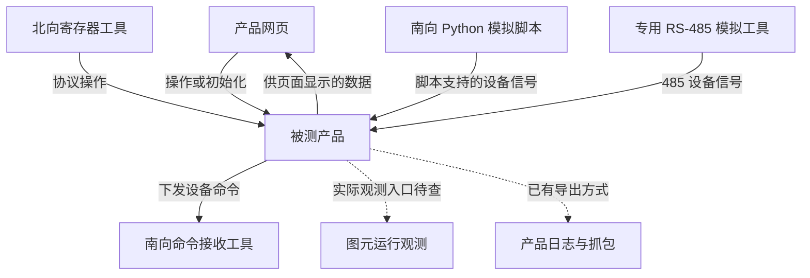

> 工作区归档说明（2026-09-17）：本文件继承原有技术内容与验证范围；本文可识别的文件引用已适配新目录。当前模块入口见 [模块导航](../README.md)。资料归档不代表产品功能或实机验证已经完成。

# BEH 产品端到端测试融合：主窗口与多工具协作探索指南

版本：v1.0｜日期：2026-09-16｜性质：进阶目标、调查提示与候选实施方案。
适用对象：能够访问公司相关源码、工具说明、已有测试和适用测试环境的本地 AI 与实施人员。
默认人机入口：现有 DeepSeek Harness；具体支持的 Skill、工具调用、后台运行和 MCP 能力需现场核对。

> **本文作者没有查看 BEH 或产品源码，没有使用你们的北向工具、南向专用模拟工具，也没有连接设备。文中给出的是组织思路、需查清的问题和可尝试的做法，不能作为已经证实的内部架构或接口说明。实际方案由本地 AI 研究源码、工具说明、配置和现有成果，并做最小验证后决定。**
>
> 本文单独承接本轮新增的“产品网页＋北向寄存器＋南向 Python 模拟脚本＋专用 RS‑485 模拟工具＋图元观测＋报文/日志验证”进阶讨论，不并入、覆盖或替代此前的《AI 测试与解释融合：双环境实施指导》。这里的场景组织与接口形式都可以根据证据调整；用户目标、真实证据和未完成事项应保持清晰。
>
> **用户最新明确：南向 Python 模拟脚本与专用 RS‑485 模拟工具是两项独立能力，必须分别保留。Python 脚本已经可以由 AI 直接操作运行；专用 485 工具的控制与取证方式另行调查。不得把前者替换、改名或归并成后者。**

## 0. 先用大白话说明要做什么

你在一个主窗口说明要测试的业务。主 AI 研究这条业务和现有工具，分别选择是否使用已有 Python 模拟脚本、专用 485 模拟工具，安排谁提供哪些设备信号、谁设置寄存器或操作网页、哪里采集图元值、最后检查什么。实际执行与持续采集交给可调用的工具和程序；主 AI 根据真实记录解释过程、分析异常，必要时提出补测。

“一个主窗口”表示你有一个任务入口；它不表示所有软件必须塞进一个进程，或原工具永远不需要自己的窗口。“多个工具同时运行”也不意味着每个工具都要配一个 AI。电表模拟、持续取值和报文记录，可以由普通程序维持。

首轮推荐采用：**一个主 AI＋一份总任务指南（可做成 Skill）＋若干已验证工具入口＋适用的场景执行程序。**先完成一条已有业务场景，再依据实际需要扩展。是否需要新增程序、复用哪个框架、是否采用 MCP，由现场调查决定，不为形式完整重复建设。

## 1. 统一术语与已知线索

### 1.1 本轮用词

| 用词 | 本文含义 |
|---|---|
| 产品网页 | 被测产品原有的 Web 页面；用户前面说的“外部界面”是语音转写问题 |
| BEH 网页工作台 | 自建工具的工作界面；与产品网页分别标识，不混作同一个被测页面 |
| 寄存器 | 北向或南向协议中需要读写、解析的对象；地址、类型与含义由实际协议定义 |
| 北向工具 | 通过产品北向入口进行设置或读取的现有工具；实际协议与调用方式待查 |
| 南向 Python 模拟脚本 | 用户已有的一套独立模拟脚本，AI 可以直接操作运行；模拟设备、参数、通信链路和结果格式按脚本调查 |
| 专用 RS‑485 模拟工具 | 与上述脚本不同的另一套专用工具，经 485 接入产品，例如模拟电表；自动控制和取证接口另查 |
| 图元观测 | 获取与本次产品运行关联的图元输入、状态、输出等可观察信息；接入链路与引擎依赖待查 |
| 场景执行程序 | 安排工具动作、等待条件、持续采集、程序检查与结果保存的代码；可复用已有实现 |
| 预期依据 | 判断行为是否应该如此的需求、规格或独立参考；不能仅由当前运行输出定义 |

用户提到北向工具中有“10、06 设置，03 读取”等操作。这些作为调查线索保留；先确认工具、协议、功能码表示方式及寄存器映射，本文不据此认定整个系统的协议栈或支持范围。

### 1.2 已有信息能说明到哪里

| 用户描述或历史资料 | 可以作为的起点 | 尚需查明 |
|---|---|---|
| 已用 Playwright 操作产品网页、设置值、导出日志并解析验证 | 有值得复用的真实操作路径和解析方法 | 当前入口、版本、自动化程度、成功与失败证据 |
| 有北向设置与读取工具 | 可以调查协议操作与自动化接入 | 实际可控接口、读写语义、异常响应和业务映射 |
| 有南向 Python 模拟脚本，AI 可直接操作运行 | 已有可直接使用的模拟执行入口，优先研究并复用 | 脚本参数、配置、生命周期、支持设备、实际链路、输出与收报能力 |
| 另有专用工具可经 485 模拟电表等设备 | 另一项独立的南向接入能力，与 Python 脚本分别登记 | 工具型号、支持设备、可修改数据、自动控制及收发记录能力 |
| 原图元工具可连接产品，显示 debug 值、使用断点等 | 可以从源码追踪实际执行与观测链 | 本地引擎是否参与、值的来源与时效、对象绑定、断点作用域 |
| 产品网页可抓取报文；模拟工具可能能直接查看收报 | 存在候选外部验证手段 | 抓的是哪一段通信、方向、时间、完整性以及能否导出 |
| 已有 FB/CB 测试工作与相关资料 | 可以复用组件行为测试和局部复现能力 | 当前真实覆盖范围，以及与产品运行对象的对应关系 |

以上是用户反馈或历史记录，不是本文完成了公司环境验收。新调查需要区分“说明书描述、源码证实、实际验证、尚不清楚”。

## 2. 要实现的端到端范围

### 2.1 从业务入口到外部结果

目标是围绕一条业务，明确输入、环境条件、产品处理、外部输出和页面呈现，并形成可追溯解释。每个场景可以只使用所需工具，不要求每次把全部入口都操作一遍。

下图只表示本轮讨论的交互角色，不代表查明了源码架构、线程关系或具体通信时序：



图中的 Python 模拟脚本与专用 RS‑485 模拟工具是两个独立节点。某个场景可以使用其中之一，也可以同时使用两者；各自模拟哪类设备、作用于哪条业务链需明确。不得因二者都属于南向模拟就假定可以互相替代。

“南向命令接收工具”表示验收角色：可能由 Python 脚本、485 工具分别承担其支持的部分，也可能需要其他已有入口。不要默认电表模拟工具能接收全部控制命令。图中“提供信号”是业务方向，不预设主动上报还是响应轮询；Python 脚本使用的通信链路不能从 Python 语言本身推断。

### 2.2 三类结果分别看

| 检查角度 | 回答的问题 | 证据示例，按能力取得 |
|---|---|---|
| 产品外部行为 | 对给定条件和操作，产品最终对外做了什么，是否符合业务规则 | 接收端原始报文、解析后的命令、必要的设备反馈、北向读取 |
| 内部过程 | 可观察到哪些处理步骤，哪里产生变化，哪些解释有支持 | 实际图元值、日志、事件、对应源码和配置 |
| 网页呈现 | 用户最终看到的值、状态和反馈是否正确 | 真实页面读取、关键画面、Playwright 操作记录 |

网页提示设置成功不直接证明业务生效；图元输出符合预期不直接证明命令正确送达；设备收到命令不直接证明网页显示正确。每项按自己的证据判断，最后按该场景事先声明的要求汇总。

模拟设备收到报文，可以支持对应的通信和产品逻辑结论；若没有真实设备动作与反馈，就不扩大为真实设备物理行为已经验证。

### 2.3 与已有组件测试的关系

端到端测试把入口、配置、内部处理和外部结果连起来。已有 FB/CB 测试可以继续承担组件行为验证、边界探索和局部回归。出现异常后，如果实际输入、状态和依赖可以重建，可提取代表样本进行局部复现；条件不齐时明确局限。

独立 FB/CB 运行结果与产品内本次运行记录分别保留身份，不能把前者直接写成本次端到端测试中的实测值。也不能预设每条产品业务都经过 BEH：绕过图元的实际路径同样需要查明并解释。

## 3. 先研究什么，再决定怎么接

### 3.1 围绕一条真实业务调查

优先选测试员熟悉、已有操作方法和预期依据的业务。建议从现有成功记录、页面动作、北向操作、模拟工具配置和实际输出反向定位，再结合源码追踪；无需先读懂所有仓库。

调查至少尝试回答：谁发起变化、产品如何识别与保存、哪些条件决定生效、是否进入图元、谁产生最终输出、哪里能取得真实结果。每个答案附对应源码/配置/文档或运行证据；查不到的依赖明确保留缺口。

### 3.2 建立业务量的对应关系

| 要对应的内容 | 要研究的细节 |
|---|---|
| 网页字段 | 字段含义、单位、范围、提交与回显方式，设定值和测量值是否不同 |
| 北向寄存器 | 实际地址、读写属性、类型、倍率、字节/字顺序、错误响应及适用版本 |
| 产品内部信号 | 配置项、信号标识、缓存、使能条件、控制来源与优先级 |
| 图元对象 | 工程版本、实例/端口绑定、状态来源、是否确实参与这条业务 |
| 南向数据或命令 | 设备类型与地址、协议字段、原始编码、转换规则和接收含义 |
| 页面结果 | 显示哪种状态或数值、刷新来源、格式化/舍入及新鲜度 |

同一个业务量在不同环节可能有不同表示，应比较有依据的业务含义；不能简单要求网页数字、寄存器原始整数和图元浮点值全部相等。映射文件可以由 AI 从源码与表格整理，但关键关系需由实际数据核对。

### 3.3 完整执行链不能预设

连接产品是否仍需本地 BEH 引擎、已有 Runner 或其他宿主？计算、调度、状态维护、数据转换分别在哪里？原工具的 debug 值从哪里产生、经过什么缓存？这些都需要研究源码与配置，再以最小运行验证补证。

“有源码”提供了调查条件，不保证一定有公开 API，也不保证原生服务可以脱离 GUI 运行。需要 GUI 生命周期或特定线程时，应保留这些前提再选择接入方式。第三方专用模拟工具未必有源码，优先查其说明、配置、命令与已有使用方法。

### 3.4 调查交付应简洁可用

建议保留一张表：能力名称、实际工具及版本、已知入口、运行位置、前置条件、输入、输出/证据、可自动化程度、最小验证、未知项、推荐下一步。表中状态可用“已验证、文档/源码支持待验证、需人工步骤、当前不可用、未知”。

查清一小段即可推进相应接入，不以全仓知识库或完整架构图作为前置。发现本文建议不适用时说明证据和调整理由；在既有用户目标与授权范围内继续，不为符合本文而制造接口或删掉必要依赖。

## 4. 一个主窗口、Agent、Skill、工具和执行程序怎样分工

### 4.1 推荐的首版分工

| 部分 | 实际职责 | 不应被误认为 |
|---|---|---|
| 主窗口/主 Agent | 接收业务任务、调查和规划、选择工具、解读异常、生成解释 | 必须新建一个独立 Agent 平台 |
| 总 Skill 或任务指南 | 说明目标、证据要求、能力索引、处理不确定性与结果表达 | 写好 Markdown 就自动具备设备控制能力 |
| 各能力说明 | 说明何时使用、如何调用、输入输出、限制和排错线索 | 每一份说明都需要一个新 AI 或新窗口 |
| 可调用工具与适配 | 真正操作网页、协议工具、Python 模拟脚本、专用 485 工具、观测入口或解析器 | 必须使用同一种语言、同一台机器或同一个通信协议 |
| 场景执行程序 | 按调查后形成的场景安排执行、并发采集、等待、检查、保存和清理 | 必须从零重建测试框架 |
| 结果与证据记录 | 保存场景、基线、过程、检查、失败与解释引用 | 所有原始数据都要塞进 AI 聊天上下文 |

这一分工是候选组织方式。现有框架已经提供的能力直接复用；一个组件也可承担多个职责，不要求对应六个项目或六个进程。

### 4.2 主 AI 负责哪些判断

主 AI 适合研究业务与源码、识别未知、选择适用场景、组织工具调用、解释冲突，以及决定是否需要有限补测。它根据真实工具结果更新判断。

已经确定的重复动作、轮询/订阅、报文收集、协议解析、数值比较、文件保存等，优先交给程序。不要让模型按每个采样点或调度周期临时决定是否读取和如何比较；这类工作是否能够连续维持，应由实际程序验证。

这种组合借鉴了工作流负责已知执行步骤、Agent 负责动态决策的区分；不是要求照搬某家 Agent 框架。[Anthropic：工作流与 Agent 的区分](https://www.anthropic.com/engineering/building-effective-agents)

### 4.3 多个工具同时工作怎样实现

场景可能需要 Python 模拟脚本持续运行、专用 485 工具同时提供另一类设备信号、图元观测持续采集、报文同时记录，而网页或北向工具在某个条件满足后施加输入。是否用多个进程、线程、异步任务或既有服务，按工具能力选择；这与是否使用多个 AI 是不同问题。

先验证各工具能否共同使用同一设备、串口、会话和数据源。共享资源由场景统一协调，避免多个任务相互覆盖设置或争抢控制。观察和采集应在需要的触发动作之前就绪；已确定步骤按条件推进，不能只靠任意延时碰运气。

### 4.4 一个入口不代表关闭窗口后自然继续

主窗口可以负责启动任务、查询进度、查看证据、请求取消并接收解释。要在窗口关闭或会话中断后继续运行，需要实际可独立维持的执行宿主、持久化任务状态和恢复方式；这些能力必须验证，不能仅因调用了后台命令就宣布可靠无人值守。

专用工具若需要真实桌面会话、窗口或 USB/485 设备，保留相应运行条件。用户仍可只有一个 AI 入口；底层原工具是否需要自己的 GUI，由工具实际依赖决定。

## 5. Skill 怎么拆，MCP 什么时候用

### 5.1 先有一个总入口

总 Skill 可以叫“产品端到端测试与解释”，名称仅为建议。应告诉主 AI：先了解业务与预期、查能力与源码、选场景、使用已验证入口、检查真实结果、解释并保存未知。

先通过索引按需阅读各能力说明，不把所有源码、协议表、日志和工具文档一次性注入上下文。复杂且经常独立复用的能力，再拆为单独 Skill；已有 Skill 继续引用，避免维护互相矛盾的副本。

是否安装为宿主原生 Skill，要核对 DeepSeek Harness 当前能力。若暂不支持特定加载方式，可以先使用项目任务指南与可执行入口；本文不认定某种安装格式已经可用。

### 5.2 每个能力包建议包含什么

| 内容 | 作用 |
|---|---|
| 使用说明 | 何时适用、已验证范围、前置条件、常见失败与限制 |
| 真实调用入口 | 已有脚本、命令、API 或经过验证的自动化路径；不存在就写待实现 |
| 输入与结果说明 | 如何指定对象与场景，返回成功/失败、有效值和原始证据在哪里 |
| 最小示例与证据 | 一次实际调用怎样完成；示例不能代替真实产品验证 |
| 生命周期与资源说明 | 启动、连接、持续运行、停止、释放资源，以及共享限制 |

推荐按网页操作、北向寄存器、南向 Python 模拟脚本、专用 RS‑485 模拟工具、图元观测、日志/报文解析这六类整理。Python 和 485 两项各自有说明、入口、状态和证据来源；不压成一个模糊的“南向工具”。六类是职责索引，不要求六个 Agent、六个 MCP 服务或六套独立工程。

### 5.3 MCP 是一种接入选择

MCP 可以让 AI 应用发现并调用工具、读取相关资源；一个服务可以提供多个工具，工具也可以来自多个服务。它不自动实现设备协议、GUI 驱动、后台调度或业务验收。[MCP 官方架构说明](https://modelcontextprotocol.io/docs/learn/architecture)

若已有脚本或命令已经容易调用，先使用即可；若宿主支持 MCP，且统一发现、参数约束或跨入口复用确有价值，再增加封装。任何方式都先验证真实能力，不因采用某个接入标准就跳过源码调查。

### 5.4 什么时候再考虑子 Agent

源码分区研究、独立分析失败证据或复核报告等任务，在确有收益时可以由子 Agent 协助。持续模拟与采集优先由程序实现。对同一产品的实际写入和场景状态由一个执行协调入口管理，分析 Agent 不自行更改运行现场。

另一 AI 的复核可以发现问题，但不会自动让测试预期变成独立业务依据。首轮不把多 Agent、模型投票或复杂分派系统作为端到端接通的前提。

## 6. 六类能力分别怎样调查与接入

以下是问题清单与候选做法，不是已经存在的 API。实际接口、命令、参数与返回结构以现有工具为准；必要时补充小范围适配，但先验证是否适合。

### 6.1 产品网页：复用 Playwright 人工操作路径

读取已有脚本/路线、执行入口、截图与 Trace、导出文件方法，以及已知失败样本。核对当前产品版本、页面和账号状态，复用适用成果。

属于被测网页路径的步骤，通过真实页面控件完成。网络、DOM 和源码可帮助定位或读取证据，但不能为跑通场景而把被测点击改成直接业务 API 写入。场景若明确采用北向入口，则由北向工具承担该动作；两条真实入口分别报告覆盖，不混淆。

网页既可以承担准备工作，也可以承担触发动作或最终结果检查，需在场景中标清。页面的“提交成功”、接口响应、重新读取后的值与最终业务效果是不同事实；按该场景的要求分别取得证据。

产品网页中的抓包功能是产品自身能力，Playwright 可以操作它并导出结果。Playwright 自身网络观察围绕浏览器流量；产品南向通信是否被捕获，需要查产品抓包或接收端工具。[Playwright 网络能力](https://playwright.dev/docs/network)

### 6.2 北向寄存器工具：保留真实协议入口

先查工具说明、既有用例和实际调用方式，明确目标、寄存器定义、请求与响应格式、读回含义、超时及异常表达。地址偏移、数值进制、类型、倍率和多寄存器编码等应按该产品的实际协议资料核对，不根据字段名字猜。

已有命令/API/脚本入口可用时优先复用；仅有 GUI 时，再评估已有自动化手段或适用的有限适配。不能因为名字叫“工具”就认定主 AI 已能控制它。

至少保留实际发起了什么、对端返回什么、读回或后续观测说明什么。协议确认不必然等于业务已经生效。北向写入与网页设置若作用于同一业务量，应明确准备、触发与优先级条件；有意测试竞争或控制切换时单独定义场景。

### 6.3 南向 Python 模拟脚本：已有可直接执行能力

**用户已明确：AI 可以直接操作并运行这套 Python 模拟脚本。**以这个已有入口继续，重点是读懂和复用其实际能力，不把“是否能运行”当作尚未获知的问题，也不改称专用 485 工具。

本地 AI 应读取入口、参数、配置、支持设备、数据更新方式、启动/退出逻辑和输出记录，确认一次调用是短任务还是持续运行，以及怎样判断模拟设备真正就绪。Python 使用什么协议或物理链路由脚本决定；不能推定它一定走网络、一定不走串口或与专用工具等价。

候选接入方式是由场景执行程序直接调用已有入口，并管理配置、进程状态与日志。若现有接口已能更新模拟信号或取得收发报文就直接使用；不足时再按源码与目标补充。不能为方便判通过而把产品应该产生的输出直接写成模拟器的“收到结果”。

独立登记脚本版本、启动配置、模拟设备身份、实际提供的信号、取得的结果和进程状态。日志格式、输出文件名或数据字段改变时，需要同步解析，不让旧解析器静默读出错误结论。

### 6.4 专用 RS‑485 模拟工具：另一项独立能力

单独登记工具名称与版本、所模拟设备、485 连接方式、实际串口/设备地址、通信参数、配置文件和操作方法。AI 能直接运行 Python 脚本，并不证明它已经能够控制这一套专用工具。

调查它是否提供命令行、API、脚本接口、配置导入导出、日志/报文导出或其他可验证的自动化入口。GUI 自动化是按实际情况评估的候选；如果某些准备只能人工完成，就明确“已人工准备”及范围，自动运行其余可完成部分，不宣称整场完全无人值守。

工具可能模拟电表等设备。它能提供哪些信号、是否支持故障/状态变化、是否能接收并记录指定命令，都应按说明和实际使用核对。若只能显示而不能导出某种证据，应列明限制，再研究适用取证办法。

若以后用 Python 写一层调用专用工具的适配程序，底层能力仍标为“专用 RS‑485 模拟工具”；这层适配不等于用户原有的“南向 Python 模拟脚本”。两者保留不同能力标识、版本、实例和证据来源。

### 6.5 图元观测：研究本次运行的真实对象和值

从原工具的连接、debug、变量更新和相关测试入口追踪实现，查明工程/实例/端口如何对应实际运行数据。连接产品是否需要本地引擎、数据在哪计算、是否经过缓存或转换、不同值是否来自同一次采样，均需证据。

按场景选择有意义且可获得的观察点。优先取得结构化信息，以文字模型分析；多模态只用于必要局部静态核对。若观测依赖原生宿主、线程或 GUI 生命周期，按实际要求接入，不预先删去这些依赖。

持续运行实验与断点实验分别记录：断点/单步的作用范围和时序影响需查清。采集不到的状态标为未知；源码推断可以解释候选原因，但不能冒充真实数值或逐拍记录。

### 6.6 日志与报文解析：保留已有方法与原始数据

复用用户现有的导出与专门解析方法，先核对输入格式、工具版本、时间口径、字段定义和已知解析失败。程序优先处理解析、转换与比较，AI 读取摘要和必要片段。

原始文件、解析结果与解释结论分别保存并可相互定位。解析失败、缺包、截断、类型不符或未知编码应显式呈现；不能将缺失字段补零后继续判通过。

优先评估从实际接收端取得下发报文：Python 脚本与专用 485 工具分别检查其是否具备此能力。产品抓包和日志可作补充。不同来源的记录要说明观测位置，不把产品“准备发送”的日志直接等同于设备已经收到。

## 7. 场景怎么描述，才能把工具真正连起来

### 7.1 人能看懂、程序能执行的同一个场景

场景先表达业务问题，再绑定实际工具。中文说明与机器可读配置引用同一组对象、参数和预期，不分别维护两套互不对应的答案。

| 场景内容 | 需要说明 |
|---|---|
| 目的与依据 | 验证什么业务；正确行为依据来自哪里；哪些规则待确认 |
| 对象与版本 | 产品、工程、配置、被测设备和相关工具的实际身份 |
| 初始条件 | 控制模式、使能、已有状态、设备在线条件及其他必要前提 |
| 网页角色 | 初始化、触发、最终检查，或本场景不使用 |
| 北向角色 | 初始化、触发、读取检查，或不使用；避免无意覆盖网页设置 |
| Python 模拟角色 | 是否使用、模拟什么设备、提供哪些信号、是否承担命令接收 |
| 485 专用工具角色 | 独立填写是否使用、设备、信号、人工前提与接收能力 |
| 图元观察 | 实际参与路径中能观测的对象与状态，以及未能取得的部分 |
| 推进条件 | 哪个就绪或事件允许下一步，超时怎样报告 |
| 检查规则 | 必须检查什么、容差/时间窗口依据、哪些证据只是辅助 |
| 结束处理 | 需要停止的采集、释放的资源、需要保留的现场 |

每场可只使用 Python 模拟脚本、只使用专用 485 工具，或同时使用两者。组合依据是业务需要和实际设备能力；不能为了满足“六类工具都出现”而多做无关动作。

### 7.2 一个最小结构示意

下面 JSON 只说明如何保留两个南向入口，**不是可运行场景，也没有真实产品参数**。空值表示尚未调查，不能据此执行或验收；实际可以沿用现有格式。

```json
{
  "example_only": true,
  "scenario_id": "EXAMPLE-NOT-EXECUTABLE",
  "business_rule_source": null,
  "product_binding": null,
  "web_route": null,
  "northbound_binding": null,
  "southbound_python": {
    "selected": null,
    "script_entry": null,
    "device_bindings": [],
    "roles": [],
    "evidence_outputs": []
  },
  "southbound_rs485_tool": {
    "selected": null,
    "tool_binding": null,
    "connection_binding": null,
    "device_bindings": [],
    "roles": [],
    "manual_prerequisites": [],
    "evidence_outputs": []
  },
  "beh_observations": [],
  "steps": [],
  "required_checks": [],
  "optional_observations": []
}
```

首次可以只把一个已有场景的真实信息填清，不必建立大型场景语言。复杂事件、并发和条件分支确有需要时再扩展；不把尚未调查的能力包装成已经可调用的动作。

### 7.3 预期和人的参与

可信预期来自适用需求、协议规则、明确逻辑定义或经验证的独立参考。AI 可以整理、解释与提出问题；仅从当前代码或当前输出反推的预期，标为行为观察/快照，不能独立证明业务正确。

人主要核对具体业务问题，例如某条件变化后应立即生效、等待条件，还是保留原状态。允许回答“不知道”；不把阅读报告当作需求批准。已明确的规则直接复用，真正影响判断的歧义集中列出，不要求非专业用户审读全部脚本。

## 8. 场景执行程序怎么组织

### 8.1 首先复用已有框架与入口

盘点现有 Playwright 执行器、Python 模拟脚本、协议工具、BEH 入口和解析器能提供什么。如果已有框架可承担调度和报告，优先在其适当扩展点组合；不足时补充负责安排场景的小程序。

网页人工路径执行器继续承担它的约定职责。整体场景可以合法使用北向协议和设备模拟，但不要为了兼容这些动作，破坏原有网页路线的限制或把被测页面步骤悄悄绕过。

新增调度代码使用现有可维护环境即可。即使选择 Python 编写调度器，也要明确区分“调度程序”“已有南向 Python 模拟脚本”“专用 485 工具的可能适配层”三个不同对象。

### 8.2 候选生命周期，按真实入口调整

1. 读取场景和环境信息，核对版本、目标及当前可用能力；未知关键参数先补证据。
2. 按依赖准备需要的工具。Python 脚本与 485 工具分别启动或核对已就绪状态；并非每次都需要两者。
3. 使所需观察和记录就绪，保存基线，确认本次使用的设备与对象对应关系。
4. 按场景施加网页、北向或设备信号变化；等候有定义的条件，记录实际动作与返回。
5. 获取足够证据后执行有依据的检查，保存失败、缺失和不确定性；结束本轮拥有的资源。
6. 主 AI 读取结构化摘要与关键证据，完成测后解释，必要时提出或执行预算内补测。

这是一种安排提示，不规定实际调用顺序。原工具生命周期、已有运行状态和业务逻辑可能要求调整；调整理由和真实执行记录应可查。

### 8.3 持续任务与短动作分别管理

记录中的持续模拟、订阅或采集需要有会话/进程身份、就绪判据、退出状态和有效性信息。一次性读取、设置或导出则需要明确完成、失败与结果。发起调用成功不等于任务已经就绪。

采集程序持续保存原始数据，按需生成变化摘要；主 AI 不必逐条读取完整报文或逐拍参与。缓冲、采样和筛选造成的缺失应能识别，不能将采样摘要解释成没有遗漏的全量过程。

### 8.4 同时使用 Python 与 485 工具

分别管理两项能力的配置、设备身份、就绪状态、数据更新和停止流程。查明它们是否共享设备地址、端口、串口、总线、账号或目标状态；有共享限制就由场景统一安排。

不要让两套工具意外模拟同一个身份并相互干扰，也不能自动把一套提供的值归到另一套设备上。某项启动失败时，说明哪些检查依赖它；其余独立工作能继续就继续，受影响的端到端结论保持未完成。

### 8.5 超时、重试与中断

使用来自需求、已有测试或实际观察的等待条件与预算；技术超时上限与业务时限分别说明。达到超时后保留已经发生的输入与数据，不能改 Expected 或反复重试直到某次通过后抹去前面的失败。

重试需要判断动作是否已生效，尤其写值、切换模式、启停设备和下载等不能因响应丢失盲目再做。恢复任务时核对版本、目标状态和最后已完成步骤，不能仅凭聊天记忆继续。

结束时只清理由本轮拥有且可安全结束的资源，遵循工具与测试环境的现有规则。共享产品上他人已经改变的值，不能用旧快照盲目覆盖。

### 8.6 让人始终只有一个任务入口

主窗口可提供“启动场景、查询状态、查看证据、请求停止、解释结果”等逻辑能力；这些名称是交互建议，不是现成命令。用任务编号关联持久化状态，让会话切换后仍可查进展。

在正式依赖夜间运行前，实际验证所需后台宿主、桌面会话、设备连接和凭据环境，以及窗口关闭/网络中断后的行为。若专用 485 工具仍需人工准备，明确提示本轮覆盖范围，不让主 AI 假装完成了无法调用的操作。

## 9. 怎样把证据关联成同一次端到端测试

### 9.1 建议保留的信息

| 信息类别 | 内容与目的 |
|---|---|
| 测试身份 | 场景编号、运行编号、尝试编号与父子关系，区分首次运行和补测/重跑 |
| 执行基线 | 实际产品、程序/工程、配置、脚本、工具与解析器的版本；未知明确记录 |
| 设备与对象 | 设备身份、工具实例、图元对象、寄存器/信号对应，避免同名误关联 |
| 数据来源 | 网页、北向工具、Python 模拟脚本、专用 485 工具、图元观测、产品日志等分别标明 |
| 动作与状态 | 准备、触发、完成、失败、中断，以及对应的实际输入或返回 |
| 时间信息 | 原始时间、采集接收时间、周期/序号、时钟来源与已知同步精度 |
| 数值与有效性 | 原始编码、解析值、单位、转换依据、新鲜度、错误与缺失 |
| 检查与解释 | 预期来源、规则版本、比较结果、引用哪些原始证据、哪些属于推断 |

这是结果内容建议，不强制替换现有 Schema。可以先通过适配整理现有文件，保留原始来源；缺字段显式为空或未知，不补造。

### 9.2 Python 与 485 的证据必须可区分

可使用不同来源类型，例如 `south_python_script` 与 `south_rs485_tool`，再附工具实例和模拟设备身份。名称可以调整，关键是能明确回答“哪套工具、哪个设备、提供或接收了什么”。

若主调度器也是 Python 写的，其事件应标为调度事件，不算模拟设备收发。若用 Python 包装专用 485 工具，接收证据仍注明原始来源是该专用工具；同一份文件被多个模块引用，不变成多份独立证据。

### 9.3 同一个编号不能单独证明因果

运行编号帮助组织文件；不保证网页动作、图元变化和某个南向报文一定存在因果关系。可结合实际对象、有效值变化、协议请求标识、原生事件、执行条件和受控对照建立关联。是否能向系统内部传播标识，要看实际协议与源码，不要求强行改所有通信格式。

GUI 更新时间、日志写盘时间、工具接收时间、产品采样时间可能不是同一个概念。只有明确时钟关系和采集语义时，才比较精确延迟或同一周期；不能把两个不同批次的值拼成同一瞬间。

### 9.4 接收、响应和执行是不同事实

根据业务需要分别记录：产品是否发起发送、接收工具是否实际收到、是否按协议响应、模拟设备状态是否按约定变化、产品是否读回相应反馈。不是每个场景都要求全部检查，但需要提前声明验收到哪一步。

若模拟工具支持状态响应，可以进一步研究闭环场景；若它只记录报文，就停在相应证据范围。输出的业务预期不能直接从收到的报文复制回来作答案。

## 10. AI 解释与回看怎样融合

### 10.1 测前解释面向业务

说明场景目的、初始条件、选择了哪些入口、Python 脚本和 485 工具分别承担什么、预计会发生什么，以及依据从哪里来。真正不清楚的规则保留待确认，不把候选假设写成已证实过程。

### 10.2 测后解释面向这一次真实运行

围绕实际证据说明：操作做到了哪一步，设备提供了哪些状态，产品哪一段发生变化，哪些图元值可直接看到，最终接收端收到什么，网页显示什么，各项与预期怎样比较。

对“为什么”的解释引用源码、配置、规则与实际记录。只看到相关变化时，表达为候选原因；没有中间值时说明缺口，避免为结果编一条完整但未观测的故事。

结果建议分开表达“执行完成程度、外部业务检查、网页检查、内部解释证据、待确认规则”。若内部采集只是辅助，缺少它可能影响解释而不改变已经充分验证的外部结论；若场景预先要求该内部检查，则缺失应使对应范围保持未完成。不能事后调整必需项来获得 PASS。

### 10.3 失败时的解释与补测

先找最后一个有证据支持的正确环节，以及第一个出现差异的观察点。这只缩小调查范围，不等于已经定位根因；映射、解析、时钟与预期本身都可能出错。

优先复查已有证据和源码，再做能区分候选原因的最小补测。一次只改变必要条件，保留新旧运行身份，使用任务预算。条件允许时把局部样本交给已有 FB/CB 测试；初始状态或依赖无法还原时，不宣称已精确复现。

### 10.4 首版回看先链接真实产物

一份场景报告可以引用 Playwright Trace、网页关键画面、北向记录、Python 模拟日志、485 工具记录、图元观测和解析结果。报告按实际关联的步骤组织，帮助人逐段查看；不必先建设完整播放器。

Playwright Trace Viewer 适合回看浏览器操作、页面快照及相关记录；整条产品业务仍需关联其他工具的证据，不能自动从浏览器 Trace 得到产品内部逐拍状态。[Playwright Trace Viewer](https://playwright.dev/docs/trace-viewer)

区分“查看历史过程”“重新运行场景”“模拟器对输入的响应”。查看历史证据不等于本次执行；重跑的可重复程度由实际状态、时钟和外部条件决定；动画、插值或 AI 推断不能标作真实采样。

## 11. 一个可讨论的执行示例

这是结构示例，不包含真实寄存器、阈值、协议或设备配置，也不要求实际系统按这个顺序工作。

**业务问题**：在明确设备状态和控制条件下，从指定入口设置一个业务量，产品对指定设备的最终输出与产品网页显示是否符合已确认规则？

| 候选安排 | 实际需要先查什么 | 本次留下什么 |
|---|---|---|
| 使用 Python 模拟脚本提供一类设备状态 | 选择哪个已有脚本、设备与参数，怎样确认就绪 | 脚本身份、配置、实际提供的数据和运行状态 |
| 需要时接入另一台由专用 485 工具模拟的设备，例如电表 | 是否确有业务依赖，工具怎样准备和提供信号 | 工具/设备身份、485 配置、实际数据、人工步骤 |
| 启动适用的图元与收发观测 | 真实对象、采集入口、时序影响与有效性 | 观察范围、基线、开始时间与缺口 |
| 通过网页完成场景准备 | 哪些准备属于需要覆盖的网页路径 | 页面动作、结果与配置身份 |
| 从北向触发设置，或在另一场景中由网页触发 | 实际选择哪个入口，其控制条件和预期是什么 | 请求、响应、实际操作与后续读回 |
| 检查接收端命令和网页结果 | 哪个工具能接收相关命令，各处值怎样转换 | 原始接收记录、解析结果、网页值及程序检查 |
| 生成解释与需要的补测 | 哪些结论有证据，哪里存在分歧 | 过程解释、引用、未知和最小下一步 |

如果该业务只需要 Python 模拟脚本，就不额外引入 485 工具；如果必须有电表等 485 设备，则不能用无关脚本虚构这一前提。需要两者时，各自就绪与数据身份必须分开验证。

对照网页入口与北向入口时，先确认二者在该业务条件下是否应具有相同效果。控制模式、权限或优先级不同，可能有合理差异；按规则比较，不强求表面数值一致。

## 12. 推荐的推进方式与交付

以下工作可以交替推进、按条件调整，不要求先完成完整平台，也不预设所有入口能同时接通。

| 工作包 | 建议做什么 | 完成到什么程度才算相应成果 |
|---|---|---|
| A：盘点与源码研究 | 分别列出六类能力，追踪一条实际业务，确认预期与关键映射 | 有证据的能力表、未知项与可验证方案；不等于测试已经通过 |
| B：复用直接入口 | 复用已能运行的 Python 模拟脚本及已有网页/解析路径，按所选业务接入 | 实际调用与记录可查；新增适配的范围明确 |
| C：调查专用 485 工具 | 单独确认自动控制、采集与人工前提 | 说明自动化等级与实际支持范围；没有接口也不伪造结果 |
| D：贯通代表场景 | 用适用工具完成输入、外部检查和可获得的内部解释 | 真实数据与预期来源可对照；Python/485 角色清晰 |
| E：执行组织与回看 | 将已验证步骤纳入适用的执行程序和主窗口入口 | 可查询状态、查看证据、处理失败、保存与恢复；范围经验证 |
| F：夜间与扩展 | 在已有范围扩大场景，按需要加入两个南向能力的组合 | 批次完成程度、冲突、阻塞和待业务问题清楚，无假通过 |

首轮可优先利用 AI 已能直接运行的 Python 模拟脚本降低接入成本；若选定业务必须依赖专用 485 工具，就相应调整顺序。该建议不削弱对两项能力的分别记录，也不把未接通的一项称为已覆盖。

建议交付：能力与证据索引、可读业务场景、适用调用入口、运行与原始记录、检查结果、测后解释、实际使用说明。尽量放在现有项目结构中，不强制新增独立数据库、服务端、网站或 Agent 平台。

## 13. 夜间运行与主窗口体验

### 13.1 下班前需要明确的信息

尽量从已有配置读取：选定场景和目标、使用哪些模拟设备、当前版本、允许的操作范围、等待与补测预算、结果位置，以及专用工具是否已经满足必要人工准备。只有关键缺失才向用户集中说明，避免要求用户重复填写可查信息。

主窗口展示准备完成、运行中、受阻或完成的真实状态。AI 已直接启动 Python 脚本，不等于整个场景就绪；485 工具仍需人工准备时明确指出依赖。

### 13.2 运行中与次日查看

每个场景开始与结束都保存记录，已完成部分及时落盘。业务歧义进入待核对队列，技术阻塞按实际影响处理；其他不依赖它的任务继续。不得用跳过关键输入、改预期、复制旧成功文件或伪造工具输出凑整批成功。

次日优先呈现：完成范围、主要结论、异常、关键回看链接、少量待判断问题。详细报文与日志按需展开；保留所有必要原始依据，同时控制进入模型上下文的数据量。

### 13.3 自动化程度如实表达

可以分别报告“已自动执行、人工准备后自动执行、仅完成观测、仅分析已有记录、当前阻塞”。某个专用工具仍需人工操作，不必否定其余已有自动化成果，但不能将整场标为完整无人值守。

从一个主窗口启动后，由什么进程或服务维持、停止信号怎样生效、故障后能否恢复，都用实际测试验证。本文没有创建定时任务，也不宣称现有宿主已具备这些能力。

## 14. 验收建议：既检验功能，也检验是否会误导

| 验收问题 | 预期表现 |
|---|---|
| Python 与 485 是否被混淆 | 架构、配置、入口、状态与证据均分开；Python 已可直接运行的事实保留 |
| 一个主窗口能否组织场景 | 能查明实际调用了什么、进度与结果在哪里；不要求用户切换多个 AI 窗口搬运结果 |
| 网页被测步骤是否绕路 | 保留真实页面动作；北向入口测试单独表明，不能替代未完成的网页步骤 |
| Python 脚本进程启动但未就绪 | 能发现尚未满足前提，不能继续声称设备数据已经有效 |
| 485 工具需要人工准备 | 明示该依赖及覆盖范围；不虚构自动控制成功 |
| 两项模拟能力同时使用 | 设备身份、资源占用和数据来源不串混，按场景正确协同 |
| 数据转换有差异 | 根据实际单位与编码映射比较，原始值与解释可追溯 |
| 图元未参与或无法观测 | 按源码与记录说明，不能编造中间处理链或数值 |
| 接收结果不符合预期 | 即使网页提示成功，也保留外部业务检查失败 |
| 内部值符合、网页显示错误 | 分别报告对应检查，不用一个通过覆盖另一个失败 |
| 缓存、断线、缺包或解析错误 | 无效或缺失明确显示，不补成默认正确值 |
| 时间与事件关联不足 | 降低因果和延迟结论强度，不把同一编号当全链因果证明 |
| 预期仅来自当前实现 | 标明业务依据缺口，不能直接宣布业务正确 |
| 任务中断与恢复 | 已完成记录保留，未知副作用先核对，不盲目重复写入 |
| 错误检出能力 | 在适用隔离样本中验证能识别代表性差异；模拟数据和实际结果不共用自我证明的答案 |
| 后台/夜间声明 | 与实际验证的宿主、会话、设备和恢复能力一致 |

只针对新增接入与具体风险补充有意义的验证，优先复用已有有效结果。验收结论同时列完成、部分完成、阻塞与未验证范围；没有真实设备或原始证据时不能宣布产品端到端通过。

## 15. 可直接交给本地 AI 的启动指令

以下任务在用户既有授权范围内推进；不会因为本文出现某项能力就额外授予设备写入、断点、下载或其他控制权限。

> 我们现在做 BEH 相关的进阶产品端到端测试与解释融合。本文作者没有查看公司源码、没有使用这些工具，也没有连接产品。文中的组织方式、接口和推进顺序都是候选建议；你需要研究实际源码、配置、工具说明和已有测试，再用最小运行验证选择方案。建议与事实不符时，说明证据并调整，不能为了符合文档虚构架构。
>
> 必须分别保留六类能力：产品网页 Playwright、北向寄存器工具、已有南向 Python 模拟脚本、另一套专用 RS‑485 模拟工具、BEH 图元观测、日志/报文解析。用户已明确 Python 模拟脚本可以由 AI 直接操作运行，应研究并复用这个已有入口。专用 485 工具是独立能力，例如模拟电表，它的自动控制与取证方式需要单独调查；不得把二者合并、替换或混记来源。
>
> 先盘点六类能力各自的真实入口、参数、生命周期、运行位置、输入输出、证据和限制。研究一条测试员熟悉且有预期依据的业务，查清网页字段、寄存器、内部信号、图元对象及南向命令之间的实际对应，核对单位、状态与控制条件。连接产品是否仍需要本地引擎、各段在哪里运行、图元是否参与，都由源码与实际记录确定。
>
> 推荐以现有 DeepSeek Harness 的一个主窗口作为入口。主 AI 负责研究、规划、异常分析和解释；已确定的动作、持续模拟、采集、等待、解析与比较由工具和程序执行。可以用一份总 Skill/任务指南配各能力说明，按宿主实际支持接入；不要因名称而预设必须六个 Agent、六个服务或新建平台。优先复用已有执行器和脚本。
>
> 场景明确哪些工具负责准备、哪些触发业务、哪些观察和检查。Python 模拟脚本与专用 485 工具可按需要单独使用，也可同时使用，分别保存配置、设备身份、就绪状态和证据。被测网页步骤仍走真实网页路径；北向协议入口按其自己的真实路径执行，不能相互替代来掩盖未测步骤。
>
> 预期来源、实际执行、外部业务检查、网页呈现和内部解释证据分开表达。优先研究实际接收端能取得的原始报文，复用已有日志导出和专用解析方法。实际输出不能反推为独立业务答案；用户不懂的问题用具体业务语言提出，允许“不知道”，继续其他有依据的工作。
>
> 保存运行身份、版本、实际输入、工具来源、原始报文/日志、图元观测与检查结果，支持过程回看。测后解释实际发生了什么、原因有什么证据、哪里未知；必要补测有预算且保留首次失败。不能编造逐拍状态、时间关系或没有取得的设备结果。
>
> 围绕一条代表场景调查与实现交替推进，完成可访问范围内的接入、运行、验证和报告，不止于规划。若某能力需人工准备或暂不可用，说明受影响范围并继续独立工作。夜间执行、窗口关闭后的持续运行与中断恢复需要实际验证后才宣称可用。
>
> 最终交付查明的事实与未知、选择方案的理由、实际可运行入口、场景与证据、程序检查、过程解释、完成范围及待业务核对项。本期不扩展自动删图出题、AI 开发考试或完整动画回放平台。

## 16. 与已有资料的关系及方法来源

### 16.1 项目资料

- `../测试与解释融合/02_AI测试与解释融合_双环境实施指导_v1.0_2026-09-16.md`：已有解释与测试融合基础，强调源码探索和两种产品连接情况；本文是独立进阶文档。
- `../网页人工路径/AI人工路径测试自动化_架构设计与MVP实施方案_v1.0_2026-09-13.md`：复用真实网页路径、执行记录、预期独立性和 Trace 回看思路；接入前核对实际交付包与当前版本，不能把示意接口当现有接口。
- `../00_AI测试_模块入口与复用规则.md`：查找已有组件测试与参考规范，按实际成果复用。

本文仅创建新的指导文件，不修改以上资料。后续实施可以引用它们，但不能把旧文件中的假设或方案状态当作当前源码事实。

### 16.2 外部方法参考的使用范围

本文引用的工作流/Agent 区分、MCP 工具接入、Playwright 网络与 Trace 能力，只支持组织和工具方法，不证明 BEH、产品或模拟工具具有相同接口。来源已在对应段落链接；实际采用版本和调用方式仍需本地确认。

## 附：交接时最容易说错的几件事

1. **两项南向能力不能说成一项。**原有 Python 模拟脚本，AI 已可直接运行；另有专用 485 模拟工具，例如电表模拟器，控制方式另查。
2. **一个主窗口不等于一个程序。**你只向一个主 AI 下任务，后台可以有多个工具持续工作；是否能无人值守要实测。
3. **Skill 需要真实能力支撑。**指南教 AI 怎样使用，脚本/工具实际执行；MCP 是可选接入方式，子 Agent 也不是每项能力的必需品。
4. **接上产品不决定执行架构。**本地引擎、目标产品和其他组件各负责什么，要查源码与运行证据。
5. **端到端既看实际结果，也讲过程依据。**设备接收、网页显示和图元观测各自验证，缺证据保留未知；不能用 AI 自拟答案证明自己正确。

先让一条有明确业务预期的场景通过现有真实入口完成运行和解释，再逐步扩展；同时保持两项南向能力的独立身份和可追溯证据。
