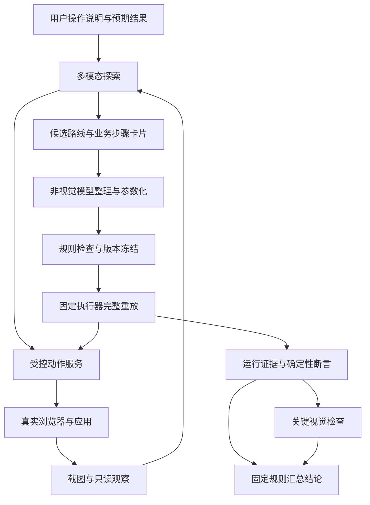

> 工作区归档说明（2026-09-17）：本文件继承原有技术内容与验证范围；本文可识别的文件引用已适配新目录。当前模块入口见 [模块导航](../README.md)。资料归档不代表产品功能或实机验证已经完成。

# AI 人工路径测试自动化：架构设计与 MVP 实施方案

版本：v1.0｜日期：2026-09-13｜状态：设计基线，待真实系统验证  
正式文档目录：`/AI人工路径测试自动化`  
适用对象：业务使用者、AI 实施助手、测试与开发人员。

> **目标：用户只需说明“我平时怎么操作、应该看到什么”；多模态模型先实际走一遍，形成带证据的操作路线；非视觉模型负责整理、参数化和维护，固定 Playwright 执行器负责重复操作；程序按规则判定路径、结果和证据是否满足要求。**
>
> 本文交付架构、规则、数据契约、实施顺序与验收标准。当前未取得目标软件地址、账号、版本和真实页面，因此文中的设备管理案例属于设计示例，不能当作已经完成的产品测试。本文提出的 `hpt` 命令和模块均为待实现接口。

## 1. 用户需求与设计结论

### 1.1 这套系统要解决什么

现有方式已经能让 AI 编写、调试并留下 Playwright 脚本。需要补齐的是：**脚本必须走被测的人工操作路径，不能为得到业务结果而跳过界面；使用者无需读代码，也能了解测试实际做了什么、有什么证据。**

| 用户需求 | 本方案的落实方式 | 验收时看什么 |
|---|---|---|
| 用户只能描述业务操作，不会判断脚本实现 | 自然语言输入；系统生成步骤卡片与证据 | 用户看到动作、对象、预期页面，无需审 Python |
| 第一遍由多模态模型带路 | 探索必须读取当前截图，通过受控动作服务操作 | 首轮真实动作记录、截图、页面反馈 |
| 后续让非视觉模型使用已有成果 | 提供文字、语义控件、参数和检查点；稳定回归由程序执行 | 不需要每轮重新理解整个页面 |
| 真正覆盖手工测试经过的界面 | 业务步骤只能使用允许的 UI 动作 | 操作序列、动作实现版本、路线一致性 |
| 自动检查是否绕路 | 受限操作格式＋固定执行器＋版本校验＋运行证据 | 拒绝请求记录、执行器身份、步骤覆盖 |
| 不能遇到 bug 就换方法把它绕过去 | 原运行立即保留失败；修路线另起版本和运行 | 首次失败仍可见，不能被后一次成功覆盖 |
| 详细严谨且能实践 | 定义输入输出、失败分类、数据状态、开发工单、验收矩阵 | 可逐阶段实现，阶段有明确出口 |

### 1.2 第一版的主要决定

1. **继续使用 Playwright。**复用其浏览器控制、定位、等待和追踪能力；不重写浏览器自动化引擎。
2. **多模态探路与日常执行共用同一个动作通道。**第一遍也不允许直接请求业务接口、修改应用状态或伪造成功。
3. **优先让 AI 生成声明式路线，而不是执行任意 AI 代码。**路线类似一张程序可读的操作清单；固定执行器把动作映射到 Playwright。
4. **非视觉模型不是浏览器驱动。**它可负责理解需求、填写参数、提出路线修改；对稳定路线，程序可直接重放，不必每步调用模型。
5. **结果分开报告。**至少分别显示路径合规、UI 功能、视觉检查、证据完整性；不能用一个笼统的“人工等价 ✅”掩盖未检查部分。
6. **先做一个完整小闭环。**优先普通表单、按钮、自定义下拉框和列表；Canvas、操作系统对话框、中文输入法专项另有阶段。

### 1.3 对前面讨论的必要校正

| 前面容易产生的理解 | 本文采用的严格表述 |
|---|---|
| 静态扫描通过，就证明脚本没有绕路 | 扫描只能发现一部分问题；任意 Python 可通过别名、动态导入、子进程等绕过黑名单 |
| 点击后发生请求，就证明请求来自这次点击 | 时间相邻只能提供线索；后台轮询、自动保存、异步队列均可能同时发生 |
| `is_trusted` 可以识别人工操作 | 不能用它认证人工来源，也不能单独判断是否遵守完整业务流程 |
| DOM 可见就等于人能看到 | 不成立；透明、遮挡、裁切、低对比度等仍需感知检查 |
| `press_sequentially()` 等价真实中文输入法 | 不成立；拼音候选、组合输入和系统输入法属于额外覆盖范围 |
| 保存截图就已完成视觉验收 | 不成立；截图必须被明确的检查方法读取并形成判定 |
| 新建浏览器就是干净重跑 | 只清理浏览器状态还不够，后端数据、账号与应用版本也要定义 |
| 第一次探路成功，就是业务“标准答案” | 探路只证明实际走过；预期结果仍须来自业务要求，不能由当前有缺陷的页面反向定义 |
| 日常 95% 都能交给便宜模型 | 目前没有本项目实测数据；节省程度、成功率、维护成本都需要测量 |

**承诺边界：在声明的环境、路线、输入方式和检查范围内，提供可追溯的 UI 回归结果；不声称与所有真实用户、所有设备、所有感知和输入行为完全等价。**

## 2. 术语与覆盖范围

| 术语 | 大白话含义 |
|---|---|
| 多模态模型 / Explorer | 能看当前页面截图、结合文字理解界面并提出下一步操作的模型 |
| 非视觉模型 / Route Compiler | 读取文字化路线与控件信息，整理参数、规则和维护建议的模型 |
| Human Route / 人工操作路线 | 用户要经过哪些页面、操作哪些控件、每步应看到什么 |
| Runner / 固定执行器 | 实际调用 Playwright 的小程序；只实现允许的动作 |
| Policy / 人工路径规则 | 规定能做什么、不能做什么、哪些情况必须停下 |
| Checkpoint / 检查点 | 一组必须验证的事实，如“弹窗打开、名称正确、列表有且只有一条记录” |
| Oracle / 预期结果依据 | 测试据以判断对错的要求；来自用户、规格、权威字段定义等 |
| Evidence / 证据 | 原始截图、动作事件、断言记录、版本信息、错误日志 |
| Clean rerun / 从约定初始状态完整重跑 | 固定版本与输入，从明确起点再走完整路线，而不是续跑探索现场 |
| 适配器 | 对 Canvas 等特殊控件补充的一小段固定能力，需要单独验证后启用 |

### 2.1 三个独立覆盖维度

不把“更像人”简化成一个从低到高的数字，因为不同维度不能互相替代。

| 维度 | 可选值 | MVP 默认 |
|---|---|---|
| 业务路径 | `ui_only` / `mixed_setup` / `legacy_audit` | `ui_only`，范围内所有业务操作经过 UI |
| 输入细节 | `functional` / `interaction_specific` | 普通文本用功能级输入；键盘、下拉、拖动专项按用例声明 |
| 感知检查 | `required` / `sampled` / `not_checked` | 关键检查点 `required` |

`mixed_setup` 表示某些准备工作预先完成，不代表被测步骤可改为接口调用；必须列明未覆盖部分。抽样视觉检查只能支持抽到的运行，不能替整批运行背书。

### 2.2 第一版明确包含与暂缓

| MVP 包含 | 后续独立扩展 |
|---|---|
| 一个 Web 应用、一个固定浏览器配置、一个测试账号 | 多浏览器、多语言、多个权限角色 |
| 用户描述→多模态探路→结构化路线→固定重放 | 开放式任意网站自主探索 |
| 点击、普通输入、按键、自定义下拉、滚动、DOM 断言 | 系统文件窗口、真实 IME、移动触摸、屏幕阅读器专项 |
| 关键截图、视觉判定、Trace、失败报告 | 完整交互式报告站点、趋势平台 |
| 禁止业务 API 捷径、版本绑定、不可覆盖的运行记录 | 独立账号隔离、强化系统权限隔离、远程执行池 |
| 10 个代表性用例与故障注入验收 | Canvas/BEH 图元编辑、跨组件信号运行态闭环 |

## 3. 与 Playwright、Webwright 的关系

### 3.1 采用成熟能力，补齐本项目特有约束

| 能力 | 来源与本项目处理 |
|---|---|
| 浏览器、DOM/ARIA 定位、真实控件动作 | 采用 Playwright；不自己造浏览器驱动 |
| 自动等待、动作可执行性检查 | 采用 Playwright，并按不同动作补充检查 |
| 截图与追踪查看 | 采用 Playwright；另存业务断言和本项目判定 |
| 探索后留下可重跑产物 | 借鉴 Webwright，将受限路线作为权威输入 |
| 参数化、复用、更新后回归 | 借鉴 Webwright Skill Factory 的思路，先用本地文件索引 |
| 人工路径规则与不能绕路的运行入口 | 本项目新增，不把它宣传为 Webwright 已有的保证 |
| 多模态先探路、非视觉模型维护、程序重放 | 本项目工作分工，不要求安装新的多 Agent 平台 |

Webwright 官方把脚本和运行产物作为主要成果，Skill Factory 提供参数化复用与重放验证。这些机制值得借鉴，但其自由编写程序的工作方式本身并不构成本项目的受限执行边界。本项目第一版不依赖完整安装 Webwright，也不依赖其插件接入是否成功。[Webwright 官方仓库](https://github.com/microsoft/Webwright)

Playwright 推荐基于角色、标签等用户可感知语义定位控件。本项目优先使用这类定位，但“成功定位”还必须结合实际可交互性、视口与截图判断。[Playwright Locators](https://playwright.dev/python/docs/locators)

### 3.2 两条接入路线

| 接入方式 | 用途 | 可以给出的结论 |
|---|---|---|
| **A：受限路线＋固定执行器，优先实现** | 新用例、正式重复执行 | 在受控通道覆盖范围内判定路径合规 |
| B：已有 Playwright 脚本＋扫描与日志 | 盘点旧脚本、快速试验、辅助迁移 | 仅“审计未发现已知违规”或“发现违规”；不自动升级为 A 的保证 |

已有脚本无需全部推翻：先提取业务步骤、参数、选择器和断言，将适合的部分迁到 A；不支持的动作单独标记，不能为兼容旧代码开放任意 `evaluate` 或 Python 执行入口。

## 4. 总体架构与信任边界

### 4.1 逻辑架构



Explorer、Compiler、视觉检查器是逻辑角色，可以由同一宿主分阶段调用模型；无需同时运行多个 Agent。本工作区可对接现有 DeepSeek Harness，其他环境可由 Codex 作为入口；接入层不写死模型品牌。此处是接口设计，不表示当前桌面软件已具备自动切换任意模型的能力。

### 4.2 权限应该怎样分配

| 主体 | 可以访问 | 不能在正式运行中获得 |
|---|---|---|
| 探路模型 | 截图、有限 DOM/ARIA 摘要、允许动作接口 | 通用 Shell、业务 HTTP 客户端、浏览器调试连接、任意 JS |
| 非视觉模型 | 路线副本、参数定义、脱敏日志、错误报告 | 直接控制正式运行浏览器、修改本次判定、覆盖原证据 |
| 固定执行器 | Playwright、已验证路线、运行目录 | 运行路线中嵌入的 Python/JS、动态导入插件、任意命令 |
| 观察器 | 固定读取函数、截图、浏览器产生的日志 | 写 DOM、写业务存储、修改响应 |
| 判定器 | 结构化断言、策略结果、视觉结果、文件清单 | 让语言模型自由宣布总结果 |
| 应用自身 | 正常页面脚本、UI 触发请求、正常存储行为 | 不因自动化规则而禁止其本来需要的业务逻辑 |

**边界限制：固定执行器仍然是有权限的程序。**如果模型同时可以修改执行器代码、连接同一浏览器、运行任意 Shell 或调用应用接口，就不能声称已实现能力隔离。普通开发机上的“约定只调用这个工具”属于软约束；正式受控运行至少需要独立执行进程、冻结代码、限制模型可调用工具，并关闭额外浏览器控制入口。

无需为了 MVP 先建设复杂安全平台：先用固定入口实现并验证规则；执行环境是否达到隔离条件写进 `assurance_level`。条件不足可以继续试验，但报告显示 `audit_only`，不能通过改名字提升保证。

### 4.3 分开两类网络

- **模型控制面：**模型输出操作数据，不需要访问被测应用 API。若宿主有其他工具权限，应为本任务收窄或转交独立执行服务。
- **浏览器业务面：**应用正常发出的 HTTP、GraphQL、WebSocket 等必须允许，否则 UI 本身无法工作。审计针对自动化绕过 UI 的通道，不针对“网络里出现了 POST”。

不能简单屏蔽全部请求，也不能仅凭请求地址白名单识别绕路。普通页面也可能通过 GET 改状态，因此“只允许 GET”同样不能证明只读。

## 5. 一次完整使用流程

### 5.1 用户提供的最少信息

用户可以只说：“从首页进入设备管理，新增一个叫 Test001 的设备，类型选 PCS，保存后应显示成功，在列表能看到它。”系统再整理：起点、对象、输入、操作顺序、预期结果和需要覆盖的范围。

| 信息 | 谁负责补齐 | 缺少时怎么处理 |
|---|---|---|
| 目标地址、可访问环境、测试身份 | 用户或已有环境配置 | 不编造地址与账号，记录尚未接入 |
| 人工操作顺序 | 用户描述＋多模态实际观察 | 有不影响语义的细节由模型探路 |
| 正确业务结果 | 用户、规格或已有权威用例 | 标记 `oracle_pending`，不能把页面当前输出当答案 |
| 控件定位和脚本实现 | 模型与执行器 | 不要求用户判断选择器或 Python |
| 截图、Trace、动作时间 | 程序 | 不能让模型事后补写成“已观察” |
| 会写入的测试数据及清理方式 | 系统在测试环境中规划 | 创建前明确数据归属，避免反复创建难清理数据 |

用户只需在业务含义确实不清楚或路线发生实质变化时确认；已经说明的步骤不反复询问。

### 5.2 多模态第一次探路

1. 建立独立探索运行，记录应用构建标识、账号角色、浏览器、视口、语言、时区和数据初态。
2. 保存入口原始截图，返回截图编号和当前页面的有限语义摘要。每个候选控件带 `target_id`，引用当前观察版本。
3. 模型根据当前截图选择动作；服务拒绝陈旧、未知、模糊或不允许的目标。
4. 程序执行正常 UI 动作，记录前后截图、页面变化和错误；遇到失败先留下原证据。
5. 到达检查点，分别保存“预期是什么”和“实际观察是什么”。实际不符即失败，不能替换预期。
6. 输出候选路线、步骤卡片和未决项。探索中失败后改过路线，要保留变更记录。

**看过截图的判据：**只有捕获图片还不够；需要图像输入记录，以及模型对指定图片、指定目标的结构化观察。模型若实际没有视觉输入能力，该次标记为非视觉探索，不能冒充多模态探路。

### 5.3 路线整理与发布

非视觉模型把候选路线整理为机器可读数据：把变化值提成参数，绑定每一步的目标语义，保留中间页面、检查点和失败条件。程序检查格式、权限、路线顺序、参数范围和证据引用。

整理后形成独立候选版本。它必须在约定的干净起点完整重跑；确认关键视觉检查和业务断言均通过后，才成为可复用版本。若用户已完整说明业务行为，程序不需要再强制用户审批一遍技术实现。

### 5.4 日常执行与维护

优先匹配已有路线的应用、版本兼容范围、角色、输入类型和测试目的；匹配则填入合法参数，交固定执行器重放。非视觉模型可解读报告，不能在失败运行里悄悄改步骤或断言。

控件找不到时，先区分环境异常、产品缺陷、路线失效和定位问题。需要改路线时创建候选版本，再调用多模态模型重新观察受影响页面。旧失败保留，候选版本经过完整重放和旧用例回归后才替换当前版本。

## 6. 人工路径规则：具体允许什么

### 6.1 动作规则表

| 规则编号 | 动作或做法 | MVP 规则 |
|---|---|---|
| HP-001 | 点击、双击、悬停、按键、滚动 | 允许固定实现；必须绑定路线步骤和可交互目标 |
| HP-002 | 普通文本输入 `fill()` | 功能级用例允许；先走规定的聚焦/点击动作，记录未覆盖逐键事件 |
| HP-003 | `press_sequentially()`、键盘快捷键 | 交互专项允许；按路线声明焦点来源、键序列和等待条件 |
| HP-004 | 原生 `select_option()` | 功能级原生选择器允许；不代表测试了弹出菜单的视觉与键盘过程 |
| HP-005 | 自定义下拉、日期选择器 | 必须真实打开控件、选择可见项；禁止改隐藏 input 或组件内部值 |
| HP-006 | 初始 `goto()` | 仅限本用例声明的入口地址；登录回调等正常页面跳转记录来源 |
| HP-007 | 中途拼 URL、深链跳到结果 | 未作为被测人工行为声明时禁止；不能跳过应测试的搜索或导航 |
| HP-008 | `requests/httpx/fetch`、Playwright Request、直接 WebSocket 指令 | 模型与路线不能用来完成范围内业务；应用自身正常请求允许 |
| HP-009 | 任意 `evaluate`、`dispatch_event`、JS `.click()`、写存储 | 路线接口不提供；应用自身正常事件与存储行为允许 |
| HP-010 | `force=True`、删遮罩、改 disabled、改 CSS | 正式 UI 路线禁止；失败时保存证据 |
| HP-011 | Mock、`route.fulfill`、HAR 响应回放、注入响应 | 正常产品验收运行禁止；独立故障测试环境按第 15 章声明 |
| HP-012 | `first()` / `nth()` 消除歧义 | 禁止无依据兜底；如“表格第 2 行”本就是业务要求则需明确表达 |
| HP-013 | 文件上传 | 扩展动作需先点击可见入口触发 file chooser，再选测试文件；不声称覆盖系统文件窗口 |
| HP-014 | JS `scrollIntoView()` 或自动滚到隐藏位置 | 普通路线可采用固定滚动能力并记录；滚动交互专项必须使用声明的滚轮/键盘路线 |
| HP-015 | 调应用内部函数、Vue/React store、画布内部对象 | 禁止用来完成 UI 步骤，即使效果与手动结果相同 |
| HP-016 | 忽略失败、删除断言、自动降严格度 | 禁止；变更用例范围必须生成新版本并说明原因 |

### 6.2 为什么还要补充可交互性检查

Playwright 的 `click()` 默认会等待目标唯一、可见、稳定、可接收事件且可用；`force` 会跳过部分检查。其“可见”定义仍把 `opacity:0` 的元素视为可见，而且 `fill()`、`select_option()`、逐键输入等动作的内置检查并不相同。执行器必须按动作定义补充视口、遮挡、焦点和感知要求，不能把所有方法都当作自带同等保证。[Playwright Auto-waiting](https://playwright.dev/python/docs/actionability)

本项目要求：普通文本先检查目标可用、可编辑，执行已声明点击，再填写并读回；交互专项通过真实点击或 Tab 建立焦点，然后发送按键。检查点记录实际等待时间，不能靠无限等待隐藏性能问题。

`fill()` 适用于普通输入，`press_sequentially()` 用于需要逐键事件的情况。两者都不能替代操作系统输入法、拼音候选、硬件键盘布局等专项验证；上传 API 也不能证明系统文件窗口能被真人正常使用。[Playwright Actions](https://playwright.dev/python/docs/input)

### 6.3 DOM、视觉与诊断的职责

| 信息通道 | 可以做什么 | 不能据此宣布什么 |
|---|---|---|
| DOM / ARIA | 定位按钮，读取字段值、文本、角色和状态 | DOM 有文字就宣布人看到了 |
| 原始视口截图 | 查看实际呈现、遮挡、布局和提示 | 单张图证明数据已持久化或交互全程正常 |
| Console / Network | 辅助定位失败，观察应用自然发生的请求 | 请求与点击相邻就证明完整因果链 |
| 后端只读诊断 | 在额外诊断范围内核对持久化或业务计算 | 替代用户界面上的成功反馈 |

观察器优先使用 Playwright 固定读取 API，不向模型暴露任意表达式。确需 `getComputedStyle`、命中测试等只读浏览器脚本时，代码作为执行器固定实现受版本管理，路线只引用命名能力；任何只读脚本仍是可信代码的一部分，不是不可误用的天然边界。

## 7. 自动审计怎样做，怎样避免夸大

### 7.1 四层约束

| 层次 | 实施内容 | 实际保证 |
|---|---|---|
| 1. 路线格式检查 | 枚举动作、禁止额外字段、参数类型、最大步骤/长度/等待时间、引用完整性 | 非法操作数据不能进入执行 |
| 2. 能力限制 | AI 只能提交路线或动作；执行器不接受代码、模块名、任意 URL 与方法名 | 在该通道内无法表达直接 API、任意 JS 等捷径 |
| 3. 运行身份与边界 | 冻结路线/执行器/策略版本，正式运行独占浏览器，不共享其他控制端 | 降低执行中变更和外部控制风险；是否达到须实测确认 |
| 4. 证据与序列核对 | 步骤前后状态、事件顺序、截图、断言、禁止能力拒绝日志 | 证明记录的运行满足已实现规则，并暴露证据缺口 |

对旧脚本，补充 Python AST、导入依赖、危险调用和动态能力扫描；可接现有静态检查工具，但不把黑名单扩展包装成任意代码的完备审计。

### 7.2 执行边界的最低实现要求

1. 模型不能拿到 `page`、`context`、CDP 地址或 Python 对象，只能调用定义好的动作请求。
2. 路线中的目标由对象字段组成，如 `role=button, name=保存`；不允许自定义选择器引擎、JS 片段、格式化模板执行。
3. 参数只作为数据插入 locator 或输入值，不进入 `eval`、Shell、import 或可执行模板。
4. 执行器代码与策略在运行开始时冻结并记录摘要；正式运行期间不得热更新。摘要只帮助发现变化，不能单独抵抗同权限主体同时篡改程序与日志。
5. 每个运行使用独立目录、唯一 ID、独占数据命名空间；同一浏览器上下文不能被探索器和回归任务同时控制。
6. 达不到边界要求时填写 `assurance_level=audit_only`；报告“受控通道未完全建立”，业务结果可以展示，路径保证不能算通过。

### 7.3 网络审计的准确说法

网络记录是辅助证据。点击保存后看到接口 500，可以报告“该步骤失败，期间观察到相关请求 500，疑似相关”；若缺少请求关联标识，不应直接断言该请求就是唯一根因。

应用可能有轮询、延时保存、Service Worker、缓存和 WebSocket。记录观察覆盖范围与缺失项，不通过禁用产品本来的 Service Worker 来制造所谓“真实环境”。Playwright 官方也说明 Service Worker 会影响部分拦截可见性。[Playwright Network](https://playwright.dev/python/docs/network)

如果 UI 检查已完整通过、仅可选网络诊断缺失，可保留 UI 结论并注明诊断限制；如果缺少判定所必需的动作或断言证据，则总结果不得通过。

## 8. 数据契约与版本设计

### 8.1 最少需要的文件

下表为后续实施时应创建的产物；本次仅交付本文，不表示这些文件已经生成。

| 文件 | 内容 | 写入者与规则 |
|---|---|---|
| `intent.md` | 用户原始说明、范围、预期依据 | 接入层保存原文；后续修订有版本 |
| `behavior_contract.json` | 从用户说明提取的必要业务步骤、顺序、必需结果与覆盖范围 | 与路线分开冻结；路线修复不得同步降低此契约 |
| `route.json` | 可执行动作、参数、目标、检查点 | 模型提议，校验器通过后冻结 |
| `route_summary.md` | 用户可读步骤卡片 | 从 route 自动生成，避免双份维护 |
| `policy.json` | 动作规则与严格度 | 维护者管理，运行时只读 |
| `environment.json` | 应用/浏览器/语言/视口/账号角色/数据策略 | 执行服务实际采集或显式配置 |
| `run_manifest.json` | 本次输入、版本、文件索引与摘要 | 执行器追加，结束后冻结 |
| `events.jsonl` | 连续动作事件、时序与拒绝记录 | 执行器写；模型不能补写成已执行 |
| `assertions.jsonl` | 每个断言的预期、实际、结果 | 固定断言模块 |
| `visual_checks.jsonl` | 图片引用、检查项、结论与方法 | 视觉检查服务 |
| `screenshots/`、`trace.zip` | 原始图像和浏览器追踪 | 浏览器采集；原图不覆盖 |
| `report.md`、`result.json` | 人类阅读报告与机器判定 | 判定器依据证据生成 |

### 8.2 版本绑定

每次运行至少绑定：`case_id`、`case_revision`、`route_revision`、`policy_revision`、`runner_revision`、`app_build`、`environment_profile`、实际参数、浏览器版本、运行 ID、UTC 时间与单调时间。

其中 `case_revision` 绑定独立的行为契约。路线每一步映射到契约中的业务步骤，程序检查必需步骤、顺序和结果是否保留，不能只检查路线自己声明的步骤是否全部跑完。契约依据用户已经表达的要求生成，无需用户读 JSON；只有业务含义确实不明或发生变化时再核对。它仍可能提取错误，因此保留原文与用户可读摘要，不能宣称自然语言理解绝不出错。

模型参与探路、维护或视觉检查时还记录模型标识、提示模板版本、图像输入引用、输出与调用时间。服务未提供的具体模型构建号写 `unknown`，不能自行补齐。

版本规则：修改业务预期、步骤顺序、定位器、等待预算、动作方式、视觉基线，均产生新修订；修改后旧报告保持原版本。应用构建无法获取时记录部署信息或已知版本来源，并注明不确定性。

### 8.3 核心对象字段

| 对象 | 必须字段 | 关键验证 |
|---|---|---|
| Intent | 原文、起点、结果、范围、预期依据状态 | `oracle_pending` 不可发布正式通过结果 |
| Route | 版本、环境引用、参数、目标、步骤、检查点、后置状态 | 不允许任意可执行字段 |
| Target | 类型、名称、作用域、精确匹配方式 | 返回多个匹配不得自动挑第一个 |
| Step | ID、业务步骤映射、动作、目标、参数引用、超时、前置/后置检查引用 | 动作与参数形状匹配；状态顺序合法 |
| Checkpoint | ID、预期来源、机器断言、视觉项目、必需性 | 不能以“模型觉得完成”作为唯一断言 |
| Run result | 多维结论、失败主因、证据缺口、版本绑定 | 从结构化结果计算，不由模型自由改写 |

### 8.4 一条路线的主要字段示例

下面是 **route 格式示例**，不是现成可运行的软件。示例假设已有测试夹具页面：无需登录的设备管理首页，具备与下列名称一致的可访问控件；点击保存后弹窗关闭、提示成功并显示表格行。真实产品必须经过探路再替换这些假设。为便于阅读，本例展示路线主体；正式发布还需要独立的行为契约与映射、环境配置、清理路线及固定执行器，不能只凭这段 JSON 运行。

```json
{
  "schema_version": "1.0",
  "case_id": "device_create_happy",
  "case_revision": 1,
  "route_revision": 1,
  "policy_ref": "human_ui_v1",
  "environment_ref": "device_fixture_chromium",
  "intent": {
    "source": "user_requirement",
    "oracle_status": "confirmed",
    "summary": "从首页进入设备管理，新建设备，保存后在列表看到正确数据"
  },
  "coverage": {
    "path": "ui_only",
    "input": "functional",
    "visual": "required",
    "excluded": ["登录", "真实中文输入法", "其他浏览器"]
  },
  "entrypoint_id": "app_home",
  "parameters": {
    "device_name": {
      "type": "string",
      "min_length": 1,
      "max_length": 32,
      "source": "run_input"
    },
    "device_type": {
      "type": "string",
      "enum": ["PCS"],
      "source": "run_input"
    }
  },
  "targets": {
    "device_nav": {"by": "role", "role": "link", "name": "设备管理", "exact": true},
    "page_heading": {"by": "role", "role": "heading", "name": "设备管理", "exact": true},
    "add_button": {"by": "role", "role": "button", "name": "新增设备", "exact": true},
    "dialog": {"by": "role", "role": "dialog", "name": "新增设备", "exact": true},
    "name_field": {"by": "label", "name": "设备名称", "exact": true, "scope": "dialog"},
    "type_field": {"by": "role", "role": "combobox", "name": "设备类型", "exact": true, "scope": "dialog"},
    "type_option": {"by": "role", "role": "option", "name_param": "device_type", "exact": true},
    "save_button": {"by": "role", "role": "button", "name": "保存", "exact": true, "scope": "dialog"},
    "success_message": {"by": "role", "role": "status", "name": "新增成功", "exact": true},
    "created_row": {"by": "row_with_cell", "cell_text_param": "device_name", "exact": true},
    "created_type_cell": {"by": "role", "role": "cell", "name_param": "device_type", "exact": true, "scope": "created_row"}
  },
  "steps": [
    {"id": "S01", "action": "open_entry", "entrypoint_id": "app_home", "timeout_ms": 10000},
    {"id": "S02", "action": "click", "target": "device_nav", "timeout_ms": 5000, "checkpoint": "CP_LIST"},
    {"id": "S03", "action": "click", "target": "add_button", "timeout_ms": 5000, "checkpoint": "CP_DIALOG"},
    {"id": "S04", "action": "click", "target": "name_field", "timeout_ms": 5000},
    {"id": "S05", "action": "fill_text", "target": "name_field", "value_param": "device_name", "timeout_ms": 5000},
    {"id": "S06", "action": "click", "target": "type_field", "timeout_ms": 5000},
    {"id": "S07", "action": "click", "target": "type_option", "timeout_ms": 5000, "checkpoint": "CP_FORM"},
    {"id": "S08", "action": "click", "target": "save_button", "timeout_ms": 5000, "checkpoint": "CP_SAVED"},
    {"id": "S09", "action": "click", "target": "device_nav", "timeout_ms": 5000, "checkpoint": "CP_REENTERED"}
  ],
  "checkpoints": {
    "CP_LIST": {
      "required": true,
      "oracle_ref": "intent.summary",
      "assertions": [{"target": "page_heading", "kind": "visible"}],
      "visual": []
    },
    "CP_DIALOG": {
      "required": true,
      "oracle_ref": "intent.summary",
      "assertions": [{"target": "dialog", "kind": "visible"}],
      "visual": ["新增设备弹窗实际可见，表单没有被遮挡"]
    },
    "CP_FORM": {
      "required": true,
      "oracle_ref": "intent.summary",
      "assertions": [
        {"target": "name_field", "kind": "value_equals_param", "param": "device_name"},
        {"target": "type_field", "kind": "text_equals_param", "param": "device_type"}
      ],
      "visual": ["设备名称和已选类型正确显示，保存按钮可辨识"]
    },
    "CP_SAVED": {
      "required": true,
      "oracle_ref": "intent.summary",
      "assertions": [
        {"target": "success_message", "kind": "visible"},
        {"target": "dialog", "kind": "hidden"}
      ],
      "visual": ["新增成功提示在原始截图中可读，没有错误提示覆盖"]
    },
    "CP_REENTERED": {
      "required": true,
      "oracle_ref": "intent.summary",
      "assertions": [
        {"target": "created_row", "kind": "count_equals", "value": 1},
        {"target": "created_row", "kind": "visible"},
        {"target": "created_type_cell", "kind": "visible"}
      ],
      "visual": ["列表中的目标设备名称和类型正确且可读"]
    }
  },
  "timing": {"checkpoint_timeout_ms": 5000, "run_timeout_ms": 120000},
  "data_contract": {
    "before": "本次 device_name 在测试数据中不存在",
    "after": "本次名称只存在一条记录，类型为 PCS",
    "cleanup_route_ref": "device_delete_fixture",
    "cleanup_scope": "仅本次运行创建的数据"
  }
}
```

实现注意：`row_with_cell` 是固定执行器内置的“按可见单元格精确匹配行”能力，不是任意 XPath 字符串；作用域引用不能成环。真实 combobox 如果通过 input value 呈现已选项，需将示例中的文本断言替换为实际对应的值断言，并产生路线修订。

S09 是否触发服务端重新加载必须实测。若菜单只切换本地缓存，它只能证明“重新进入页面仍可见”；要验证持久化，另定义刷新、退出重进或新上下文 UI 查找步骤，不能用本示例的 `CP_REENTERED` 宣称已证明数据库持久化。示例省略独立行为契约的完整数据，正式路线还需补齐 `behavior_step_id` 映射并通过交叉校验后才可发布。

### 8.5 格式与语义校验规则

使用成熟 JSON Schema 或严格数据模型验证，不仅检查 JSON 能否解析：

- 全层级拒绝未知字段；动作采用判别联合，每种动作只接受自己的参数。`force`、`script`、`url`、`method`、`headers` 等未定义字段一律拒绝。
- `open_entry` 在 MVP 中仅允许一次且必须第一步；真实 URL 从已登记环境入口解析，不接受运行参数变成任意地址。
- 参数禁止隐式类型转换；校验长度、枚举、文件 ID、数值范围，最终实际值绑定本次运行。
- 所有步骤 ID 唯一；目标、参数、检查点引用存在；目标作用域无环；声明为必需的检查点必须被运行触达。
- 路线顺序冻结；必要业务步骤不能删除。JSON Schema 之外还要用程序检查跨字段关系和业务顺序。
- 不接受运行中自改路线；变更必须产生候选版本。超时和步骤预算只允许处于预设范围。

## 9. 执行器与模型接口设计

### 9.1 最小动作集合

| 类别 | MVP 动作 | 映射原则 |
|---|---|---|
| 导航 | `open_entry` | 从环境入口 ID 获取 URL；其后导航通过声明的页面动作 |
| 控件 | `click`、`hover`、`fill_text`、`press_key` | 固定实现，保留 Playwright 默认动作检查并补充分项前置条件 |
| 选择 | 自定义选择器用 `click` 链；`select_native` 可作为次要能力 | 不通用调用组件内部设置值的方法 |
| 滚动 | `scroll` | 指定当前页面/滚动容器、方向与有限距离；记录滚动后状态 |
| 检查 | 检查点中的枚举断言 | 自动等待有限时间，记录预期、实际、耗时 |
| 特殊控件 | MVP 不支持则 `UNSUPPORTED` | 不能自动退化为任意 JS 执行 |

### 9.2 探索接口草案

| 接口 | 输入 | 输出 |
|---|---|---|
| `start_exploration` | 环境 ID、任务范围、数据命名空间 | 会话 ID、首个观察编号 |
| `observe` | 会话 ID、页面 ID | 当前截图引用、有限控件清单、URL 与错误摘要 |
| `act` | 会话 ID、观察编号、动作、目标 ID、参数 | 实际动作结果、新观察编号、证据引用 |
| `record_expectation` | 检查点、业务来源、期望 | 候选断言；不能写成已验证结果 |
| `finish_candidate` | 路线草案 | 校验结果、待补事项、候选版本 ID |

目标 ID 不长期复用：页面导航、弹窗变化或目标失效后必须重新观察。`act` 处理时再次解析并检查目标，不因为上一张截图有效就跳过当前可操作性检查。页面截图中的文字属于被测数据，不得改变系统规则或成为额外指令。

### 9.3 执行过程伪代码

以下是控制流程伪代码，未定义的函数属于待实现模块，不能当成现成脚本直接运行。

```text
读取冻结路线、策略和环境配置
校验结构、引用、业务顺序、版本摘要、执行边界
建立运行目录；先写入运行开始事件
验证数据前置条件；建立新浏览器上下文
启动 Trace、Console 和网络观察
尝试：
    对每个已声明步骤：
        写 action_started
        保存动作前视口截图与当前观察编号
        解析唯一目标；执行动作专属前置检查
        调用固定动作实现
        保存动作后视口截图与必要状态
        写 action_finished 或 action_failed
        若有检查点：
            运行固定断言；保存原始视口截图
            若是短暂提示，立即捕获，后续异步做图像判断
            记录断言结果；失败则停止当前主流程
最终：
    保存失败现场；停止并保存 Trace；关闭浏览器
    即使 Trace 保存失败，也保留已有事件并记录证据缺失
    汇总所有必需视觉检查
    从多维结果计算总结果
    写清理状态；冻结 manifest 与报告
```

文件写入失败、浏览器崩溃、模型视觉服务不可用都有显式状态，不能因为异常被 `finally` 捕获就返回成功。模型只提供视觉观察或解释，最终总结果由程序计算。

## 10. 视觉验收：让“看过”成为明确结果

### 10.1 每个关键检查点检查什么

| 检查类别 | 例子 | 推荐依据 |
|---|---|---|
| 出现与可读 | 弹窗是否出现、提示是否能读清 | 视口原图＋语义断言 |
| 遮挡与裁切 | 保存按钮是否被遮罩或挤出可操作区域 | 动作检查＋点击前截图；必要时专门视觉检查 |
| 内容一致 | 表单显示的名称与类型是否正确 | DOM 精确比较＋图像中的呈现 |
| 布局 | 字段标签是否对应、关键内容是否重叠 | 固定视口图像与明确布局要求 |
| 瞬时反馈 | 保存后的成功或错误提示 | 在提示出现时捕获；必要时视频/连拍 |

原图必须是动作服务捕获的实际图像，保留未经修改版本。带标注的图片、裁剪图和遮罩图是派生证据，另存并引用原图；不能覆盖原图。全页截图不等于用户当时视口，关键证据默认用视口截图，并记录滚动位置、像素比与缩放。

### 10.2 非视觉模型日常运行时，视觉从哪里来

| 模式 | 适用场景 | 判定规则 |
|---|---|---|
| 首次、多变页面、基线变化 | 多模态视觉检查器读取本次截图 | 返回逐项 `pass/fail/uncertain`，必须引用图像 |
| 稳定页面、固定环境 | 与经业务确认的固定基线做图像差异检查 | 只对事先定义的图像一致性要求有效；变化转视觉复核 |
| 暂无视觉服务 | 程序完成 UI 与证据采集 | 视觉 `not_checked`；必需视觉没完成时总结果 `INCOMPLETE` |

首次探路的视觉能力不会自动“传递”给之后的非视觉模型。每次声称完成视觉验收，都必须有本次检查结果。基线差异阈值需要用真实字体、动画和动态内容标定，不能随意放宽到测试全绿。

动态姓名、时间等区域可以预先定义遮罩，但遮罩内就没有像素比较保证；被遮罩内容如属于业务结果，仍需独立断言/视觉检查。运行失败后不能扩大遮罩把 bug 隐藏掉。

### 10.3 视觉结果契约

视觉结果至少包含：`run_id`、`checkpoint_id`、截图文件与摘要、检查方法、逐项结果、可见事实描述、不能确认的部分、模型/基线版本。`confidence` 若存在仅作辅助，不能以模型自报置信度替代证据。

图像不清楚、截错页面、图片未真正输入模型、缺失截图，分别记录原因并返回 `uncertain` 或 `not_checked`。禁止让非视觉模型根据步骤文字编造“截图里显示正常”。

## 11. 干净重跑、数据与环境

### 11.1 四层初始状态

| 层次 | 必须明确的内容 |
|---|---|
| 浏览器 | 新上下文、Cookie/Storage 初态、页面起点、缓存相关设置 |
| 身份 | 测试角色、是否包含登录、是否复用预置身份 |
| 后端数据 | 本次名称是否已存在、关联数据是否准备好、清理策略 |
| 软件与配置 | 应用构建、后端版本、功能开关、语言、时区、浏览器与视口 |

Playwright BrowserContext 提供隔离的浏览器状态，但不会替测试清空服务端数据库；应用版本和服务器数据仍由本项目定义。[Playwright Isolation](https://playwright.dev/python/docs/browser-contexts)

MVP 默认使用独立测试环境、独立账号和每次唯一的数据名称。完整重跑至少重新创建上下文，并验证业务数据初态。首轮探索留下的成功数据不能直接被回归误认为本次创建成功。

### 11.2 登录和准备工作的例外要放在哪里

| 情况 | 处理 |
|---|---|
| 测登录过程 | 从未登录页面经 UI 完整登录；不得加载已登录状态 |
| 只测登录后表单 | 可从声明的已登录前置条件开始，报告“登录未覆盖” |
| 使用保存的登录状态 | 只在 setup 阶段由受信执行器加载；来源、版本和角色记录清楚 |
| 业务需要准备大量关联数据 | 可单独 setup，但生成与验证边界必须声明；不能把本次被测设备预先建好 |
| 需要接口或数据库清理 | 在明确的测试环境维护阶段单独执行，不能夹在主流程里把失败救成成功 |

Playwright 支持保存和复用认证状态。这里将其限定为明确前置条件，不能用来覆盖登录测试；认证状态文件应按凭据处理，不进入普通报告和共享测试包。[Playwright Authentication](https://playwright.dev/python/docs/auth)

### 11.3 重试、提交和恢复

- 普通等待可以自动重试条件查询；不可无限重复点击保存、付款、删除等可能产生副作用的动作。
- 保存超时不等于保存失败。先保留现场，通过已声明 UI 路线查找本次唯一数据；无法确认则标记 `INCOMPLETE` 和“提交结果不确定”，不要直接再次提交。
- 为诊断重跑时创建新的 `run_id` 并链接原失败。一次失败后再成功，只能记录为“重跑成功，存在不稳定现象”；首轮结果不覆盖。
- 浏览器崩溃后，从中途恢复的结果标记诊断恢复，不能替代完整重跑资格。
- 清理单独记录。清理失败不抹掉主流程证据，但该数据命名空间暂不可用于下一次要求干净起点的测试。

## 12. 结果判定与失败分类

### 12.1 结果不是一个布尔值

| 维度 | 状态 | 含义 |
|---|---|---|
| `path` | pass / fail / unknown | 操作通道和路线是否满足规则 |
| `functional` | pass / fail / not_run | 当前用例要求的 UI 业务断言是否满足 |
| `visual` | pass / fail / uncertain / not_checked / not_required | 本次视觉要求是否有依据地完成 |
| `evidence` | complete / incomplete | 必需事件、断言、截图和版本是否齐全 |
| `environment` | ready / blocked / unknown | 起点、身份和数据是否满足要求 |
| `stability` | first_pass / recovered / unmeasured | 是否首轮成功，是否通过重试恢复 |

正式通过条件：环境 ready，业务预期有依据，路径 pass，功能 pass，必需视觉 pass，必需证据完整，所有声明步骤和检查点按序完成。一次首轮失败的汇总不能标成稳定通过。

单次运行与重试组分开：新的独立运行满足条件可以得到自己的 PASS；关联运行组仍保留 `first_result=FAIL`、`recovered=true`，不能把整组展示成首轮通过。稳定性指标只使用明确口径的首轮结果。

### 12.2 总结果与主因

按下列顺序计算总结果，同时保留所有维度，不用主因覆盖其他发现：

| 优先级 | 条件 | 总结果 |
|---|---|---|
| 1 | 有确定证据的违规操作、UI 断言失败或视觉要求失败 | `FAIL` |
| 2 | 所需动作能力不支持，尚不能执行到该部分 | `UNSUPPORTED` |
| 3 | 环境、登录或必要前置条件阻断 | `BLOCKED` |
| 4 | 无确定失败，但必要证据、视觉结果、业务预期或执行边界不足 | `INCOMPLETE` |
| 5 | 所有必需条件满足 | `PASS` |

`FAIL` 不自动代表产品 bug。`failure_category` 另分：`PRODUCT`、`POLICY`、`ROUTE`、`RUNNER`、`ENVIRONMENT`、`DATA`、`UNKNOWN`。对遮挡等有明确证据的缺陷可判产品问题；仅“找不到按钮”通常先记录待分类，不能武断归因。

若已有可确认的 UI 失败，同时 Trace 丢失，保留 `FAIL` 并标记证据不完整；缺证据不能洗掉确定失败。若浏览器崩溃导致没有终态证据，结果只能保留部分观察和未完成状态。

### 12.3 用户实际看到的报告示例

> **本次未通过：保存按钮被遮罩挡住。**  
> 已完成：进入设备管理、打开新增窗口、填写名称与类型。  
> 失败处：点击“保存”超过 5 秒仍不可接收点击。未使用强制点击，也未绕过页面创建数据。  
> 证据：第 S08 步截图、动作失败记录、Trace。后续列表检查未执行。  
> 分类：疑似产品交互缺陷，需结合遮罩出现条件确认。  
> 覆盖：Chromium、固定桌面视口、功能级文本输入；未覆盖真实中文输入法和其他浏览器。

报告首页优先显示失败步骤、事实与图片；实现细节放可展开区。建议默认生成 Markdown，后续增加轻量 HTML；第一版不建设重型 Dashboard。

## 13. 证据留档与失败后定位

### 13.1 动作事件字段

`event_seq`、`run_id`、`step_id`、事件类型、UTC 时间、单调时间、动作与参数摘要、目标语义、页面 ID、当前 URL、目标矩形、滚动位置、结果、耗时、截图引用、错误类别。

每次动作先写 started，再写 completed/failed。开始了却没有终止事件说明运行被中断；报告不得自动补成成功。敏感字段在普通报告中脱敏，原始凭据不进入模型提示与共享证据。

### 13.2 Trace 的正确用途

Trace 用于回看浏览器操作、页面状态与网络，帮助调查“当时发生了什么”。Python 的 `context.tracing` 本身不记录业务 `expect` 断言，因此本方案必须另存 `assertions.jsonl`，不能把一个 Trace 压缩包当作完整测试结论。[Playwright Tracing API](https://playwright.dev/python/docs/api/class-tracing)

可在安装 Playwright 的执行环境中使用官方命令查看已有 Trace：

```bash
python -m playwright show-trace /absolute/path/to/run/trace.zip
```

查看 Trace 是诊断，不等于重新执行或验证原测试通过。[Playwright Trace viewer](https://playwright.dev/python/docs/trace-viewer)

### 13.3 留存建议

正式发布路线的首次通过证据与回归基线长期保留；失败证据至少保留到问题关闭；普通成功运行可按空间预算轮转。清理策略不得删除尚未归档的失败现场。证据清单的哈希用于发现误改，不宣称其天然具备对抗同权限篡改的审计效力。

## 14. MVP 技术方案与开发拆解

### 14.1 技术栈与部署选择

| 部分 | 第一版选择 | 理由 |
|---|---|---|
| 浏览器执行 | Python＋Playwright，一个已验证浏览器版本 | 与现有脚本接近，成熟能力可复用 |
| 参数和路线验证 | JSON Schema 或严格 Pydantic 模型，二选一作为权威 | 不维护两套相互矛盾的格式规则 |
| 用例与产物 | JSON、JSONL、Markdown、PNG、Trace | 便于审计、比较和迁移 |
| 内部验证 | pytest 或现有测试框架 | 测真实约束和失败行为，不只测代码自身调用 |
| 环境 | 项目独立环境；可沿用现有 pixi 习惯 | 锁定依赖，减少其他电脑环境差异 |
| 模型接入 | 宿主适配器，区分视觉与文字能力 | 复用现有入口，不绑定单一模型 |
| Webwright | 方法参考和可选适配 | 不成为 MVP 启动前置条件 |

依赖应记录实际验证版本及浏览器构建，不在本文凭空指定“最新最佳版本”。Python 环境与 Playwright 浏览器下载、系统依赖是不同层，需要分别检查；不能只交一个环境文件就宣称任何电脑可运行。

运行在哪台机器取决于浏览器能否访问被测系统。普通 Web 页面可以在 Windows、macOS 或可访问系统的 Linux/WSL 环境执行，但对应字体、语言、视口和浏览器差异必须记录；Windows Java/原生 BEH 不能因为有 Playwright 就直接覆盖。无需为普通 Web 回归默认复制多个 Docker 镜像。

### 14.2 后续代码目录规划

| 路径 | 职责 |
|---|---|
| `src/hpt/contracts/` | 路线、动作、结果格式与语义验证 |
| `src/hpt/policy/` | HP 规则与保证级别判定 |
| `src/hpt/runner/` | 固定动作、状态机、浏览器生命周期 |
| `src/hpt/observation/` | 截图、语义读取、日志收集 |
| `src/hpt/vision/` | 视觉服务适配与图像基线检查 |
| `src/hpt/reporting/` | 多维判定、Markdown 与机器结果 |
| `src/hpt/adapters/` | 宿主模型适配器；后续特殊控件能力 |
| `cases/` | intent、路线、参数集、预期依据 |
| `policies/`、`environments/` | 规则与环境配置 |
| `fixtures/` | 可控演示应用和已知缺陷模式 |
| `tests/` | 规则、状态机、故障检出、回归测试 |
| `artifacts/<run_id>/` | 每次独立运行证据；正式代码仓通常不提交所有大文件 |

普通测试使用一个明确项目目录。路线与执行器版本可以纳入 Git；大型运行产物另行保留并引用版本。本文主题下的正式设计、使用说明与阶段报告继续归入 `/AI人工路径测试自动化`。

### 14.3 实施工单与阶段出口

| 阶段 | 必须完成的工作 | 可检查产物 | 退出条件 |
|---|---|---|---|
| M0：接入与基线 | 获取一个真实页面、最小账号、用户路线；冻结测试范围；确认视觉服务可用 | 环境档案、intent、范围表 | 浏览器可访问；预期来源明确；完成范围不含糊 |
| M1：可控验证夹具 | 搭建简单设备页面，具有真实前端事件和持久化；可配置遮挡/错误等缺陷 | 夹具应用、缺陷开关说明 | 正常路径可人工走通；缺陷开关能真实改变 UI 行为 |
| M2：受限执行与判定 | 实现严格格式、允许动作、断言、事件与总结果；禁止任意代码入口 | Runner、规则用例、报告 | 合法路径运行；违规请求被拒绝；缺证据不 PASS |
| M3：多模态探索 | 用当前截图选择目标，动作全部走 Runner；输出候选路线 | 首次探索证据与 route | 无预写完整路线仍能走通选定场景；截图确实输入模型 |
| M4：非视觉接力 | 文字模型整理参数和路线，独立上下文重放，完成关键视觉验收 | 候选与发布版本、重放报告 | 重放不依赖探索现场；业务与路径均符合要求 |
| M5：真实系统试点 | 接入 10 个代表性用例，执行稳定性与缺陷检出试验 | 验收矩阵、失败清单、局限说明 | 达到第 15 章门槛或明确记录未达成项 |
| M6：使用与维护 | 入口命令、使用说明、模型适配、路线更新与回退 | 可安装运行包与操作文档 | 第二个干净环境按文档运行一个用例并解释失败 |

**开发依赖先做执行器，再接模型；使用流程仍是多模态先探路。**这是为了让第一轮模型操作也有约束，不表示改成让非视觉模型从零摸索。

第一阶段只需一个真实路径，MVP 最终再扩大到 10 个代表用例。没有真实环境时可先完成 M1/M2，但只能声明“夹具验证通过”，不能宣布真实软件已被覆盖。

### 14.4 建议的代表性用例

正常新建、必填校验、重复名称、取消操作、类型选择、查询过滤、分页查找、编辑保存、键盘焦点/回车、删除确认。这里是候选集合，按目标产品实际功能调整；不为凑数创建产品不存在的功能。

每个用例至少包含：业务原文、初始状态、操作步骤、正确结果、输入方式、视觉检查、数据清理、应用/角色范围。关键缺陷专项单独建例，不能全部塞进一个大成功路径里。

## 15. 验证方案：要证明系统能发现问题

### 15.1 故障注入的正确边界

测试自动化系统本身时，需要可控夹具故意制造遮挡、500 或不保存。这些是**夹具版本/测试服务端配置**，在运行前设置并记入 manifest。正式验收被测产品时，不允许 Runner 临时 mock 成功或篡改响应。

故障注入验证的是“工具能否检出这类故障”，不证明真实产品已经存在该故障。执行器单元测试可以使用 Mock 隔离依赖，但这类结果不算真人路径集成验证。

### 15.2 必做验收矩阵

| ID | 测试条件 | 应观察到的结果 | 防止的错误 |
|---|---|---|---|
| T01 | 正常设备新建与列表核对 | 功能/路径/视觉/证据满足后 PASS | 系统只能报错，不能执行正常流程 |
| T02 | 路线增加 `http_request` 动作 | 执行前拒绝，POLICY 失败 | 直接调接口创建 |
| T03 | 合法动作内加入 `script` 或 `force` | 严格格式拒绝 | 未知字段被悄悄接受 |
| T04 | 绕过菜单，中间插入第二次 `open_entry` | 顺序/策略拒绝 | 深链跳过被测步骤 |
| T05 | 保存按钮被遮罩 | 点击失败，保存现场 | 强制点击掩盖真实交互 bug |
| T06 | 保存按钮透明但 DOM 存在 | 视觉要求失败或不确定，不能全绿 | DOM 可见性冒充人可见 |
| T07 | 页面有两个同名保存按钮 | 目标歧义，要求限定作用域 | `first()` 随便选中 |
| T08 | 保存接口返回 500 | UI 失败；日志提供辅助线索 | 后台失败却改接口继续 |
| T09 | 显示成功提示但没有真实保存 | 重进/刷新/新上下文 UI 核对失败 | 只看 toast 就认定完成 |
| T10 | 名称正确但类型错 | 精确类型断言失败 | 只确认记录存在 |
| T11 | 视觉模型不可用或未收到图像 | visual 未检查/不确定，INCOMPLETE | 非视觉模型假装看了截图 |
| T12 | 丢失关键截图或断言文件 | evidence incomplete，不能 PASS | 有报告无证据 |
| T13 | 新上下文但后端已有同名数据 | 前置数据检查阻断或按重复用例处理 | 把上次成果当本次成果 |
| T14 | 提交超时但服务端实际保存 | 标记结果不确定，按既定 UI 核对 | 自动重按保存产生重复记录 |
| T15 | 必测键盘事件，仅用 fill 无法触发 | 交互专项检出，与功能级结果分开 | 宣称所有输入机制都覆盖 |
| T16 | Runner 运行期间版本被改动 | 保证降级/中止，不能普通 PASS | 修改执行器绕过固定规则 |
| T17 | 第一次失败，重跑成功 | 两份运行保留，stability=recovered | 重试洗绿 |
| T18 | 改一条路线支持新页面 | 新用例和旧回归均执行；旧失败阻止发布 | 修新场景破坏旧场景 |
| T19 | 主流程成功但清理失败 | 主结果和清理状态分开；后续数据隔离 | 污染下次初始条件 |
| T20 | Canvas/系统窗口未实现 | UNSUPPORTED 且写明缺口 | 自动调用内部 API 冒充覆盖 |

这些用例验证的是实际控制与观察结果；不要只编写“调用了某个函数就通过”的实现镜像测试。

### 15.3 首版门槛与指标

以下数字是**拟定验收目标，不是已测性能或成功率保证**：

- 所有明确违规请求及其未知字段变体必须在产生违规业务动作前被拒绝；保留每类输入与拒绝原因。
- 所有必需检查缺失的情况不得返回 PASS；任何已确认失败不得被重试覆盖。
- 10 个代表用例各做 3 次独立初态重放，报告全部首轮结果。若 30/30 通过，可说明该小样本稳定性结果，不能推算对任意页面的高成功率。
- 已知夹具缺陷按类别统计检出数/植入数；正常夹具被误判的数量另报。先要求上述关键缺陷均能检出，再扩大样本。
- 至少保留 1 次完整的“用户说明→真实多模态探路→非视觉整理→程序独立重放→关键视觉复核”证据，不能只测预写路线。

| 指标 | 计算方法 | 注意事项 |
|---|---|---|
| 首轮完成率 | 无重试完整通过的运行数 / 全部启动运行数 | BLOCKED/UNSUPPORTED/INCOMPLETE 分项列出，不静默删分母 |
| 有效环境内通过率 | 有效前置条件且范围可支持的 PASS / 对应运行数 | 必须同时展示被排除数量和原因 |
| 已知缺陷检出率 | 正确指出缺陷的测试数 / 已植入缺陷测试数 | 是样本集能力，不是所有未知 bug 的召回率 |
| 误报率 | 正常夹具被判失败的次数 / 正常夹具运行数 | 区分路线、视觉和环境误报 |
| 探路成本 | 模型调用次数、输入输出用量、用时 | API 价格按实际账单或当时价计算 |
| 回归成本 | 执行时间、模型调用、视觉调用 | 不能把视觉开销遗漏后宣称“零模型成本” |
| 维护成本 | 每次 UI 变化的修订次数、重跑数、人工介入时间 | 同时衡量定位修复与误改预期 |

## 16. 路线复用、更新与防止测试越修越宽

### 16.1 MVP 的复用索引

先用一个 JSON 索引，按应用、页面/功能、角色、参数形状、支持的版本范围查找，无需向量数据库和复杂路由系统。匹配结果分为：

| 结果 | 行为 |
|---|---|
| `run` | 路线、环境、角色、输入范围匹配，直接执行固定版本 |
| `adapt` | 明确存在结构或需求变化，生成候选版本并重新验证 |
| `skip` | 无匹配、范围不明或能力不支持，进入新探路或说明缺口 |

可以借鉴 Webwright 的复用与回归思路，但本项目发布的是受限路线及固定能力引用；不能把任意生成程序直接纳入受控路线库。[Webwright 官方仓库](https://github.com/microsoft/Webwright)

### 16.2 自动维护允许改到哪里

定位器修复可由模型提出，但旧定位失败要留档；标签更名、按钮移动是否改变业务含义，需要依据变化评估。删除步骤、降低检查要求、更换预期、放宽视觉差异阈值、延长性能预算，都不是普通定位修复。

更新记录包含：原失败、候选改动、修改原因、受影响用例、回归结果。发布后保留上一版本，可回退。旧版本已经不能适配新应用时，回退路线也不保证恢复测试，需要同时检查应用版本兼容性。

## 17. 面向 BEH / 图元测试的后续扩展

本文核心适用于 Web UI。若用于用户现有 BEH、图元编辑和 Windows Java 引擎，应先区分实际界面技术，不把“有网页外壳”理解为画布元素都有 DOM。

| 界面类型 | 后续可行方向 | 不能当成人工路径完成的方式 |
|---|---|---|
| 普通 HTML/SVG 控件 | 语义定位＋固定鼠标/键盘动作 | 直接改业务对象或绕过表单 |
| Web Canvas 图元 | 多模态定位可见图元/端口，结合画布区域、缩放、滚动做鼠标拖动 | 调内部 `createNode` / `connectPorts` 实现新增连线 |
| Windows Java / 原生窗口 | 单独桌面自动化适配器与截图能力 | 仅运行引擎 API 就声明界面测试通过 |
| UI 之后的信号处理/运行态 | 另接信号追踪、运行日志作为后续证据 | 用内部值变化替代可见编辑行为 |

Canvas 扩展至少记录：画布截图、视口与缩放、图元局部位置、起止端口、鼠标轨迹、连线前后画面、撤销/保存/重新打开结果。坐标不能脱离截图和当前画布变换长期硬编码；坐标计算可借助已验证几何信息，但动作必须真正落到可见画布上。

这部分安排在普通 Web MVP 验证后，不要求前期拉取所有依赖源码或一次打通跨仓追踪。UI→运行态的上下游关系仍需实际实验确认。

## 18. 供后续实施 AI 直接使用的任务说明

下面这段用于启动开发；它规定目标与阶段，不代表本文已实现这些功能。

```text
实现“AI人工路径测试自动化”的最小闭环，遵守本设计文档。

用户只负责表达操作流程与预期结果，不要求用户审查 Playwright 代码。
首次使用多模态模型读取当前截图并探路；后续文字模型整理和维护路线，
稳定执行交给固定 Playwright Runner。

先核对目标环境和已有代码。已有 Playwright 能力优先复用。
先实现严格路线格式、动作白名单、固定执行器、证据和多维判定，
再接多模态探索。探索和回归必须走同一动作通道。

禁止路线携带任意 Python/JS、直接业务 API、存储写入、Mock 成功、
强制点击、修改界面状态和未声明的深链跳步。
网络与日志只作诊断；不能凭时间关联认证人工来源。
模型具备其他控制权限时必须记录保证不足，不得伪称已硬隔离。

先完成一个设备管理夹具和一条完整正常路径，再验证遮挡、错误保存、
重复数据、证据缺失、视觉不可用、提交结果不确定等故障。
预期结果依据与实际观察分开，不允许根据当前页面反向修改答案。

每个阶段交付实际代码、运行方式、结果和已知限制；未执行写未执行。
真实目标未提供时先完成夹具验证，不得编造真实软件测试通过。
失败运行不可覆盖；修复必须新版本、独立初态完整重跑和旧用例回归。
先用 Markdown 报告完成闭环，后续再做轻量交互界面和特殊控件扩展。
```

### 18.1 拟议命令接口

**以下 `hpt` 命令尚不存在，是开发目标；不要直接复制当作已安装工具使用。**

```text
hpt doctor --environment <environment_id>
hpt explore --intent <intent_file> --environment <environment_id>
hpt validate --route <route_file> --policy <policy_file>
hpt run --route <route_file> --inputs <inputs_file> --environment <environment_id>
hpt report --run <run_id>
hpt compare --old-run <run_id> --new-run <run_id>
```

`doctor` 的职责是检查浏览器、字体/语言、目标连通、凭据引用、写入空间和视觉服务；它不得替用户创建业务数据，也不能只检查 Python import 就报告环境全部就绪。

## 19. 当前待落实项与下一步

| 当前缺少的真实信息 | 对实施的影响 | 默认处理 |
|---|---|---|
| 第一个被测应用和页面地址 | 无法实际多模态探路 | 先准备夹具，M0 接入时补齐 |
| 账号角色、是否包含登录 | 不能确定起始身份和覆盖范围 | 不默认借用管理员权限 |
| 用户的具体业务路线及正确结果 | 示例不能成为产品标准 | 从用户自然语言或已有用例提取 |
| 宿主是否支持图像与受限工具集 | 决定多模态探路与保证级别 | 实际检查能力；不凭模型名称判断 |
| 部署/构建标识与数据清理方式 | 影响复现、重跑与版本结论 | 记录已知信息与缺口 |
| 是否 Web Canvas / 原生窗口 | 决定是否落入 MVP 能力范围 | 不支持的动作明确返回 UNSUPPORTED |

建议实施的第一项具体实验：在一个真实小页面或可控设备夹具上，完成“多模态走一遍→输出路线→文字模型参数化→固定执行器换一个名称完整重放→插入遮挡故障后能报出失败”。这一实验同时验证接力、复用和不绕路三项核心假设。

## 20. 技术依据与文档验证说明

### 20.1 本次核对的官方资料

资料核对日期为 2026-09-13。本文未引用未经本项目验证的 benchmark 来预测成功率，也不以仓库星数作为架构依据。

| 来源 | 本文采用的事实 | 未从来源推导的保证 |
|---|---|---|
| [Webwright 官方仓库](https://github.com/microsoft/Webwright) | 可重跑程序、产物留档、Skill Factory 的参数化与复用验证 | 不等于已经具备本文完整人工路径隔离 |
| [Playwright Locators](https://playwright.dev/python/docs/locators) | 角色、文本、标签等语义定位 | 不等于视觉正确 |
| [Playwright Auto-waiting](https://playwright.dev/python/docs/actionability) | 各动作检查不同、force 与可见性定义 | 不等于所有动作完全像真实人类 |
| [Playwright Actions](https://playwright.dev/python/docs/input) | 输入、键盘、选择、文件与鼠标能力 | 不等于系统输入法和系统窗口全覆盖 |
| [Playwright Isolation](https://playwright.dev/python/docs/browser-contexts) | BrowserContext 隔离浏览器状态 | 不会清空服务端数据 |
| [Playwright Authentication](https://playwright.dev/python/docs/auth) | 可保存和复用认证状态 | 不代表登录路径已测 |
| [Playwright Network](https://playwright.dev/python/docs/network) | 网络观察与拦截能力、Service Worker 相关限制 | 不构成人工操作来源证明 |
| [Playwright Tracing API](https://playwright.dev/python/docs/api/class-tracing) | Python context tracing 不记录测试断言 | Trace 不等于完整业务验收 |
| [Playwright Trace viewer](https://playwright.dev/python/docs/trace-viewer) | 可以回看运行轨迹 | 查看轨迹不等于执行回归 |

此前对话提到的 Webwright `playwright_patterns.md` 具体深链约束，本次访问未成功，本文未将其作为已重新核实的事实；禁止跳过被测 UI 步骤属于本项目明确提出的规则。

### 20.2 设计验证与实际完成状态

本次已进行文档结构与示例检查：路线 JSON 可解析；9 个步骤 ID 唯一；5 个检查点均有引用；目标、参数和检查点引用存在；目标作用域无环；入口动作只出现一次且位于首步；16 条 HP 规则与 20 项验收场景编号齐全。另对预期来源、持久化边界、缺证据与重试口径作了设计复核。上述结构检查不是完整 JSON Schema 验证，也不是执行器运行验证。

当前实际状态：完成设计与官方能力核对；目标软件接入、执行器实现、真实多模态探路、视觉服务调用、故障注入和 30 次回归均尚未开展。后续应依据第 14～15 章提交真实证据再更新此状态。

## 附：大白话说明

你说一遍平时怎么用、什么结果才对；能看图的 AI 先到页面上实际走一遍，把路线和现场留下。之后不看图的 AI 可以帮忙整理、改参数，固定程序照路线点按钮、填输入框。程序只开放这些动作，没开放的捷径不能从这个通道调用。

每次执行都要知道：**走的是不是约定的路、界面结果对不对、关键画面有没有检查、证据齐不齐。**卡住就留下现场；改路线另跑一次，不能把原失败擦掉。你看业务步骤和结果，技术实现与规则检查由系统负责。


# 实现补充：v0.1.0 可运行交付（2026-09-13）

本设计已落实为 Python/Playwright 本地 MVP。实际实现的字段、命令和结果口径以交付包 README、docs/01_使用与接入指南.md、docs/02_实现说明与边界.md 为准；本文早期示意不作为可执行接口。实际路线 schema_version 为 1.1。

已实现严格路线与独立业务契约、受限固定执行器、真实图像探路入口、文字维护入口、截图与断言、视觉门槛、证据压缩快照、独立复核、不可覆盖版本与旧输入回归。没有交付操作系统级沙箱、完整网络因果认证或任意 GUI 适配。

实际验证：106 项检查通过；10 场景各 3 次独立功能重放；50 份最终运行证据包摘要复核一致；独立 Python 环境安装 wheel 并运行成功。实际多模态助手从截图生成 9 步探索路线，换参数重放后查看四个关键检查点图片，生成独立外部视觉评估。完整原始结果未被改写。

整体认证字段 certification 仍为 INCOMPLETE；overall 的 PASS 仅表示声明范围内的固定 Runner UI 检查通过。外部供应商模型仅完成接口及协议验证，真实供应商和用户真实系统接入仍待对应配置；不以本地夹具测试替代生产环境验证。

曾发现托管环境文本日志后续同步变化，保留失败原件，增加完整二进制证据快照并逐包复核。详细过程、已完成范围与未验证能力见 03_实际验证报告_v0.1.0.md。
