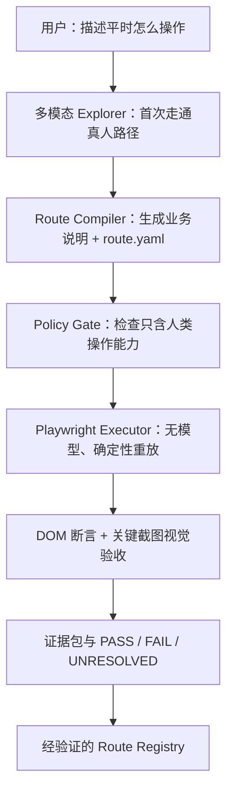
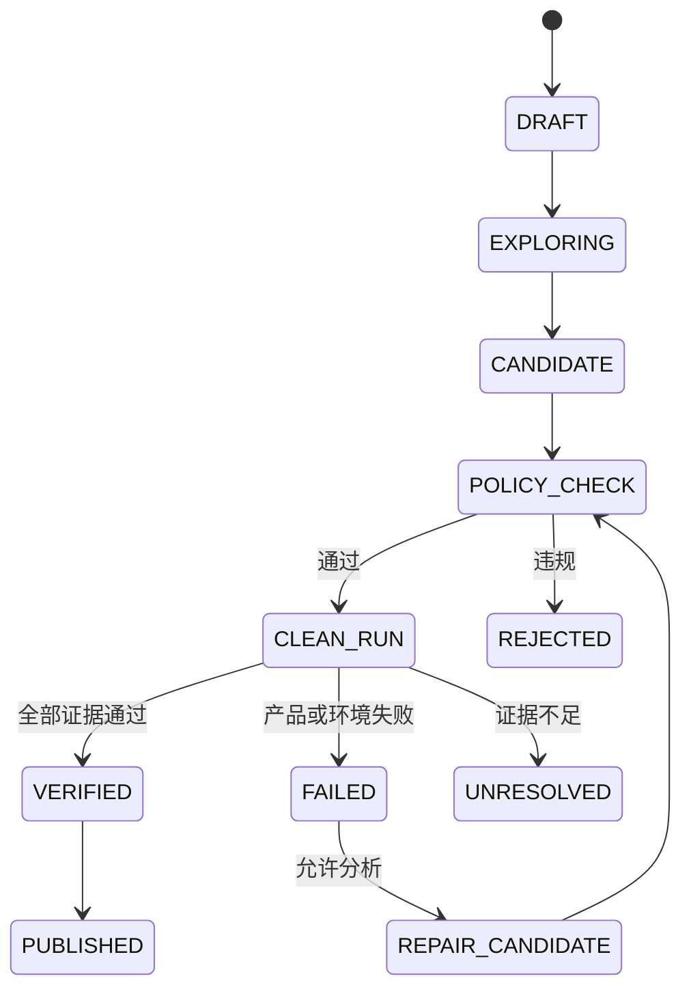

# AI 人工路径测试自动化：总体架构设计

> 文档编号：00  
> 版本：v0.1  
> 日期：2026-09-13  
> 状态：Architecture Draft / 可作为 MVP 开发总纲  
> 核心目标：让 AI 像普通用户一样通过真实 UI 完成操作，并由机器证明它没有用用户不具备的捷径。

---

## 0. 一页结论

本项目不是“让 AI 想办法把网页任务做完”，而是“让 AI 替代人工做真实的端到端 UI 测试”。两者的验收标准完全不同：

- 任务自动化关心最终业务结果是否出现；
- 人工路径测试还必须证明结果是通过点击、输入、选择、滚动等用户通道产生的；
- 直接调用业务 API、注入 JavaScript 状态、修改 Storage、Mock 成功、用 deep-link 跳过待测步骤，即使结果正确也应判为不合格。

推荐架构不是“一个更强的 Browser Agent”，而是以下闭环：



核心技术决策：

1. **Playwright 继续作为浏览器执行底座，不换技术栈。**
2. **多模态模型负责首次探路、页面大改后的重新探索；文本/代码模型负责把轨迹整理成可执行路线、分析失败。**
3. **日常回归由固定程序执行，不需要模型每次重新思考。**这比“非多模态模型每次现场操作”更快、更稳定、更可审计。
4. **正式路线优先使用受限的声明式 `route.yaml`，不直接信任 AI 随意生成的 Playwright 程序。**执行器只开放点击、输入、选择、滚动等人类操作能力，从结构上堵住调用接口的捷径。
5. **人只审核业务动作和可见结果，不审核 Playwright 代码。**系统必须自动完成防捷径审计和证据判定。
6. **吸收 Webwright 的有效机制，而不是第一版整体照搬。**采用 workspace-as-state、clean rerun、关键点截图、动作日志、脚本/路线复用、回归重放；补上 Webwright 默认不负责的 Human-path Policy 与强制能力边界。

---

## 1. 问题定义

### 1.1 用户真正提供的“标准答案”

用户只需用自然语言描述业务行为，例如：

1. 打开设备管理；
2. 点击“新增设备”；
3. 名称输入 `ABC`；
4. 类型选择 `PCS`；
5. 点击保存；
6. 看见“新增成功”；
7. 返回列表后能看见 `ABC`。

这叫 **Human Behavior Contract（人工行为契约）**。它表达的是“人怎么做、应该看到什么”，而不是：

- Playwright 应使用哪种 locator；
- 应调用 `fill()` 还是 `press_sequentially()`；
- 哪段 Python / TypeScript 代码正确；
- 自动化有没有暗中使用 API。

后四项必须由系统负责，不能把责任转嫁给不熟悉自动化代码的使用者。

### 1.2 项目成功的严格定义

一次测试只有同时满足以下三件事，才可判为 `PASS`：

| 维度 | 必须证明的内容 |
|---|---|
| 路径正确 | 所有待测业务动作均通过真实网页 UI 完成，没有跳过关键步骤 |
| 结果正确 | 每个关键节点和最终结果符合业务预期 |
| 证据充分 | 动作日志、页面状态、截图与策略审计足以支持结论 |

只完成最终状态、但路径不合格时，应判为 `POLICY_VIOLATION`，不能判为成功。

### 1.3 三类容易混淆的能力

| 类型 | 典型做法 | 能否替代人工 UI 测试 |
|---|---|---|
| 业务自动化 | 直接 `POST /api/device` | 否，只证明接口可能可用 |
| 浏览器内部捷径 | `page.evaluate()` 改状态或触发隐藏逻辑 | 否，普通用户无法这样操作 |
| 人工路径自动化 | 点击页面按钮、输入、选择、保存、观察反馈 | 是，本项目目标 |

---

## 2. 设计原则

### P1：允许 AI 看得比人多，但不允许它用人没有的业务通道

DOM、ARIA、Console、Network 可以帮助 AI 定位控件和诊断失败；真正改变业务状态的动作必须来自真实 UI 交互。

```text
允许：DOM / ARIA 辅助理解按钮是什么
允许：Network / Console 解释点击保存后为什么报错
禁止：AI 直接发送请求，绕过“点击保存”
禁止：AI 直接修改页面或浏览器业务状态，制造“已成功”
```

### P2：生成自由，正式执行受限

探索阶段允许模型尝试不同的合法 UI 路径；进入正式回归前，必须把探索结果编译成受限路线。正式执行器不接受自由终端命令，也不把原始 Playwright `page` 对象暴露给模型生成物。

### P3：失败先留档，修复另起版本

正式回归失败时，不能立即让 AI 自愈并把失败覆盖掉。必须先保存原始失败证据，再生成候选路线 `vNext`。旧路线的失败和新路线的通过是两件独立事实。

### P4：机器审代码与能力，人审业务与画面

用户界面默认展示：

- 它按什么业务步骤操作；
- 每一步是否完成；
- 它实际看到什么；
- 是否触发禁用能力；
- 最终结论及证据。

代码、selector、内部请求明细可以展开查看，但不作为用户完成审批的前提。

### P5：传统规则兜底，模型判断只处理语义

- JSON Schema、能力白名单、状态机、路径边界、动作日志完整性由固定程序判断；
- 页面“是否好看”“弹窗是否遮挡”“文字是否肉眼可读”等语义视觉问题再交给多模态模型；
- 同一个模型的自述不能单独构成通过证据。

### P6：Adopt → Adapt → Build

- Adopt：Playwright、pytest/Playwright Test、trace、截图、HAR 等成熟能力；
- Adapt：借用 Webwright 的 clean rerun、关键点证据、workspace-as-state、Skill/Route 复用；
- Build：只自研 Human-path DSL、Policy Gate、业务可读审核、路径版本与证据判定这些差异化能力。

---

## 3. 总体架构

系统分为四层，避免把所有逻辑塞进一个 Agent。

| 层 | 组件 | 职责 |
|---|---|---|
| 交互与控制层 | Task Intake、业务审核页、Orchestrator | 接收自然语言任务、选择严格度、管理状态与人工审批 |
| 学习与生成层 | Multimodal Explorer、Route Compiler、Repair Analyst | 首次探路、路线编译、失败归因、生成候选新版本 |
| 受限执行与验证层 | Policy Gateway、Human Action Driver、Checkpoint Verifier | 只执行允许的人类动作，完成断言、截图和视觉校验 |
| 证据与复用层 | Evidence Store、Route Registry、Regression Replay | 保存事实、版本、运行证据、复用与回归验证 |

### 3.1 控制流



### 3.2 首次创建路线

1. 用户描述“平时如何操作”和期望结果；系统将其保存为 `task.yaml`，原话不可被 AI 静默改写。
2. 多模态 Explorer 从声明的起点打开干净浏览器，通过截图 + DOM/ARIA 理解页面。
3. Explorer 只能调用受限动作工具：点击、键盘输入、选择、滚动、hover、拖动、文件选择等。
4. 每次动作记录动作前后截图、可见控件语义、URL、页面标题、时间和结果。
5. Route Compiler 将轨迹转换成两份同步产物：用户可读的业务步骤、机器可执行的 `route.yaml`。
6. Policy Gate 做结构校验；失败时拒绝进入正式执行。
7. Playwright Executor 在全新 browser context 中从头完整重放。
8. Verifier 逐个核对 checkpoint；通过后才允许发布到 Route Registry。

### 3.3 日常回归

```text
已验证 route.yaml
        ↓
Policy Gate 再校验版本与权限
        ↓
固定 Playwright Executor
        ↓
动作日志 + DOM 断言 + 关键截图
        ↓
PASS / FAIL_PRODUCT / FAIL_AUTOMATION / BLOCKED_ENV / UNRESOLVED
```

日常成功路径不需要调用大模型。模型只在以下情况重新出现：

- 新任务首次探索；
- 页面结构明显变化；
- 失败原因无法由固定规则归类；
- 用户批准生成路线新版本；
- 需要做视觉语义判断的 checkpoint。

---

## 4. 模型与固定程序的职责边界

| 能力 | 多模态模型 | 文本/代码模型 | 固定程序 |
|---|---:|---:|---:|
| 看截图并理解布局 | 主责 | 否 | 保存图片 |
| 首次像人一样找路 | 主责 | 辅助 | 约束可用动作 |
| 整理业务步骤 | 参与 | 主责 | Schema 校验 |
| 生成 selector 候选 | 参与 | 主责 | 测试 selector 是否唯一、可见 |
| 日常重放 | 不参与 | 不参与 | 主责 |
| 禁止 API/Storage/JS 捷径 | 不可信 | 不可信 | 主责 |
| DOM 精确断言 | 辅助 | 辅助 | 主责 |
| 页面视觉是否异常 | 主责 | 否 | 提供截图与阈值 |
| 最终发布 Gate | 不单独决定 | 不单独决定 | 机器规则 + 必要人工审批 |

一个重要修正：**非多模态模型不应成为每次回归的“操作员”。**它最有价值的位置是 Route Compiler 和 Failure Analyst。真正执行已知路线的是无模型的确定性程序；否则每次运行仍会产生新的随机决策，既慢又难证明前后等价。

---

## 5. Human-path Policy：人工路径约束

### 5.1 默认允许的状态改变动作

- `click` / `double_click`；
- `hover`；
- `type` / `press_sequentially` / `keyboard.press`；
- `select_option`；
- `check` / `uncheck`；
- `scroll`；
- `drag_and_drop`；
- 通过网页可见控件触发的上传和下载；
- 通过可见链接、菜单、Tab、浏览器正常前进/后退发生的导航。

DOM/ARIA 可以用于定位，但 locator 最终必须指向用户可见、可交互的控件。隐藏元素、不可见副本、测试专用按钮默认不可操作。

### 5.2 默认禁止的捷径

- Python/Node HTTP 客户端直接调用业务 REST/GraphQL/RPC；
- Playwright `page.request` / `context.request` 直接完成业务；
- `fetch`、XHR 或其他脚本内网络调用；
- `page.evaluate()` / `eval()` / `add_init_script()` 修改业务状态；
- 直接修改 localStorage、sessionStorage、IndexedDB、业务 cookie；
- `route.fulfill()`、接口 Mock、伪造成功响应；
- 直接访问数据库、消息队列或后端内部接口完成待测业务；
- `dispatch_event()` 或 DOM 属性修改来绕过真实交互；
- 构造 deep-link 或 URL 参数跳过声明为待测的页面步骤；
- 调用产品测试后门、隐藏菜单或仅开发环境存在的快捷入口。

### 5.3 必须区分“测试准备”与“待测路径”

一些 API、Storage 或数据库操作可用于搭建测试数据，但必须位于隔离的 Setup/Teardown 通道，并满足全部条件：

1. 明确写入 `test_boundary`，不属于本次待测功能；
2. 不得直接制造本次断言要验证的业务结果；
3. 在动作日志中单独标记为 `SETUP` 或 `TEARDOWN`；
4. 正式 Human-path 执行期间关闭该能力；
5. 报告明确告诉用户“哪些前置条件不是通过 UI 建立的”。

典型例外：如果本次不测试登录，可加载预先认证的 browser context；如果本次测试登录，就必须从登录页真实输入并点击。

### 5.4 三档测试严格度

| 等级 | 含义 | 默认用途 |
|---|---|---|
| H1 UI Channel | 所有业务状态改变必须通过真实 UI；DOM/ARIA 可辅助定位 | 所有用例必开 |
| H2 Human Interaction | 输入逐键发生，严格模拟鼠标、滚动、焦点、拖拽等交互细节 | 自动补全、键盘事件、debounce、焦点类用例 |
| H3 Human Perception | 关键节点保存截图并进行视觉语义验收 | 所有核心流程默认开启 |

默认配置：`H1 + H3`。只有测试输入法、实时搜索、快捷键、焦点顺序等交互细节时升级到 `H2`，避免所有测试都变慢、变脆弱。

---

## 6. 为什么正式执行优先使用 Route DSL

如果直接让 AI 生成任意 `final_script.py`，再用文本扫描找 `requests.post`，仍可能漏掉别名导入、动态调用、封装函数、Shell 子进程或间接注入。更稳妥的办法是让正式执行器只理解有限动作语言：

```text
AI 可以生成：点击“新增设备”
执行器知道：调用受控的 locator.click()

AI 无法表达：直接 POST /api/device
因为 Route DSL 根本没有 http_request 这个动作
```

### 6.1 示例 `route.yaml`

```yaml
schema_version: "0.1"
route_id: "device.create"
route_version: 1
human_summary: "通过设备管理页面新增一台 PCS 设备，并确认列表可见"

test_boundary:
  start_url: "${BASE_URL}/device-management"
  auth_mode: "preauthenticated"
  auth_is_under_test: false
  allowed_origins: ["${BASE_ORIGIN}"]

interaction_profile: ["H1", "H3"]

parameters:
  device_name: "ABC"
  device_type: "PCS"

steps:
  - id: "S01"
    intent: "打开新增设备窗口"
    target:
      role: "button"
      name: "新增设备"
      visible: true
    action:
      type: "click"
    expect:
      visible:
        role: "dialog"
        name: "新增设备"
    checkpoint: "CP01"

  - id: "S02"
    intent: "填写设备名称"
    target:
      label: "设备名称"
    action:
      type: "type"
      value: "${device_name}"
    expect:
      value_equals: "${device_name}"

  - id: "S03"
    intent: "选择设备类型"
    target:
      label: "设备类型"
    action:
      type: "select"
      option_label: "${device_type}"
    expect:
      selected_label: "${device_type}"

  - id: "S04"
    intent: "保存设备"
    target:
      role: "button"
      name: "保存"
    action:
      type: "click"
    expect:
      visible_text: "新增成功"
    checkpoint: "CP02"

  - id: "S05"
    intent: "确认新设备出现在列表"
    action:
      type: "observe"
    expect:
      visible_text: "${device_name}"
    checkpoint: "CP03"
```

### 6.2 两份同步表达

每个 Route 必须同时保存：

- `route.yaml`：机器严格执行；
- `route_review.md`：把同一内容翻译成用户能审核的业务步骤。

两者由同一份结构化数据渲染，避免 AI 分别写两份导致内容漂移。用户批准的是“动作和预期是否符合平时操作”，不是 locator 或源码。

### 6.3 必要的逃生口

某些复杂控件可能暂时无法由 DSL 表达。此时允许生成 `custom_action` 候选，但：

- 默认状态为 `UNVERIFIED`；
- 必须进入单独插件目录；
- 经过静态规则、能力沙箱和专门回归用例后才能启用；
- 报告显著标明它不属于标准白名单动作；
- 第一版 MVP 不应为了覆盖少数复杂控件而提前开放任意代码执行。

---

## 7. 关键组件设计

### 7.1 Task Intake

输入可以非常自然：文字描述、已有测试步骤、将来的人类录制轨迹。系统将其整理成：

```yaml
task_id: "T-001"
goal: "新增一台 PCS 设备"
start_state: "已登录，位于设备管理"
human_steps: []
expected_result: "提示新增成功，列表出现该设备"
destructive_level: "reversible-write"
test_data: {}
```

必须保留用户原始描述和 AI 结构化版本，二者不可互相覆盖。

### 7.2 Multimodal Explorer

Explorer 的输入包括任务、当前截图、必要的 ARIA/DOM 摘要和上一步结果。它只能使用一组单步工具：

```text
observe_screen
read_accessibility_snapshot
click_target
type_text
press_key
select_option
scroll
hover
drag
upload_via_picker
go_back
capture_checkpoint
```

诊断工具另设只读通道：

```text
read_console
read_network_summary
read_dom_attributes
```

诊断信息不能直接触发业务请求或改变页面状态。网页中的文字一律视为不可信数据，不能覆盖系统任务、策略或权限，防止网页提示注入诱导 Agent 执行越权动作。

### 7.3 Route Compiler

Compiler 不从零猜页面，而是读取已经走通的完整轨迹，完成：

- 合并无意义的探索动作，只保留业务路径；
- 将像素目标转换为 role/name/label 等稳定语义定位；
- 生成每步前置状态、动作、预期结果和 checkpoint；
- 标记需 H2 的输入/焦点敏感步骤；
- 参数化会变化的业务值；
- 生成用户可读的业务审核版本；
- 不确定处明确标为 `UNRESOLVED`，不得猜测后发布。

### 7.4 Policy Gateway

Policy Gateway 分三道门：

1. **Schema Gate**：动作类型、字段、参数、URL、权限均符合规范；
2. **Capability Gate**：路线只请求白名单能力，正式 Runner 不暴露 HTTP、Storage、任意 JS、Shell；
3. **Boundary Gate**：导航未越过允许域名，deep-link 未跳过本次待测步骤，Setup 未制造待测结果。

如果未来兼容任意 Playwright 脚本，再追加 AST/Semgrep 静态扫描与受限进程沙箱；但它是兼容层，不是 MVP 的首选可信路径。

### 7.5 Human Action Driver

Driver 是固定代码，负责把 DSL 动作映射到 Playwright：

- 自动等待可见、可用和稳定状态；
- locator 必须唯一，否则返回歧义，不随机选一个；
- 点击前检查无遮挡和可交互；
- 每步记录目标语义、解析到的元素摘要、动作和持续时间；
- H2 下采用逐键输入、真实焦点变化和更接近用户的滚动/鼠标事件；
- 不把原始 `page` 交给路线或模型。

### 7.6 Checkpoint Verifier

每个 checkpoint 可以组合三类证据：

| 证据 | 适合判断 | 局限 |
|---|---|---|
| 确定性 DOM/ARIA 断言 | 文字、值、可见性、选中态、URL、数量 | 不一定发现遮挡、错位、肉眼不可读 |
| 截图/视觉语义判断 | 弹窗是否真实呈现、布局遮挡、反馈是否可见 | 概率判断，不能单独证明底层状态 |
| Network/Console 只读诊断 | 解释 4xx/5xx、JS 报错、超时 | 只能解释，不能替代 UI 成功证据 |

核心流程建议同时要求确定性断言和关键截图；纯视觉结论置信度不足时返回 `UNRESOLVED`，不能为了给出答案而强判。

### 7.7 Evidence Store

每次正式执行生成不可覆盖的 `run_id`：

```text
runs/<run_id>/
├── run_manifest.json
├── route_snapshot.yaml
├── actions.jsonl
├── checkpoints.json
├── policy_report.json
├── screenshots/
├── console.log
├── network_summary.json
├── trace.zip                 # 可配置
├── failure_analysis.md       # 仅失败时
└── verdict.md
```

`run_manifest.json` 至少记录：路线版本、应用版本/commit、环境、浏览器版本、模型版本（若调用）、开始结束时间、测试数据标识和配置摘要。敏感字段、Cookie、Token、密码和个人数据必须在日志与截图中脱敏。

### 7.8 Route Registry

每条路线拥有稳定 `route_id` 和不可变版本：

```text
routes/device.create/
├── v1/
│   ├── route.yaml
│   ├── route_review.md
│   ├── baseline/
│   └── verification.json
├── v2-candidate/
└── registry.json
```

状态只允许：`DRAFT → CANDIDATE → VERIFIED → ACTIVE → DEPRECATED`。更新路线必须回放旧用例；未验证的新版本不能覆盖仍可工作的旧版本。

---

## 8. 失败分类与“不能偷偷自愈”

统一结论建议如下：

| 结论 | 含义 | 是否算产品失败 |
|---|---|---:|
| `PASS` | 路径、结果、证据和策略全部通过 | 否 |
| `FAIL_PRODUCT` | 合法用户动作已执行，但产品表现不符合预期 | 是 |
| `FAIL_AUTOMATION` | 路线或定位器自身错误，尚不能评价产品 | 否 |
| `BLOCKED_ENV` | 登录、网络、服务、测试数据等环境阻塞 | 否 |
| `POLICY_VIOLATION` | 使用或试图使用人类不具备的捷径 | 否；但本次结果无效 |
| `UNRESOLVED` | 证据矛盾或不足，不能可靠归类 | 未知 |

### 8.1 正式运行失败后的正确顺序

```text
冻结本次 run 证据
→ 固定规则尝试分类
→ 必要时让 AI 只读分析
→ 给出“产品问题 / 路线漂移 / 环境问题 / 不确定”
→ 不改旧结果
→ 如获允许，再创建 vNext 候选路线
→ 新路线单独 clean rerun + regression replay
```

### 8.2 禁止的自愈方式

- 找不到按钮后直接调用对应 API 继续后续步骤；
- 自动跳到目标 URL 并把原步骤当作通过；
- 关闭断言、降低视觉阈值或删掉 checkpoint；
- 选择另一个语义不同但“能继续走”的控件；
- 修改测试数据来迁就产品错误；
- 用新路线的成功覆盖旧路线的失败记录。

预先声明的多个 locator fallback 可以使用，但它们必须指向同一个可见业务控件，并由 Driver 验证唯一性和语义一致性。

---

## 9. 与 Webwright 的关系

截至 2026-09-13，Webwright 的公开设计重点是：把浏览器视为可丢弃环境，把代码、日志和截图视为持久状态；要求产出可重跑的 Playwright 程序；在全新目录做最终执行，并对关键点做截图/日志验证；其 Skill Factory 进一步把成功任务蒸馏为可参数化、可独立运行和可回归重放的代码 Skill。微软也明确说明它允许 coding model 自由写代码，这正是其通用网页任务能力的来源。[Microsoft Research](https://www.microsoft.com/en-us/research/articles/webwright-a-terminal-is-all-you-need-for-web-agents/) · [Webwright GitHub](https://github.com/microsoft/Webwright)

本项目的采用边界：

| Webwright 机制 | 决策 | 原因 |
|---|---|---|
| Playwright 执行底座 | 采用 | 成熟、跨浏览器、适合 E2E |
| workspace-as-state | 采用 | 轨迹、截图、日志比浏览器会话更可追溯 |
| `plan.md` / Critical Points | 改造采用 | 转为 Human Behavior Contract + checkpoints |
| clean rerun | 强制采用 | 防止探索残留状态制造假成功 |
| 截图与动作日志 | 强制采用 | 形成用户可读证据 |
| 参数化复用 | 第二阶段采用 | 降低重复探索成本 |
| regression replay | 第二阶段采用 | 防止新路线破坏旧覆盖 |
| 任意 Python 作为正式执行能力 | 不直接采用 | 难以证明没有业务捷径 |
| 同一模型自我判断 `done` | 不作为唯一 Gate | 必须叠加确定性策略与独立证据 |
| 完整 Webwright 框架 | 保持可插拔 | MVP 先验证核心差异，不增加不必要绑定 |

结论：**Webwright 是可复用的基础与方法来源，不是本项目完整答案。**本项目在它之上新增的核心价值是：人类操作能力白名单、声明式路线、强制防捷径、业务可读审批和失败不可静默自愈。

---

## 10. 推荐本地项目结构

```text
human-path-testing/
├── README.md
├── pixi.toml
├── config/
│   ├── policy.yaml
│   ├── environments.yaml
│   └── models.yaml
├── schemas/
│   ├── task.schema.json
│   ├── route.schema.json
│   ├── checkpoint.schema.json
│   └── verdict.schema.json
├── src/
│   ├── orchestrator/
│   ├── explorer/
│   ├── route_compiler/
│   ├── policy_gateway/
│   ├── human_driver/
│   ├── verifier/
│   ├── evidence/
│   ├── registry/
│   └── reporting/
├── routes/
├── runs/
├── tests/
│   ├── unit/
│   ├── policy_adversarial/
│   ├── fixture_webapp/
│   └── end_to_end/
└── docs/
```

环境建议使用用户已经选择的 pixi 管理 Python、Playwright 和项目命令；浏览器二进制与业务账号仍需按运行主机管理。第一版可优先 Python 3.12 + Playwright Python + Pydantic/JSON Schema + pytest，但核心 `route.yaml` 与接口保持语言无关，未来可替换成 TypeScript Driver。

---

## 11. MVP 分阶段实施

### MVP-0：先建立“不会作弊”的骨架

目标：在自建的小型 fixture 网页上证明能力边界真实生效。

只做：

- `task.yaml`、`route.yaml`、`verdict.json` 三个契约；
- 5～8 个常用 UI 动作；
- Policy Gateway 与受限 Driver；
- clean browser context；
- 动作日志、关键截图、DOM 断言；
- 故意注入 API、evaluate、Storage、deep-link 捷径并确认全部被阻止。

暂不做多模型编排、漂亮 UI、通用网页、自主 Skill Factory。

### MVP-1：打通一个真实业务流程

选择一个有代表性但可安全回滚的流程，例如“新增测试设备并确认列表可见”。完成：

- 用户自然语言任务；
- 多模态模型首次合法探路；
- 自动生成业务审核步骤和 Route；
- 固定 Executor 从干净环境完整重放；
- H1 + H3 验证；
- 输出一页业务可读报告。

### MVP-2：失败归因与路线更新

- 区分产品失败、路线漂移、环境失败和证据不足；
- AI 只读分析失败证据；
- 候选路线版本化；
- 旧证据不可覆盖；
- 新版本发布前 regression replay。

### MVP-3：路线复用与规模化

- Route Registry、参数化、相似任务匹配；
- 成功路线无模型直接运行；
- 页面变化才召回 Explorer；
- 评估是否接入 Webwright Skill Factory，或只实现适配器；
- 再考虑轻量审批网页、批量执行、定时回归与跨浏览器矩阵。

---

## 12. MVP 验收标准

第一阶段不能以“AI 看起来跑通了”为验收。至少满足：

1. 用户只看业务步骤与截图即可判断路线是否符合平时操作，无需读代码；
2. 正式路线无法表达 HTTP、Storage、任意 JavaScript 和 Mock 等禁用能力；
3. 执行器不会暴露原始 Playwright `page` 或 Shell 给路线；
4. 每次正式运行从声明的干净状态开始，完整从头执行；
5. 所有关键步骤都有唯一动作记录及 DOM/截图证据；
6. 注入至少 8 类捷径尝试，Policy Gate 全部拒绝；
7. Fixture 应用中人为制造“按钮被遮挡、保存接口 500、成功提示缺失、列表未刷新”等缺陷，系统不能误判为 PASS；
8. 正式失败后，即使 AI 找到新路线，原始失败证据也不被覆盖；
9. 一条真实流程连续两次 clean rerun 通过，才能从 `CANDIDATE` 晋级为 `VERIFIED`；
10. 报告必须明确区分“业务通过”“人工路径合规”“视觉证据充分”三个结论。

建议重点测量：

- `false_pass_rate`：实际有问题却判 PASS 的比例；
- `policy_escape_rate`：捷径未被拦截的比例；
- `route_replay_success_rate`：已验证路线的稳定重放率；
- `unresolved_rate`：证据不足比例；
- `mean_repair_time`：页面变化后生成并验证新路线的时间。

本项目首先优化 `false_pass_rate` 和 `policy_escape_rate`，而不是单纯追求“AI 完成任务的成功率”。

---

## 13. 本系统自身如何测试

### 13.1 Policy 对抗测试

建立专门恶意样本，尝试：

- 别名导入 HTTP 客户端；
- 通过 Playwright request context 发请求；
- `evaluate(fetch(...))`；
- Storage/IndexedDB 写入；
- `route.fulfill()`；
- Shell 调用 curl；
- 构造 URL 查询参数直达结果页；
- `dispatch_event` 触发隐藏事件；
- 使用不可见控件或测试后门。

DSL 主路径应因“没有该能力”天然失败；兼容任意脚本时，再验证静态扫描和沙箱能否拦截。

### 13.2 Fixture Web App

准备一个可控小网页，内置开关制造：遮挡、重复按钮、延迟渲染、toast 消失过快、自动补全、接口 500、列表不刷新、错误 Tab 顺序、DOM 正常但视觉不可见等问题。它是验证测试工具本身的真值环境。

### 13.3 Golden Route 与 Mutation

- Golden Route：人工确认的最小正确路线；
- Mutation：自动删除一步、替换控件、放宽断言、关闭截图、注入 deep-link；
- 要求每个有意义的变异都被 Policy 或 Verifier 捕获。

---

## 14. 安全与运行边界

- 默认在测试环境或隔离测试账号运行；
- 对删除、付款、发布、发送消息等不可逆动作设置人工确认或禁止列表；
- 允许访问的域名、下载目录、上传目录均采用白名单；
- 密码和 Token 只从密钥存储或环境注入，不写入 route、日志和截图；
- 网页内容视为不可信输入，不能改变 Agent 的系统规则；
- 每次运行设置 `max_steps`、`max_retries`、`timeout` 和总成本预算；
- 失败后默认停在证据保存阶段，不为了“跑完”继续扩大权限；
- 网络/Console 只读信息用于定位，不等同于测试通过证据。

---

## 15. 第一版用户界面只需要展示什么

第一版可以先输出 Markdown/HTML 报告，不必先造重型 Dashboard。用户首屏只需要看到：

```text
任务：新增 PCS 设备
路线：5 个业务步骤，符合 H1 + H3
结果：FAIL_PRODUCT

失败步骤：S04 点击“保存”
用户看到：页面持续转圈，没有“新增成功”提示
诊断线索：保存请求返回 500（只读观察）
防捷径审计：通过，未发现直接接口/Storage/JS 操作

[动作步骤] [关键截图] [技术证据（折叠）]
```

用户需要作出的决定也只保持在业务层：

- 这是不是我平时会走的路线？
- 这个页面结果是否正确？
- 页面改版后，是否接受候选新路线？

---

## 16. 当前明确不做的事情

- 不追求第一版适配所有网站和所有复杂控件；
- 不把浏览器自动化扩大成桌面软件自动化；
- 不让模型在正式回归时拥有任意终端和网络写能力；
- 不把 API 测试与 Human-path UI 测试混成一个通过结论；
- 不用“纯截图坐标点击”替代 Playwright 的稳定语义定位；
- 不因“自愈率高”而允许系统吞掉真实 UI 变化；
- 不先建设大型 Agent 编排平台；
- 不先精雕前端界面；
- 不把 Webwright、某个模型或某种语言锁死成不可替换的核心。

---

## 17. 后续待确认的实施输入

以下事项不会改变总架构，但会决定 MVP 的具体落地：

1. 第一条真实流程及其测试环境；
2. 当前已有 Playwright 脚本使用 Python 还是 TypeScript；
3. 运行主机是 Windows、macOS、WSL 还是远程 Linux；
4. 页面登录方式，以及登录是否属于待测路径；
5. 可使用的多模态模型与文本/代码模型；
6. 哪些写操作允许自动执行，哪些必须运行前确认；
7. 页面是否有 iframe、Canvas、复杂拖拽或文件上传等特殊控件。

在上述信息未确认前，最安全的开发起点仍然是：**先做 DSL + Policy Gate + Fixture Web App，不连接真实生产写操作。**

---

## 18. 推荐下一份文档

按开发顺序，下一份应是：

> `01_MVP实施规格_HumanPath_DSL与PolicyGate_v0.1.md`

它只展开 MVP-0，给出准确的 JSON Schema、动作白名单、Driver 接口、目录、测试样本和逐项验收命令。多模态 Explorer、漂亮审核 UI 和大规模 Skill Factory 应排在骨架被证明可靠之后。

---

## 参考资料

- [Microsoft Research：Webwright — A Terminal Is All You Need for Web Agents](https://www.microsoft.com/en-us/research/articles/webwright-a-terminal-is-all-you-need-for-web-agents/)
- [Microsoft Webwright GitHub Repository](https://github.com/microsoft/Webwright)
- [Microsoft Playwright GitHub Repository](https://github.com/microsoft/playwright)
- [Playwright 官方文档](https://playwright.dev/docs/intro)

---

## 最终架构判断

这个项目最值得做的不是“再包装一层 Playwright”，而是建立一条可证明的责任链：

```text
用户定义真实业务行为
→ 多模态 AI 只用人类通道探路
→ AI 把路线编译成受限 DSL
→ 固定程序重放
→ 固定规则检查是否越权
→ DOM + 视觉验证用户实际看到的结果
→ 保存不可覆盖的证据
→ 通过后才进入可复用路线库
```

因此，系统最终证明的不只是“任务完成了”，而是：

> **它确实像一个普通用户那样操作；如果普通用户会遇到问题，这套测试不会为了完成任务而绕过去。**
