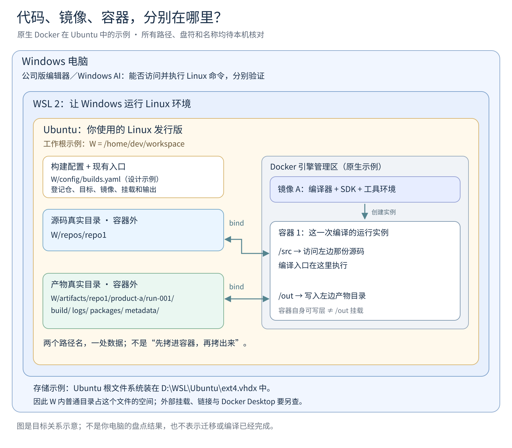
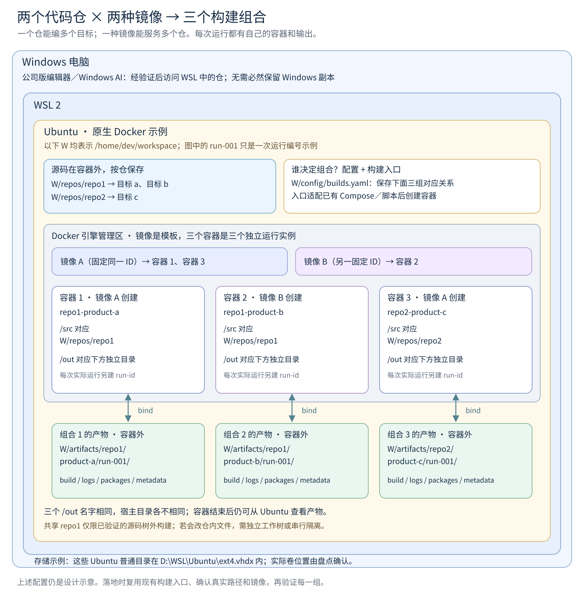
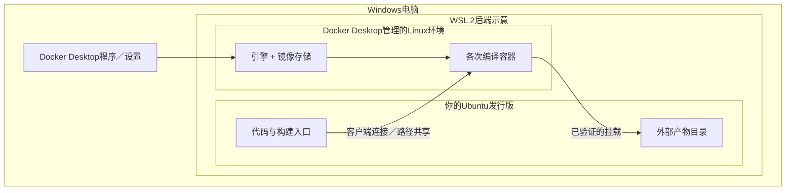

# WSL、Docker与多仓构建关系图解

版本：v1.0，2026-09-19。用途：让本目录中的盘点和部署文档可以直接对照图看，不必再翻聊天找图。

**以下是目标关系示意，不是你的电脑现状。** 两张静态图采用“Windows → WSL 2 → Ubuntu”的嵌套画法，明确选择“Docker引擎直接运行在Ubuntu中”作为示例。`dev`、`repo1`、`product-a`、`run-001`和D盘路径都只是示例；同名路径不能证明是同一份代码。实际状态以[01只读探查](01_WSL与磁盘现状只读探查_AI任务书.md)已经产出的本机报告为准；报告缺失或失效时才补查。

阅读顺序：先看下面两图理解关系，再用[02目标部署与迁移](02_多仓多镜像目标部署与迁移实施指南.md)把示意对应到真实配置、构建入口和路径。图中的嵌套表示运行环境与管理关系，不表示Windows磁盘中有一层层同名目录。

## 1. 一组构建：代码没有“搬进容器”

打开原文件：[PNG](图解/01_WSL与Docker单组合关系_示意.png) · [可编辑SVG](图解/01_WSL与Docker单组合关系_示意.svg)。SVG中的文字可编辑；PNG用于不支持SVG或中文字体不全的阅读器。

把Ubuntu理解成工作场所，镜像是预先配好的编译环境模板，容器是按模板开出来的一次工作间。正式源码和要保留的产物放在工作间外。图中的双向箭头表示同一数据的路径映射，不表示必然具有双向写权限。`bind`是绑定挂载：工作间里的`/src`看见外面的源码；`/out`写到外面的产物目录。

例如，容器里的`/out/packages/result.bin`，与Ubuntu里的`/home/dev/workspace/artifacts/repo1/product-a/run-001/packages/result.bin`是**同一份文件的两个入口**。挂载本身不负责同步两个独立副本。删除这个示例容器不会删除绑定的外部目录；但容器内程序若有写权限，仍可修改或删除外部文件。[Docker绑定挂载说明](https://docs.docker.com/engine/storage/bind-mounts/)

`workspace`只是人为选择的目录名，不是WSL规定的神秘位置。`/home/dev/workspace`、现有`/home/仓名`或厂商要求的容器`/workspace`，分别按实际用途登记；不能看到同名就断言重复。原生Docker镜像层、容器可写层和源码是不同对象，存储位置还需查实际引擎及存储后端。

## 2. 多组构建：两种镜像、三个容器、三份输出

打开原文件：[PNG](图解/02_多仓多镜像与独立产物_示意.png) · [可编辑SVG](图解/02_多仓多镜像与独立产物_示意.svg)。

本图沿用同一嵌套方式，逐个画出容器。下面的“目标a/b/c”是同仓或跨仓的构建目标示例，不是要求把代码仓根目录重新按产品划分。

| 构建组合 | 选用镜像 | 容器`/src`绑定的Ubuntu目录 | 容器`/out`绑定的Ubuntu目录 |
| --- | --- | --- | --- |
| repo1-product-a | 镜像A | `/home/dev/workspace/repos/repo1` | `/home/dev/workspace/artifacts/repo1/product-a/run-001` |
| repo1-product-b | 镜像B | `/home/dev/workspace/repos/repo1` | `/home/dev/workspace/artifacts/repo1/product-b/run-001` |
| repo2-product-c | 同一镜像A | `/home/dev/workspace/repos/repo2` | `/home/dev/workspace/artifacts/repo2/product-c/run-001` |

**组合由配置登记、由构建入口执行，Docker不会根据仓名自动猜。** [02第4节](02_多仓多镜像目标部署与迁移实施指南.md#4-谁管理组合配置为准入口负责执行)给出配置设计。图中的`config/builds.yaml`是逻辑登记示例，不是Docker或Compose原生认识的配置格式；需要适配既有脚本，或者映射成已工作的Compose配置，并验证实际启动参数。

这里的`run-001`在每个组合下分别留档；下次构建使用新的执行编号，保存`build/`、`logs/`、`packages/`和`metadata/`。镜像A的复用靠固定镜像身份及实际运行记录确认，不能只看可变标签名称相同。

图中容器1和2访问同一`repo1`，**不自动意味着可以同时编译**。如果构建会在源码目录内生成或覆盖文件，只隔离`/out`不够；应验证后采用独立worktree/副本，或串行并控制源码状态。图中的三个容器表示三次构建实例，不表示必须长期同时运行。

## 3. D盘放的是哪一层

图假设Ubuntu使用WSL 2，根文件系统保存在`D:\WSL\Ubuntu\ext4.vhdx`。这是便于说明的目标示例，VHDX实际名称、BasePath和所在卷均由本机盘点确认；WSL 1不能直接套用这个模型。[微软WSL磁盘说明](https://learn.microsoft.com/en-us/windows/wsl/disk-space)

| 对象 | 实际要定位什么 | 不能由图直接推出什么 |
| --- | --- | --- |
| Windows里的WSL组件、Ubuntu启动器 | 程序安装位置 | 程序在C盘，不等于所有代码也在C盘 |
| Ubuntu根文件系统 | 实际发行版数据文件、注册位置、挂载关系 | Linux路径以`/home`开头，不能据此断言在C或D |
| 源码、配置、产物 | 每个目录解析链接后的真实位置及所属挂载 | 工作根下的所有子目录不一定都占同一个卷 |
| 原生Docker镜像/容器层 | 当前引擎的数据目录、实际镜像存储后端及外部挂载 | 不硬认某个默认路径，也不把镜像层大小加两遍 |
| Docker Desktop数据（若使用） | 当前设置中的磁盘映像位置和实际文件 | 迁Ubuntu到D盘，不等于也迁了Docker Desktop |
| Windows代码副本、交换文件、备份、缓存 | 分别登记所在卷与占用口径 | 不能用“WSL在D盘”概括电脑上所有相关数据 |

如果`/home/dev/workspace`确实属于图示Ubuntu根文件系统，且没有指向外部的子挂载或链接，它的数据增长就反映在那个VHDX上。VHDX是承载这些目录的文件，统计总占用时不能把内部目录大小再当成另一份独立数据加上。

## 4. 如果实际使用Docker Desktop

保留已经工作的形态，按事实画图。Docker Desktop的WSL 2后端中，引擎运行在其管理的Linux环境，不能画成直接运行在你的Ubuntu里；Ubuntu中的`docker`命令可能只是连接它的客户端。其镜像和容器数据位置也要独立确认。[Docker Desktop WSL后端说明](https://docs.docker.com/desktop/features/wsl/)

这张小图只说明位置差异；Desktop内部发行版名称和数据文件安排随安装版本而异，不在本文硬编码。无论哪种形态，都应通过真实context、容器Mounts和宿主路径证据确认映射。若连接的是SSH远程Docker引擎，宿主则是远程机器，不能拿本地WSL路径直接代替远程宿主路径。

## 5. 本地AI怎样把示意图变成现状图

1. 先复用01已经形成的实际报告、02已经完成的配置和代表性构建记录，补查缺失或变化项；不要仅为了绘图重复迁移或编译。
2. 保留嵌套结构，替换真实发行版、引擎位置、仓ID、固定镜像、实际容器实例、源码和产物路径。未知项直接写“待核对”，不能用示例补齐。
3. 每条挂载关系附证据编号，每个构建组合附配置位置及最近一次实际执行记录；现状图和目标图分别命名，避免混用。
4. 图完成后对照02的验收表核对：同仓多目标、同镜像跨仓、独立产物、容器外持久化、源码写入隔离，以及公司编辑器/AI的实际可用范围。

工具的盘点、接入和通用验收只按[工具统一管理与使用指南](../工具接入与共享能力/工具统一管理与使用指南.md)执行，复用[工具状态与验收报告](../工具接入与共享能力/工具状态与验收报告.md)。本文不另建一套安装规则。

## 6. 图的来源与适用性

本次重绘依据本目录01、02的现行设计，沿用此前交流中易于理解的Windows／WSL／Ubuntu嵌套形式。检索到历史文件《Windows、WSL、Ubuntu与Docker关系图.png》《代码仓、镜像与容器放在哪儿？.png》《Docker容器与代码仓挂载图.png》，但本次未能读取原图像素，故未将它们作为已经视觉复核的旧图直接引用。当前两张PNG与SVG是新作示意图，已检查文字、边框、路径对应和渲染结果。

图中未包含真实机器测量值；未执行用户环境迁移、工具安装、产品构建或上板操作。后续本机事实应追加到执行结果中，再据此更新现状图，不能反过来用示意图证明机器已经达到目标。
