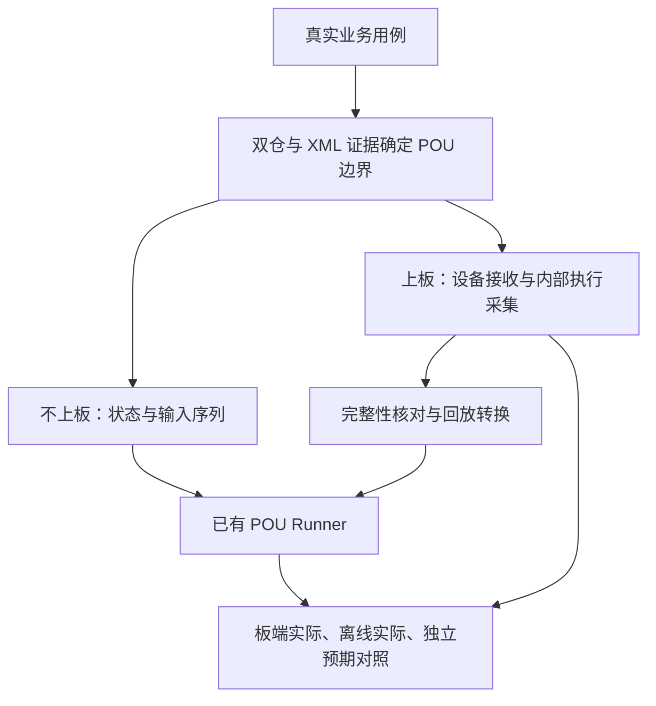

# 端到端用例与 POU 验证：场景实施方案

版本：v1.0｜2026-09-20｜总入口：[真实场景集成验证](../00_总入口与执行约定.md)。本文组织已有能力，不重建图元引擎、工具平台或第二套数据库。

## 1. 目标与责任

专业开发/测试人员提供一个真实端到端业务用例，确认业务含义和应有结果。AI 使用已完成的 WSL 产品/EMAP 事实探查和 Windows XML 分析，把用例转成已有 POU Runner 能运行的场景；上板后收集实际接收与执行数据，再回放比较。人工不需要凭经验手填所有图元内部输入。

用户已反馈测试支持 POU；具体入口、版本、状态控制与观测能力在本地承接，不假定仍局限 FB，也不声称全部 POU 已覆盖。默认公司本地 AI／DeepSeek Harness；不为本任务更换宿主。

## 2. 选一个真实用例并明确预期

优先选专家熟悉、能说明前置状态和业务结果、涉及本次关注信号的用例。不要求先覆盖所有仓和图元，也不要求每个用例都使用网页、北向、南向的全部工具。

登记产品/EMAP/模型/配置版本，准备动作、设备输入、操作顺序、模式、时间条件、最终外部结果。已有操作和模拟工具按[产品端到端指南](../../AI测试/产品端到端/BEH_产品端到端测试融合_主窗口与多工具协作探索指南_v1.0_2026-09-16.md)复用。

独立预期优先来自适用需求、协议/算法契约、设计或专家明确判断；记录适用条件、容差和依据。端到端结果不能唯一推出每个内部节点的数值时，改用 POU 输出、范围、顺序、时限或不变量断言，必要时扩大测试边界。当前实现生成的输出只能作为行为快照；“两边结果相同”是实现一致性证据，不等于业务正确。

## 3. 建立可验证的 POU 边界

读取本地双仓事实报告及实际查询结果，不从 90 GB 全仓重新索引。针对选定信号核实产品所用 EMAP 组件、实际构建与依赖身份；编译数据库按[统一流程](../../工具接入与共享能力/工具统一管理与使用指南.md#cdb)逐仓逐配置检查。

Windows 侧复用 XML 原生模型/解析结果，确认具体模型、POU 实例、端口及产品生成/绑定关系。名称相同不能建立绑定。以[模板](02_用例映射与执行记录模板.md)记录：设备点位、产品字段、EMAP/消息交接、POU 端口、类型/单位/缩放、质量/使能、状态、执行时机与证据。

重点检查 POU 边界外的全局变量、反馈、保持状态、定时器、时钟、多速率任务和调用顺序。若遗漏外部依赖，单靠端口数值不能保证重现。优先选择边界清楚的 POU，之后再下钻到 FB；不要强迫一开始把整条业务拆成最小图元。

CodeQL／Clang 用于核实调用、数据传播、写入者和机制条件；使用当前已验证入口并保留本次查询输入/输出。跨进程、跨核、分库、生成代码、回调和二进制边界按明确契约补接，不声称工具自动贯通；未提取实现明确留缺口。

## 4. 不上板：转换并运行

### 4.1 输入转换的三种来源

| 来源 | 如何产生 | 结果如何标识 |
| --- | --- | --- |
| 有明确契约的换算/映射 | 依据类型、单位、配置和时序规则确定性转换 | 条件推导；列公式、假设和证据 |
| 可在主机执行的真实上游代码 | 使用匹配版本的实际入口取得输出，再按真实交接适配 | 主机执行；保留替代层和平台差异 |
| 已有板端采集 | 校验版本、实例、时间/事件身份后转换 | 板端实测输入；注明覆盖和缺失 |

没有唯一答案时生成有依据的多个场景或标待采集，不用零/默认成功填未知，也不把 AI 重写的上游模型叫真实产品执行。转换器使用的现有代码仍可能含缺陷，关键换算须与接口/设计依据交叉核对。

### 4.2 每个用例的完整输入

保存参数和模式、初始化/复位方式、初始状态或预热序列、每步输入及质量/使能、逻辑时间/事件、执行次数和顺序、预期断言及依据。时间步长取自实际语义，不能默认一个 step 就是一拍或固定毫秒。

优先复用已有 Runner 的加载、设值、推进与取值接口，核对其是否绕经有疑问的在线 Debug 通道。状态图元保持连续运行；除用例明确要求，不每拍重置。只能读取最终输出时标内部未观测，不由输出倒算并冒充内部实测。

具体通用实施引用[不上板指南](../../工具接入与共享能力/信号追踪与运行观测/不上板信号全链路建设与验收指南_跨核与BEH图元_v1.0.md)。离线通过只覆盖已执行的软件边界与条件，不覆盖板上硬件、跨核时序或未运行的业务段。

## 5. 上板：把已有采集改成适用的执行记录

### 5.1 先核实现有采集代码

用户说明：现有界面开关可控制接入设备信号定时入库，且逻辑由己方维护、可改。先查真实取值来源（接收载荷、已换算业务对象、共享缓存或界面缓存）、采样/写库线程、数据库表、开关传播、导出和容量策略。不存在已核实的表名、函数名或通道时，不编造。

建议接收/更新事件记录与选定 POU 执行记录为主，定时环境快照按需补充。既有定时方式适合当前场景时可保留，但须声明分辨率及可能遗漏的瞬态。不能仅记录数值变化而丢掉重复消息、质量、使能、超时、序号或版本变化。

### 5.2 采集范围与内容

| 位置 | 记录时机与内容 | 证据用途 |
| --- | --- | --- |
| 设备接收/解析/更新 | 原始或必要字段、点位、序号、类型/单位、质量和来源时间（若有） | 产品此处实际收到或更新什么；不自动证明设备物理量真值 |
| 产品/EMAP 转换和跨核交接 | 实际输入输出、消息身份、版本、发送/接收/应用与返回语义 | 核对转换和传递、定位可见区间 |
| 决策/机制状态变化 | 原代码采用的条件、状态版本、操作人/上下文、成功/跳过/替代原因 | 从数值分叉继续追条件及其修改来源，不限翻面 |
| POU 消费/执行 | 实例、调用/周期、阶段、本次实际使用值、必要状态、输出 | 回放输入与板端行为对照 |
| 环境快照 | 必要的模式、连接、负载及配置变化 | 辅助解释环境；不冒充逐次执行值 |

详细实现和开关/导出规则统一按[上板指南第 17 节](../../工具接入与共享能力/信号追踪与运行观测/上板信号全链路采集建设与操作指南_跨核与BEH图元_v1.0.md#scenario-capture)；机制清单和双仓编包按[全链路机制诊断指南](../../产品与EMAP事实探查/产品与EMAP_CodeQL全链路追踪与机制诊断_上板实施指南_v1.0_2026-09-17.md)。不新建第二套工具安装手册或采集器。

快照复制当次实际使用值，不能只保存之后会变的指针，也不能后台再读同名变量代替历史值。POU 内分阶段读取的量，应记录各次真实读取/使用，不假定整个 POU 入口同时采到一张原子快照。

### 5.3 准备和执行

先修改可控的产品/EMAP 层，复用经验证的记录设施，保持业务顺序、协议布局及异常行为。每个相关构建产物都核对诊断代码已编入；EMAP 改动还须证明产品消费新依赖。生成匹配符号、配置、模型、事件格式和升级包。无真实构建条件只写准确阻塞，不生成“可上板”占位包。

打开既有开关创建采集会话，核实各域实际生效，建立已知初始状态或有效预热窗口，再执行同一业务用例。默认不依赖 BEH 在线 Debug；确需它时独立记录开启状态和影响。先验证正常链与采集完整性，再捕捉异常；一次没复现不能排除偶发问题。

关闭时停止新增采集并排空已有数据，区分“停止采样”和“导出完成”。跨核控制并非同时发生，逐域记录应答、生效序号和未收到控制的情况。异常触发可保留前后窗口，容量按实际事件速率估算；不要默认任意时长均可保留。

## 6. 板端数据如何变成回放测试

先核实格式/固件/模型版本、实例与点位、必要字段、序号缺口、覆盖/丢失、采集起止范围和关联歧义。会话号只代表同一场测试；跨核还需已有消息身份、版本与父子关系，不能靠相近时间或相同值强配。不擅改业务报文以塞入诊断字段。

优先使用 POU 实际消费记录还原输入；设备接收数据可用于回放上游链，但不能直接当成 POU 输入。稀疏样本不能未经依据插值成“真实每拍数据”。选择下列适用方式：

- 可恢复确切状态且 Runner 支持：按匹配版本恢复并验证状态。
- 可从已知初始化重跑：使用完整前序输入/事件，按语义预热到目标窗口。
- 只能获得部分状态：做有明确条件的回放；列未知和允许检验的断言，不声称精确复现。

调用同一已验证 Runner，保留原始板端文件、转换规则及转换后用例；转换不覆盖原始证据。输出三列：板端实际、离线实际、独立预期，并逐项注明比较前提、容差、时序和来源。

| 比较结果 | 下一步 | 不可直接推出 |
| --- | --- | --- |
| 两种实际一致且符合独立预期 | 固化该条件下回归用例，说明覆盖 | 全链或全部时序永远正确 |
| 两种实际一致但违背独立预期 | 查共用逻辑、映射和预期适用性 | 两个实现都算一样所以没错 |
| 两种实际不同 | 先核对状态/版本/调度/观测，再查实现差异 | GUI、板端或 Java 任一方自动正确 |
| 原始采集/状态/关联不足 | 补对应采集或缩小结论范围 | 离线未重现即板端不存在问题 |

## 7. Review、修正与验收

交付前从总入口重走 S0～S7，检查复用依据、完整依赖、独立预期、实际消费值、跨核身份、采集丢失和扰动、不可修改边界、已编入/部署身份及回放条件。检查发现问题后先改映射、配置、代码或报告中对应部分，再复跑受影响检查，保存前后证据。

分别报告：事实和映射完成到哪、不上板测试覆盖到哪、采集准备/上板运行到哪、回放到哪、业务正确性确认到哪。第一次异常观测、局部机制原因、最早违约点及已证明根因分开；可见边界间有空白时不声称根因已闭合。

最终只有一份[任务报告](../../任务记录/任务记录模板.md)及其证据索引，列出可复跑的真实入口、参数/配置、采集包、用例、断言、失败和未完成项。文档或模板齐备不构成产品验证通过。
