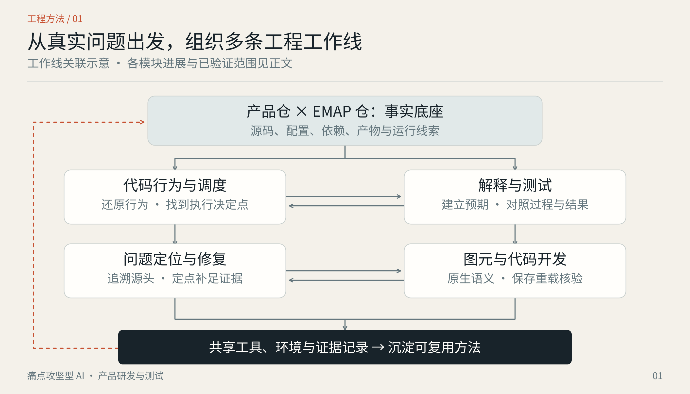
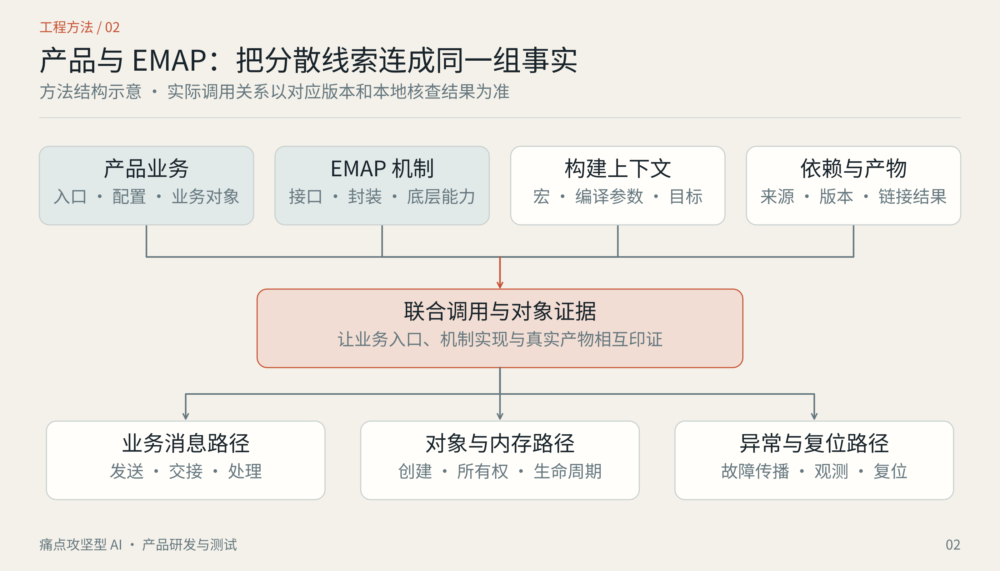
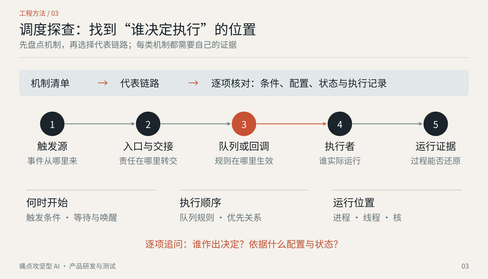
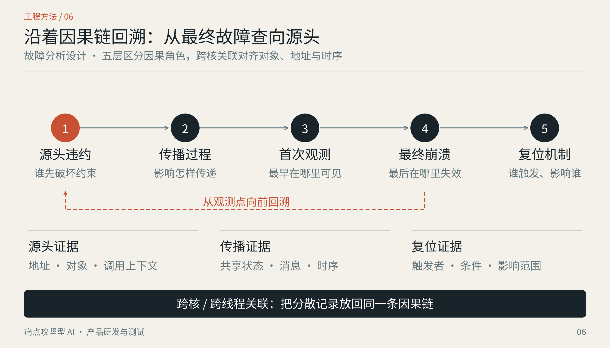
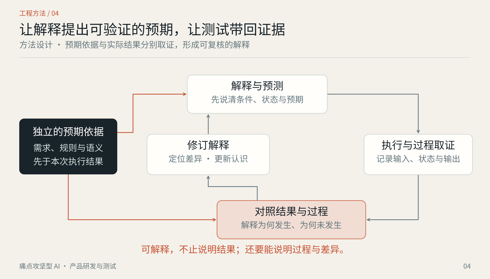
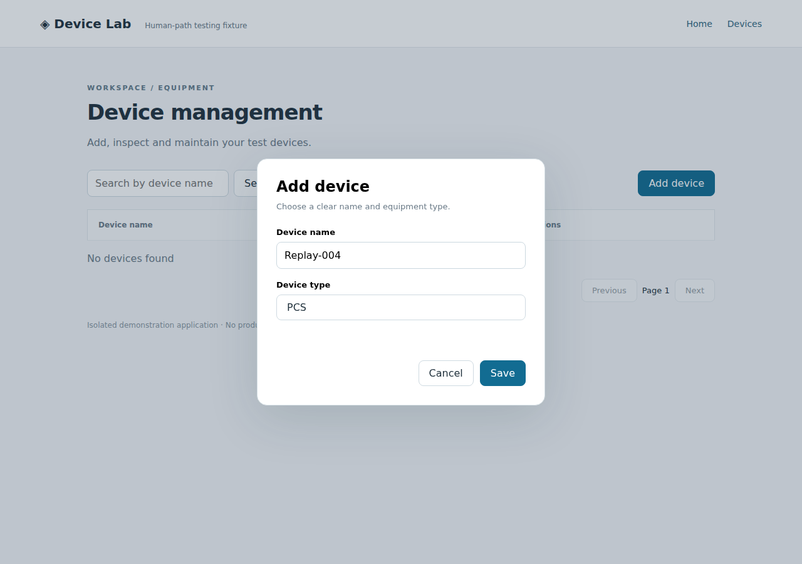
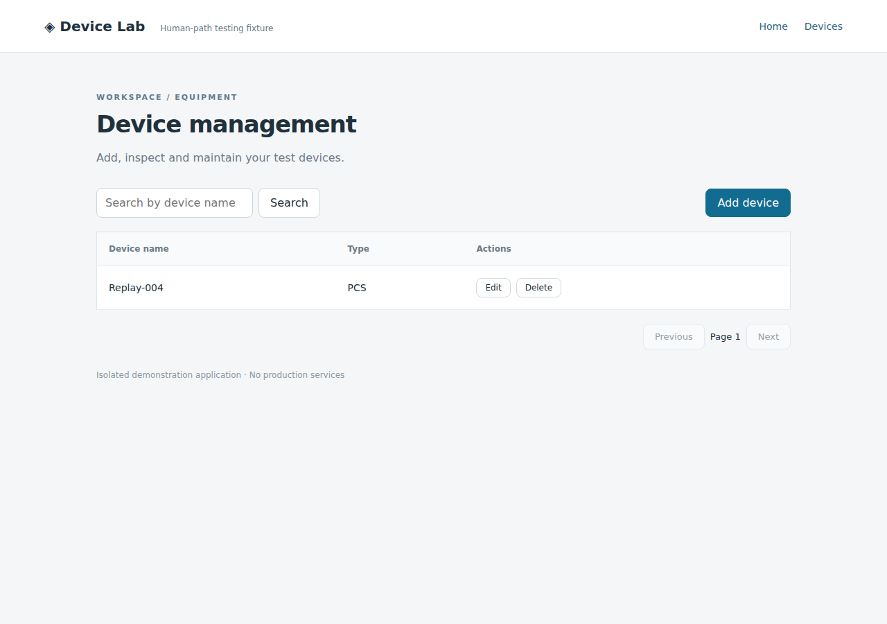
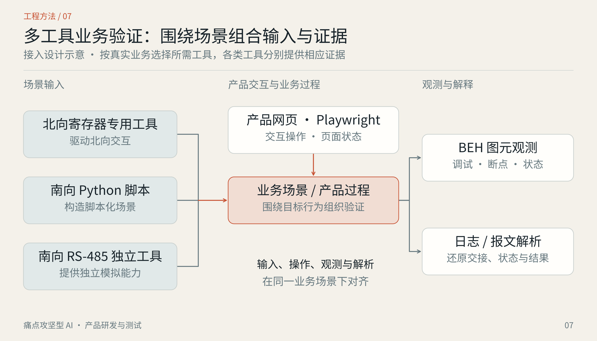
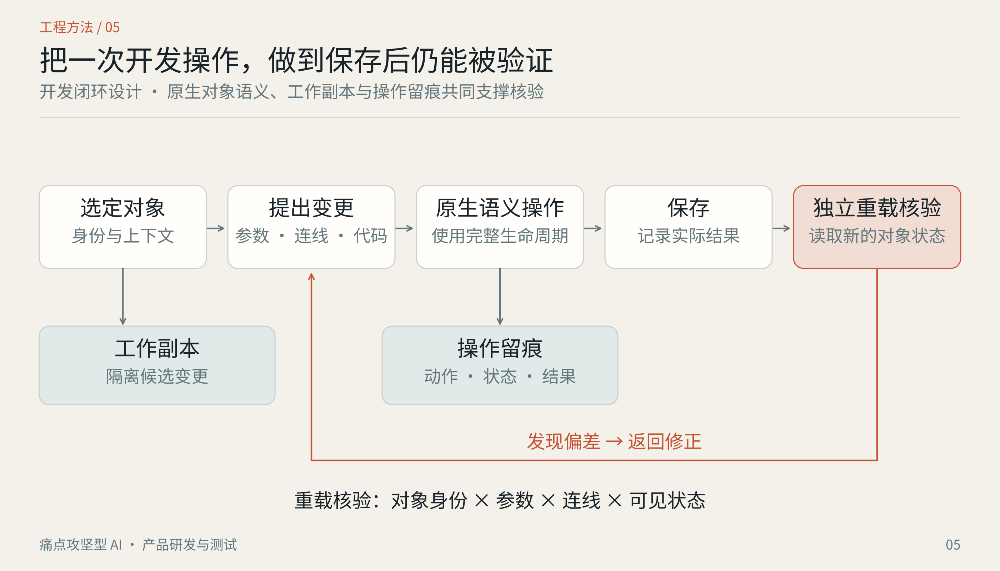
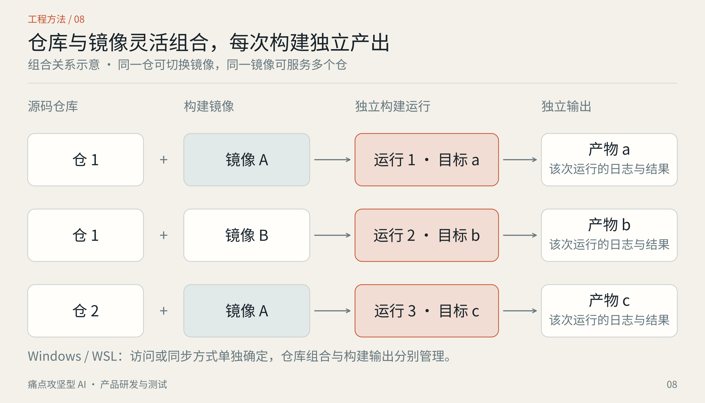

# 让 AI 进入研发深水区

## 产品研发与测试统一工作区 · 痛点攻坚型 AI 阶段成果全景

**成果展示完整稿｜2026 年 9 月 19 日**

*概念视觉：沿着一条真实问题，穿透代码、机制、工具与运行证据。*

> **这一阶段，我把 AI 应用的重点放在研发中最难啃的部分：查清真实产品、解释复杂行为、验证图元与操作、追踪跨域信号，以及为疑难故障寻找可靠证据。围绕这些问题，逐步建立一套可以持续积累、复查和接续的工程方法。**

代码写出来以后，问题常常才刚刚开始：图元为什么这样运行？一条消息跨过几个模块之后，究竟在哪里被消费？源码里的实现是否真的编进了当前设备？界面上的“保存成功”能否经得起重新打开？崩溃现场离最初的错误，又隔了多远？

这些问题需要业务理解、工程经验和多种工具共同参与。我的工作，是把问题拆解、事实调查、工具执行、结果解释和证据核验组织起来，让 AI 能够参与真实研发攻坚，并把每次探索留下的认知变成后续可以使用的资产。

这份完整稿先展开全部工作线：已经验证的结果给出范围，正在开展的工作交代最新状态，需要回工作电脑确认的地方保留明确空位。随后可以从这里提炼文章、汇报材料和成果展示 PPT。

---

### 阅读导航

| 阅读主线 | 对应章节 |
| --- | --- |
| 为什么做、整体是什么、目前走到哪里 | 01—03 |
| 产品与 EMAP 全景事实、成熟工具、调度机制 | 04—06 |
| 信号追踪与疑难故障定位 | 07—08 |
| AI 解释、图元行为测试、网页人工路径、产品端到端 | 09—12 |
| AI 图元与代码开发、网页工作台 | 13—14 |
| 环境、共享工具、数据与知识资产 | 15—16 |
| 个人能力与成果价值、待核查清单、资料覆盖 | 17—18 及附录 |

**状态口径：**“已有验证”只对应注明的样本与环境；“已有基础／用户反馈”依据工作区记录和本人反馈；“正在开展”反映当前实际动作；“方案形成”表示方法或实施材料已具备。全文的“待核查”均指需要回工作电脑确认的具体内容。

## 01 · 选择方向：把 AI 用在研发真正卡住的地方

研发人员已经能够使用 AI 辅助写代码、整理材料、生成脚本。进一步的价值，要回到真实工作的难点：看不清、解释不准、难以复现、验证不足，以及定位缺少关键证据。

这就是本阶段的定位：**痛点攻坚型 AI**。围绕具体交付问题，逐层调查和验证，直到能够说明“判断从哪里来、执行发生了什么、结论适用于什么范围”。

| 研发中的具体困难 | 本阶段建立的应对能力 | 希望留下的成果 |
| --- | --- | --- |
| 产品大、依赖多，读到的代码未必属于当前运行版本 | 产品仓与 EMAP 仓联合事实探查，核对构建、依赖和产物 | 可追溯的产品事实地图 |
| 调度、队列、回调和跨核交接交织，单看函数难理解行为 | 机制盘点、代表过程追踪、状态条件核对 | 能解释“谁决定何时执行”的机制材料 |
| 图元逻辑复杂，解释与实际行为可能不一致 | 基础解释、测试增强解释、独立预期与过程证据 | 有事实依据、可验证的解释 |
| 测试能跑，却难判断是否测到了真实行为 | 原生执行入口、可信性验真、人工路径约束与证据保留 | 可复现、可审查的测试结果 |
| 故障表现出现在末端，源头可能早已发生 | 跨核信号观测、内存生命周期与分层因果分析 | 更有针对性的诊断设计与根因材料 |
| AI 修改对象后，保存、重载、原生应用可能不一致 | 原生语义操作、候选变更、独立重载核验 | 可以审阅和验证的开发过程 |

“流程提效型 AI”与“痛点攻坚型 AI”可以相互配合。前者改善重复劳动和流程效率；本阶段选择后者作为重点，把技术精力投入到复杂系统的理解、验证和诊断之中。效率收益需要后续用真实案例测量，当前先把可用的方法与证据建立起来。

## 02 · 全景：各条工作线共用事实，也各有自己的目标

统一工作区围绕产品研发与测试组织了多个相互关联的方向。产品事实为解释、测试和定位提供依据；执行结果又能修正原先的理解；原生对象、信号观测、环境与工具则为多个方向提供共同能力。

*图 1｜能力关系示意。连线表示信息与能力的相互支撑，不表示所有模块已经完成集成。*

| 工作线 | 核心问题 | 与其他方向的连接 |
| --- | --- | --- |
| 产品与 EMAP 事实探查 | 真实产品由什么组成，当前采用哪份实现 | 为所有分析提供版本、构建、机制和依赖事实 |
| 调度联合探查 | 谁决定是否处理、何时运行、顺序和执行位置 | 深入产品事实，指导观测点与机制验证 |
| 信号追踪与运行观测 | 静态链路在一次实际运行中怎样发生 | 连接代码分析、图元测试和问题定位 |
| 问题定位与修复 | 最终故障与最初违约之间如何建立因果 | 使用对象生命周期、跨核记录和差分实验 |
| AI 解释 | 图中结构和代码行为如何用准确、易懂的语言说明 | 复用原生场景、代码关联与测试过程 |
| AI 测试 | 图元、网页操作和完整产品行为怎样验证 | 为解释、修改和问题定位提供实际证据 |
| AI 图元与代码开发 | 怎样提出、应用并验证一次正确的修改 | 使用解释结果、原生操作、保存重载与测试 |
| 网页工作台 | 人与 AI 怎样围绕同一对象看图、圈选、表达意图 | 提供统一的对象定位和交互承载 |
| 环境、工具与数据契约 | 多仓、多环境、多工具如何持续协作 | 保留可复用入口、运行记录与稳定的数据边界 |

这套组织方式的价值，是让一次问题调查产生的成果可以继续使用。例如，双仓调查查清某个回调的真实执行上下文后，调度分析、测试预期和故障诊断都可以引用同一条事实，避免各自重新猜测。

资料依据：[工作区总入口][S01]、[资料索引][S02]。

## 03 · 当前阶段：已有局部验证，真实产品攻坚正在推进

目前能够成立的阶段判断是：**工作区已形成覆盖多个研发痛点的方法、实施材料和部分可运行基础；部分方向已有明确验证，产品与 EMAP 的真实事实调查正在本地开展。各条工作线的成熟度不同，需要分别展示。**

| 方向 | 已有内容与证据 | 当前状态 |
| --- | --- | --- |
| 双仓全景事实探查 | 普通与成熟工具增强任务包、记录模板、辅助脚本、查询起点、执行与验收框架 | **用户反馈首轮已完成**：9 月 20 日补充；先承接本地报告，具体发现、版本和覆盖待本工作区回收核实 |
| 事实探查辅助实现 | 最新记录为 **53 项辅助脚本回归测试通过** | **已有验证**：适用于辅助流程；不代表真实双仓分析或语义引擎已验证 |
| 调度专题 | 产品与 EMAP 调度联合探查方案、机制范围与代表过程方法 | **方案形成**；本地专题覆盖与结果待核查 |
| 信号追踪 | 历史反馈包含产品侧 CodeQL 追踪、Windows Java 图元测试分别跑通 | **已有局部基础**；完整跨域动态贯通情况待核查 |
| AI 解释 | 基础解释已有可用反馈，测试增强解释与双环境指导已形成 | **已有基础＋增强设计**；当前接入结果待核查 |
| 图元行为测试 | 历史资料基于 **8 个真实 FB**；9 月 20 日用户确认现有测试已支持 POU | **已有 POU 支持反馈**；具体入口、运行条件和覆盖需承接本地证据 |
| 网页人工路径 HPT | v0.1.0 实现、验证报告、截图与证据包 | **已有局部实测**：106 项检查、30 次功能回放、8 类故障注入，限已记录环境 |
| 产品端到端测试 | 主窗口与多工具协作探索指南 | **方案形成**；真实场景与跨工具联调结果待核查 |
| 图元与代码开发 | 候选修改、原生操作、RoundTrip、MCP 接入实施材料 | **方案形成**；工作电脑当前功能完成度待核查 |
| 网页工作台 | 原生场景底座可行性记录、交互与验收规范 | **已有底座探索与规范**；当前界面和缺陷修复结果待核查 |
| 崩溃、复位与内存破坏 | 五层因果框架、分类假设、诊断点与实施指南 | **方案形成**；真实故障案例及诊断验证待核查 |
| 环境与共享工具 | WSL、Docker、多仓多镜像、Mutagen、统一工具指南和状态报告结构 | **实施材料形成**；真实机器部署与工具状态待核查 |

这里有两种数字必须分清：HPT 的 106 项检查属于该测试实现的已有验证；53 项属于事实探查辅助脚本。它们不能合并成“产品共通过 159 项测试”，也不能用来代表整个统一工作区的完成比例。

资料依据：[HPT 实际验证][S15]、[双仓辅助验证边界][S09]、[FB 批量适配基线][S13]；最新本地调查状态来自 2026 年 9 月 20 日用户补充；本次文档修订未独立核验公司本机报告。

## 04 · 产品与 EMAP：先把真实产品查清楚

### 4.1 从零散问答走向可追溯的事实地图

这一条工作线的任务，是弄清产品如何由代码、配置、依赖和构建产物组成，以及接口背后实际采用了什么实现。它为长期研发认知打基础，范围覆盖架构、消息、对象、内存、异常、复位和构建消费关系。

**截至本稿日期，真实双仓调查正在工作电脑上由本地 AI 开展。** 已有任务包定义了调查范围与验收方法；本轮实际查出的产品结构、后端选择和机制结论，需要从工作电脑回收后补入。

*图 2｜双仓关联方法。产品代码、EMAP 实现、构建和产物必须围绕同一目标核对；这里没有假设实际产品的核数或系统拓扑。*

### 4.2 产品仓：八类事实需要同时回答

| 事实主题 | 具体调查内容 | 查清之后能解决什么问题 |
| --- | --- | --- |
| 产品与业务职责 | 输入输出、外部接口、初始化、组件注册、业务入口、模块职责、状态所有者 | 让解释对应真实业务行为 |
| 版本与目标身份 | 产品或板型、故障版／开发版／DT、commit、未提交差异、子仓与生成文件 | 避免拿另一版代码解释当前现象 |
| 核与执行域 | 物理核、启用核、逻辑 CPU、OS／固件实例、主核／实时核等角色、镜像、任务、ISR、内存域与复位域 | 分清名称、角色与实际执行位置，避免重复计数 |
| 构建与运行产物 | 真实构建入口、有效宏、include 顺序、源文件选择、同名实现、库、链接 map／ELF、打包与装载 | 确认当前运行程序实际包含什么 |
| 消息与业务交接 | 核内队列、进程间与跨核 IPC、协议、路由、搬运、通知、分发、回调、完成、超时与重试 | 判断“发送成功”究竟完成到哪一步 |
| 对象与内存 | 堆／池、malloc／new、EMAP、共享／DMA、栈与静态对象、长度、对齐、所有权、释放与复用 | 把消息行为和对象生命周期接起来 |
| 状态与运行条件 | 过滤、去重、合并、脏标志、版本、容量、任务模式、周期消费、初始化与重启 | 解释为什么某次不处理、延后处理或读到旧值 |
| 异常与可观测性 | CPU 异常、assert／panic、terminate、分配失败、卡死、看门狗、对端复位、留档和导出 | 知道发生问题后能拿到哪些证据 |

调查还要尝试贯穿代表过程：外部输入到业务或图元、核内消息、跨核请求与完成／失败、缓冲区完整生命周期、异常到记录或复位。选择过程时按关键机制与执行域组合覆盖，避免只挑一条容易的成功路径。

### 4.3 EMAP 仓：接口名称背后的实际语义

EMAP 在这里指实际拥有源码、需要核查的仓或软件层；具体职责以源码与产品消费事实为准，也不应与链接器的 `.map` 文件混淆。

| 事实主题 | 重点核查 |
| --- | --- |
| 职责与分层 | 公共接口、核心实现、平台／OS／BSP 适配、生成、打包、测试替身；哪些自己完成，哪些转发下层 |
| 支持与实际使用 | 仓库支持哪些平台，与当前产品实际使用哪些平台分别记录 |
| API 与实现绑定 | 声明、宏／inline、实现、配置、函数表／注册、weak／strong、链接顺序与库抽取 |
| 各后端语义 | 任务／ISR 可调用性、阻塞与否、回调上下文、成功与完成、位宽／端序／布局、超时取消与恢复 |
| 内存分配释放 | 参数转换、堆／池、对齐、元信息、失败语义、锁与重入、现有保护／统计／hook、绕过 EMAP 的路径 |
| 消息运行过程 | 提交、入队／搬运、通知、分发、完成／失败、释放与复位；消息 ID 还要核对通道、版本、实例和目标 |
| 不可见下层边界 | 实际包、头文件、符号、输入输出、回调契约、配置与可观察状态；明确最小补证需求 |
| 现有异常诊断能力 | 是真实实现、空壳还是关闭分支；分别记录存在、编入、使能和验证状态 |
| 源码与产品包的关系 | 源码、目标配置、库、发布包、产品消费链是否匹配；版本字符串相同不足以证明同源 |

比如，一个 API 返回成功，可能代表完成了数据复制，也可能只代表接受了请求。不同后端的同名接口，可能在不同上下文调用回调。这类差异会直接影响测试预期、缓冲区释放时间和问题定位方向。

### 4.4 双仓关联：三类路径必须真正接起来

**业务与状态路径**从外部入口、校验转换、EMAP 接口、实际后端一直追到接收分发、真实回调和业务／图元消费，逐跳核对状态条件与完成语义。

**对象与内存路径**从申请、填充、复制／借用／所有权转移，追到对端读取、完成／取消／异常、释放和复用，回答“谁拥有这块数据、什么时候才能再用”。

**异常与复位路径**从故障或监控来源，追到处理、保存、对端通知、主核采集、导出和重启清理，同时核查故障发生后保存逻辑是否仍有机会执行。

| 可以作出的判断 | 必须接上的证据 | 尚不能自然推出 |
| --- | --- | --- |
| 源码中存在某实现 | 对应版本的源码与符号 | 已编入当前目标 |
| 当前配置选中某实现 | 源码、有效配置与实际编译上下文 | 最终链接与装载正确 |
| 当前产物包含某实现 | 编译、链接、库与包身份 | 此次设备实际运行了它 |
| 此次运行观察到某行为 | 匹配身份的产物与运行记录 | 其他版本、配置和异常过程同样成立 |

这个表描述的是跨层结论所需的关联证据。源码、产物和日志各自可以证明不同事实，不能简单用某一种证据替代全部判断。

最终要留下产品事实报告、EMAP 事实报告和双仓关联报告，以及核／域与镜像表、API—后端—包关系、机制与生命周期、证据索引、未知与冲突清单。未解决的问题也应有下一步入口，下一次接续可以从已有事实继续。

> **待核查 F01｜本轮双仓真实调查结果**  
> 预留：调查目标与版本；已完成范围；产品实际执行域；EMAP 实际后端和包来源；三类贯穿路径；已经发现的事实、冲突与未解问题。补入一张由本轮证据生成的真实架构／关系图，并保留报告与原始结果位置。

资料依据：[普通探查总入口][S03]、[产品仓任务书][S04]、[EMAP 仓任务书][S05]、[双仓关联核对][S06]。

## 05 · 成熟工具增强：让调查能够执行、复查与续接

### 5.1 三种路线，各自回答明确的问题

| 路线 | 适用目标 | 已形成的工作方法 |
| --- | --- | --- |
| 普通事实探查 | 完整回答产品、EMAP 和关联事实 | 使用现有搜索、Git、构建与产物资料，配合统一问题清单和证据模板 |
| 成熟工具增强事实探查 | 在同样的全景范围内提高定位、覆盖和复核能力 | 加入真实编译上下文、Clang／CodeQL、产物核对、执行步骤与内容验收 |
| 调度专题探查 | 深入研究是否处理、何时执行、谁决定顺序与位置 | 盘点机制，挑选代表过程，核对条件、上下文和交接关系 |

后续上板追踪与机制诊断，是所选链路具备足够事实后的动态验证阶段。它可以复用上述成果，不要求无关的全仓问题全部结束才开始。

### 5.2 分清“装了工具”与“完成分析”

增强路线围绕四件事分别留下记录：工具是否安装、能否接入真实环境、本次是否实际执行、结果是否回答了问题。WSL 中能输出版本，不等于 Docker 编译环境能够采集；数据库目录存在，也不等于关键 EMAP 文件已经提取。

2026 年 9 月 20 日用户补充确认：部分仓已有 `compile_commands.json`，不能再预设全部仓有或没有。应按仓库和实际构建配置核实文件位置、来源、时效、路径可解析性与覆盖；有效且适用的先复用，缺失或不适用的部分再选择原生导出、Bear 等采集方式。检查关键翻译单元、宏、include、响应文件、生成文件及路径映射，保持真实目标条件。

| 工具或材料 | 承担的工作 | 需要配合的判断 |
| --- | --- | --- |
| 搜索、Git 与上下文阅读 | 找入口、查版本与变更、定位候选关系 | 命中关键词只是线索 |
| 编译数据库与构建日志 | 恢复实际编译目标、宏与路径 | 检查关键文件是否漏采、配置是否混淆 |
| Clang | 在有效编译上下文中分析语法与语义结构 | 解析可用性与目标兼容性需在真实环境验证 |
| CodeQL | 查询定义、调用、引用、写入和条件关系 | 静态关系与运行目标、跨域消息需要继续核对 |
| ELF、符号、map、包与设备身份 | 确认链接、产物和实际消费关系 | 源码版本与设备包之间要能对上 |
| 辅助脚本与记录模板 | 收集、检查引用和流程、保留错误与缺口 | 机械检查不能替代代码解释和事实判断 |

### 5.3 从初始查询进入具体业务机制

现有查询起点覆盖函数定义、提取错误、命名调用、函数地址引用、其他调用点、直接变量写入和条件表达式。它们帮助组织调查，随后还要围绕真实消息、对象、状态和边界参数扩展项目查询。随包的 7 个 CodeQL 初始查询和 2 个 Clang 示例，在制作环境中尚未完成真实引擎执行验证，当前本地接入需另行留证。

例如，查到函数地址被写入注册表，还需要确认注册发生的条件和使用该表的分派位置；查到某变量被写入，也不能自然覆盖通过别名、整块复制或 DMA 发生的全部修改。

增强方案还建立了 **S00—S14 共 15 项执行步骤**与 **G0—G7 八类内容验收**。它们分别约束调查有没有按范围开展，以及身份、编译、语义、关系、机制、交叉核对和交接内容是否足够。已有结果适用时可以复用，受阻与缺失则明确留下，便于长任务中断后接着做。

### 5.4 已有 53 项辅助验证，说明了什么

最新 v1.2 记录包含 **53 项辅助脚本回归测试通过**，覆盖配置遗漏、证据错配、悬空引用、目标或基线混淆、超时与非零退出、缺少执行记录，以及错误的“完成”声明等问题。

这组测试使用临时样例和明确的模拟工具，另有主机 GCC／Binutils 合成样例；它验证辅助流程的部分保障行为。原始记录同时明确，真实工具接入、实际工具执行、产品分析与语义真值并未由这一组辅助测试验证。

**可以展示的工程成果，是让 AI 调查从一份任务说明发展为有执行入口、证据结构、遗漏检查和续接机制的工程任务包。** 本轮真实双仓运行将进一步检验它在产品上的适用性。

> **待核查 F02｜真实工具接入与执行记录**  
> 预留：实际使用的配置与命令；关键文件覆盖；CodeQL／Clang 执行结果；产物核对样例；受阻步骤；复用依据；当前状态报告。保留一份能复跑的最小示例。

资料依据：[增强探查总入口][S07]、[增强关联与验收][S08]、[验证记录与适用边界][S09]、[工具统一指南][S26]。

## 06 · 调度专题：弄清谁决定何时运行

复杂产品的行为，往往由多层机制共同决定：周期、事件、消息、队列、回调、工作线程、状态过滤，以及跨核交接。找到最终执行函数以后，还要解释触发条件、排队位置、执行上下文和完成判定。

调度联合探查把问题拆成四个直接的问句：**谁决定处理不处理？谁决定什么时候处理？谁决定先后顺序？谁决定在哪个任务、线程、核或执行域处理？**

*图 3｜调度调查方法示意。队列、回调等是待核查的机制类别，实际采用哪些机制以产品事实为准。*

### 6.1 先盘点机制，再挑选代表过程

一条链路跑通可以证明一个局部过程，但完整专题还需要覆盖产品中不同机制及其组合。方案要求先建立机制目录，记录所属模块、触发来源、入口与注册、状态条件、执行上下文、交接关系和可用证据，再选择具有代表性的过程深入。

| 调查层次 | 要回答的关键问题 |
| --- | --- |
| 触发与接收 | 外部输入、定时、消息或内部事件由谁产生，谁接收？ |
| 决策与过滤 | 哪些配置、状态、标志、版本或容量条件决定本次是否处理？ |
| 排队与交接 | 是否入队、合并、覆盖、延迟或跨域转交？接收成功代表什么？ |
| 执行与反馈 | 在哪里执行，回调如何绑定，完成／失败如何反馈？ |
| 重试与恢复 | 超时、取消、晚到、重启和复位后怎样处理旧状态与未完成对象？ |

### 6.2 同时看三种视角

**运行机制视角**解释事件如何触发、等待、执行和完成；**构建来源视角**核对当前目标实际选中了哪种实现；**能力与责任边界视角**说明哪些部分能查看、编译、修改、部署和观察，同时核查任务与中断、核与核、产品与 EMAP 之间的信息和所有权交接。三种视图共享同一配置身份与证据索引。

因此，OS 调度只是调查的一部分。产品自己的队列、任务分派、状态条件和业务完成语义，也决定了用户最终看到的行为。

这项工作体现的技术能力，是从函数关系进一步走向机制解释：不仅知道“调用了谁”，还能够回答“为什么这次调用、为什么这次没调用、在哪个上下文完成”。

### 6.3 大工程里，控制范围与交叉复核同样重要

面对此前所述约 90 GB 的仓目录磁盘规模，先区分源码、依赖、缓存和产物，再沿真实消息、状态与必要等待关系扩展调查。昂贵分析事先登记范围、资源预算与停止条件，已有结果在身份和配置适用时复用；90 GB 不能被直接当成纯源码量。

产品侧与 EMAP 侧先各自提交证据，再联合复核错误版本、同名后端、未注册回调、第二写入者、取消恢复和日志缺口。专题按自己的阶段推进，首个代表过程提供试点经验，之后仍要回到机制清单核对覆盖。

> **待核查 F03｜调度专题的真实覆盖**  
> 预留：已盘点的机制；已完成的代表过程；入口、排队、执行和完成证据；关键状态条件；尚未覆盖的机制。优先补入一个能说明技术难度的真实过程，避免只列函数名。

资料依据：[调度联合探查方案][S10]、[产品多核与 BEH 背景记录][S11]。背景记录中的历史描述作为检索起点，实际拓扑仍由本轮调查确认。

## 07 · 信号追踪：连接代码中的关系与运行中的事实

理解一条信号，通常要跨过输入、消息、模块、图元、输出等多个边界。静态代码能提供候选路径，运行记录则说明一次具体执行中实际发生了什么。两者结合，才能把“应该经过哪里”与“这次经过哪里”进行对照。

工作区已经分别形成上板与不上板两套建设和验收指南，并复用产品代码追踪与 Windows Java 图元测试的已有局部基础。

| 路线 | 能够提供的证据 | 需要保留的边界 |
| --- | --- | --- |
| 不上板：宿主执行、回放、适配或桩 | 已覆盖软件路径的输入输出、状态变化、图元行为、可重复测试 | 不自动证明真实硬件时序、跨核竞争或设备外设行为 |
| 上板：真实目标与诊断采集 | 实际执行域、时序、跨核交接、设备状态、运行异常 | 诊断代码是否进入实际包、观察点开销与记录完整性需要确认 |
| 静态关系＋动态对照 | 把运行现象映射回代码、对象和机制，找出缺失或异常的交接 | 未观察到不必然等于未发生，需考虑覆盖和采集能力 |

两条路线可以互相补充。宿主侧适合快速建立可重复的软件行为验证；板端用于补齐必须依赖真实目标的事实。具体问题需要哪类证据，应由判断目标决定。

### 7.1 追踪记录应当能跨过交接点

一次有效的全链路调查，需要考虑信号或请求身份、阶段、对象、执行上下文、状态、时间信息和完成结果。跨核或跨工具之后仍要能够关联，时钟不可直接比较时也要明确说明。

对于诊断改动，还要核对源码、目标配置、编译产物、产品实际消费、打包与设备运行身份。否则，修改虽然出现在工作目录中，设备上运行的仍可能是另一个包。

### 7.2 不上板链路，也要说明每一段实际怎样连接

| 连接类型 | 能够证明的内容 |
| --- | --- |
| 真实 Linux 依赖参与运行 | 该实现与该场景的软件集成结果 |
| 契约适配传递实际业务输出 | 两侧真实业务在声明的替代通信方式下完成衔接 |
| 分段回放 | 使用有来源、可校验的历史输出验证后段 |
| 静态关系或独立测试 | 已有结构或局部行为依据，连续执行尚未证明 |

一条链可以混合这些类型，但每段要标清。DT 的发送桩不能只返回成功，而要保存本次业务真实输出，再按已查明的契约交给接收侧。还要判断 Java 图元与产品生成的 C／C++ 是上下游，还是同一逻辑的两种实现：前者传递实际输出，后者用共同输入对照，避免重复计算后误称整链贯通。

已有的 2／4 字节对齐差异也是具体调查点：先查清它指结构体对齐、成员偏移、实际地址还是协议布局，再对照目标与 DT 的类型、宏和 ABI。浮点值保留类型、单位、原始表示与精度，业务容差有独立依据；不能靠统一添加 `packed` 或临时放宽容差使测试通过。

信号还要映射到真实产品模型中的 BEH 实例、端口、缩放和生效周期。源码推算值、DT 实测值、BEH 实测值、适配值和回放值分别标注来源，避免在图上混成同一种“真实值”。

### 7.3 从“参数没有生效”推进到可验证的诊断包

相关上板指南已经形成七段实施路线：锁定版本与成功契约、完成所选链路的双仓分析、从机制卡生成观察点、实施运行记录、重编 EMAP 并核对产品实际消费、逐执行域核验诊断包并采集正常／异常样本、对照机制验证候选原因。

HTTP 成功、发送返回、接收、应用、图元消费和网页回显分别判断。观察点要说明记录的是调用前、返回、接收回调、转换后还是图元真实执行。指南中的后续项目查询要求，与增强包现有初始查询分别管理，不能据此宣布项目分析已经完成。

目前这部分是具体实施成果，真实诊断包、部署与上板对照结果需要在 F04 中补入。

### 7.4 当前证据如何表述

历史反馈表明，产品侧 CodeQL 追踪与 Windows Java 图元测试分别已有跑通基础。它们为联合验证提供了条件，但完整跨核、跨工具、跨 BEH 的动态关联结果仍需要本地记录确认。

> **待核查 F04｜一条真实信号的完整故事**  
> 预留：输入与预期；产品代码路径；EMAP 交接；图元执行；输出或异常；使用了哪些静态与动态证据；哪些环节仍未观察到。补一张真实信号图和一组能对应起来的日志／Trace。

资料依据：[上板信号采集指南][S20]、[不上板信号建设指南][S21]、[CodeQL 上板追踪与机制诊断指南][S12]。

## 08 · 疑难故障：从最终崩溃向源头追问

跨核崩溃、复位与内存破坏，是痛点攻坚方向中技术难度很高的一类问题。最终报错的位置可能只是损坏被发现的位置，早先的错误写入、对象提前释放或状态失配，可能已经传播很长时间。

工作区针对这一类问题形成了分层因果框架与实施指南，要求先建立相互竞争的假设，再设计能区分这些假设的观察和实验。

*图 4｜故障因果调查框架。它是诊断设计，具体故障属于哪条路径，需要真实现场与验证结果支持。*

| 因果层 | 需要问的问题 | 适合寻找的证据 |
| --- | --- | --- |
| 源头违约 | 最早在哪一步违反了长度、所有权、生命周期或并发约束？ | 最早错误写入、对象身份、申请与释放、边界条件 |
| 传播 | 错误如何经共享对象、消息、缓存或后续操作扩散？ | 交接记录、复制范围、版本与状态变化 |
| 首次观测 | 哪个检查或操作首先发现异常？ | 保护检查、分配器异常、断言、异常状态 |
| 最终崩溃 | 最后在哪条指令、哪个调用现场触发故障？ | PC、寄存器、栈、异常类型、对应符号 |
| 复位机制 | 为什么最终复位，谁发起，哪些信息保留下来？ | 看门狗、对端状态、复位原因、留档与导出记录 |

### 8.1 一个 `bad_alloc`，背后可能是不同的问题

分配失败需要结合实际分配器和现场细化假设，不能单凭异常名称就选定根因。

| 竞争假设 | 有助于区分的证据 |
| --- | --- |
| 泄漏或生命周期未闭合 | 对象代次、持有者、应释放路径与实际释放记录 |
| 合法峰值或专用池限额 | 失败池、容量限制、峰值和并发未完成对象 |
| 碎片或尺寸类别限制 | 能满足本次请求的块、请求分布与失败时状态 |
| 异常大申请或计算错误 | 长度来源、乘加过程、单位、已有容量和增长策略 |
| 元数据破坏、释放后使用或重复释放 | 最后完整检查、相关写入、申请／释放与复用过程 |

同样，主核最后触发复位，不意味着主核就是最早出错的位置；另一个执行域早先发生异常，可能通过超时或监控机制才在主核表现出来。

### 8.2 诊断设计要能回答具体疑问

实施路线从锁定部署和符号身份开始，随后设计最小记录、在可控产品与 EMAP 层实施并验证取证能力，再通过复现界定最后正常与首次异常区间，逐轮收窄并做因果对照。

先锁定对象、容量、所有权和分配代次，在合法交接点检查。同一代次最后正常于 A、首次损坏于 B，先得到异常区间，再查其中的写入者、长度来源、并发复用和异步完成。按条件使用保护检查、硬件监视点或宿主回放，继续收窄；监视点未必覆盖对端核或 DMA，捕获错误指令后仍要追问错误参数或过期对象从哪里来。

申请来源尽量在可控申请、容器增长和长度解析点提前记录；已有 hook、调试器抛出捕获和 ABI 拦截按真实条件评估。最终 `terminate` 处可能已经丢失原来的业务栈，所以“在哪里留证”本身就是诊断设计的一部分。

### 8.3 记录不能掩盖故障，复位之后还要取得出来

前史记录采用预分配、有界方式，对象带代次以避免地址复用误关联。热路径、中断和异常入口不能临时分配内存、等待普通锁或同步输出文件；还要核查并发提交、半条记录、丢失和覆盖。新增日志不能顺手增加业务大锁或改变同步，把原有竞争掩盖掉。

故障后取证需要逐项核对任务重启、单域复位、整机温复位与掉电时，哪些存储保留、启动是否清除、谁还能读取。周期导出、存活域读取、启动早期留档和探针各有前提，`.noinit` 不等于掉电留存。若导出仍全部依赖同一个失效主核，应保留这项能力缺口。

诊断与修复分别验证。修复对照保持相当触发条件与同一观测配置，检查改变的是否为对应错误机制、相邻场景是否受影响、结果能否重复。只加延时或大锁后暂时不复现，不能自动作为根因证明。当前材料提供了这套实施方法，真实根因与收益仍等待具体案例。

> **待核查 F05｜真实故障案例与诊断实施**  
> 预留：故障现象；版本和复现条件；已排除的假设；最关键的新增证据；源头到复位的因果链；修复及回归结果。若暂未形成确定根因，就展示调查收敛到哪一步。

资料依据：[跨核崩溃、复位与内存破坏实施指南][S22]、[定位材料模板][S23]。

## 09 · AI 解释：让人看懂，也能回到事实核对

### 9.1 一片复杂图，怎样讲成清楚的过程

图上的左右位置未必代表执行顺序；线条交叉未必表示连接；同名图元未必是同一个实例。局部选区也可能受到圈外输入、参数、Continuation 和关联代码影响。

基础解释以原生节点、端口、连线、参数和关联代码为依据，围绕选区与用户问题组织输入、处理、输出和分支关系。解释契约要求关键步骤关联具体对象、连线或代码范围，查不到或有冲突的地方明确保留。

专业版和通俗版共用同一组结构化事实。专业版便于技术核查，通俗版便于理解业务含义；阈值、单位、方向、时间条件和未知项在两版中保持一致。

**当前基础解释已有可用反馈。** 已形成的任务／结果契约、对象引用和代码关联方法，支持后续叠加测试证据；最新样本范围与准确性案例仍需本地材料补充。

### 9.2 两档解释，分别服务不同问题

| 模式 | 回答的问题 | 需要的依据 | 适合呈现的内容 |
| --- | --- | --- | --- |
| 基础解释 | 这个结构和实现预计怎样工作？ | 原生结构、配置、参数、关联源码 | 输入—处理—输出、分支条件、边界和未知 |
| 测试增强解释 | 在指定条件下，实际发生了什么？ | 与当前版本及对象匹配的测试输入、状态、输出和过程 | 关键事件、状态变化、预期对照、差异与原因 |

*图 5｜测试增强解释的设计关系。预期依据和实际结果分别取证，避免用本次输出反过来证明自身正确。*

### 9.3 测试增强的重点，是把过程讲明白

融合方案先把技术用例翻译为可读的“场景卡”：测什么、初始条件是什么、怎么操作、预计会怎样、依据是什么。运行后再说明关键周期或事件中输入、状态和输出如何变化，哪些内容来自实测，哪些仍是源码推断。

出现差异时保留原预期和原结果，通过最小补测区分候选原因。例如，只改变一个参数或一种初始状态，观察分支是否改变。补测服务于具体疑问，已有且适用的结果可以直接复用。

同时分开三个判断：预期依据是否可靠、执行与检查是否成立、解释结论是否有证据。程序符合一个“由当前实现推导的预期”，仍需要另行判断该预期是否符合业务要求。

### 9.4 “连接产品”与“测试增强”是两条独立维度

连接设备后，值可能来自真实设备、缓存、仿真或本地模型，执行与调度也未必都迁移到板端。需要查清加载、对象绑定、采样、读值和时钟关系。界面刷新不能直接当设备采样，“一拍”也不能在没有依据时换算为固定毫秒数。

夜间长时测试形成的记录，可以用于次日回看和解释；回看历史记录与本次重新执行分别标识。融合层的自动接入、回看和恢复，需要单独验收。

> **待核查 F06｜一份能展示能力的真实解释案例**  
> 预留：原始图元选区；专业版与通俗版解释；对应代码和对象；已有测试如何支持或修正解释；仍未知的条件。补入基础解释当前效果，并确认测试增强层已接入到什么程度。

资料依据：[两档解释与测试增强规范][S17]、[双环境融合实施指导][S18]、[解释任务与结果契约][S32]。

## 10 · 图元行为测试：让真实实现持续运行，让错误被发现

### 10.1 测到真实 BEH，是第一道技术关

这一方向首先解决执行真实性：围绕真实 Parser、Model、Manager、Director 和 Runtime 建立自动驱动，输入适配与输出读取负责驱动和观察，不在外围重新实现被测算法。

Headless 表示不需要人工操作可见界面，但部分 GUI／RCP 相关模块仍可能承担注册、类加载、模型上下文或生命周期职责。裁剪依赖需要依据真实调用链判断，保留可核对的运行物与类来源。

既有 CB 测试能力独立保留，已经跑通的 Runner 和输入输出通道持续复用。新接入遇到的问题，优先判断属于对象差异、公共适配、执行生命周期，还是真正的产品缺陷。

### 10.2 从 8 个 FB 的历史基线走向公共能力复用

9 月 7 日手册记录了基于 **8 个真实 FB** 的继续推进方法，之后有 FB／CB 长时运行反馈。2026 年 9 月 20 日用户进一步确认已有测试支持 POU；应承接实际入口、版本及覆盖证据，不能继续用 8 个 FB 限定当前能力。

| 批量推进中的设计 | 它解决的实际困难 |
| --- | --- |
| 定义、配置变体、测试场景分别计数 | 避免实例和用例数量被误当成图元种类 |
| 元数据发现与受控加载分开 | 避免扫描未知对象就触发复杂初始化 |
| 能力匹配与公共适配 | 相同类型、通道或生命周期问题得到集中处理 |
| 对象描述、真实上下文、独立用例分工 | 测试外围保持清晰，不混入被测业务算法 |
| 逐项记账、超时隔离、清理与恢复 | 单个阻塞不会吞掉整个批次的执行情况 |
| 公共问题修复后回归相关对象 | 一次攻坚可以服务一组对象，同时保护已有基线 |

### 10.3 可信性：测试自己也需要被检验

AI 阅读实现后生成预期，再用相同逻辑比较结果，可能形成自证循环。因此，需要区分需求规则、数学定义、可信历史基准、独立参考和当前实现推导出的预期。实现推导可以用于行为快照或回归，业务正确性仍需适用依据支持。

可信性规范进一步关注代表性错误能否被检出：边界、运算、参数、连接、状态、时序或初始化变化是否触发有效失败。变异、隐藏场景、性质与不变量等方法按实际风险使用。仅把 Expected 改错，只说明比较器会报错；语法或加载失败，也不能替代业务错误检出。

### 10.4 Java 图元结果有独立价值，也有明确范围

无板条件下，Java 图元测试可以持续承担行为验证、边界探索与组件回归。生成的 C／C++、跨核通信、产品集成和硬件时序则需要各自的执行证据。这些方向可以共享输入与规则，但结果身份不能混用。

> **待核查 F07｜当前 FB／CB 的真实规模与代表成果**  
> 预留：最新定义数量、配置与用例数量；持续运行时长；失败／阻塞及公共根因；已经修复的问题；可信性验真覆盖。选一个“发现共因—修复公共能力—多对象回归”的真实案例，展示从单点解决走向复用的过程。

资料依据：[FB 行为测试 v2.0][S14]、[全库发现与批量适配][S13]、[测试可信性验真][S16]、[AI 测试复用规则][S33]。

## 11 · 网页人工路径 HPT：让自动化结果经得起真实操作检查

### 11.1 把“界面操作成立”作为单独目标

网页自动化如果在按钮点不到时改用接口，在数据没保存时直接改存储，就可能获得一个成功结果，却没有验证用户真正能走通这条路径。

HPT 的工作重点，是把看图探路、路线编制、确定性重放、独立业务预期、视觉复核和证据封存分开。AI 通过实际截图探索允许的界面动作，固定 Playwright 执行器重放路线，业务预期独立提供。探路结束不会自动获得通过结论。

归档保留了基于实际截图形成的 9 步探索路线，与预写示例分别保存，随后换参数独立重放。已验证路线按版本保存；定位语义、动作或预期变化时形成新契约并重新验证，避免沿用不再适用的旧结论。

| 环节 | 在已有 MVP 中的作用 |
| --- | --- |
| 实际看图探路 | 基于观察编号提出受限动作，留下探索来源 |
| 路线与行为契约 | 记录动作顺序、业务目标与检查点，参数化复用 |
| 固定执行器重放 | 通过允许的 UI 动作执行，避免随意换路径 |
| 独立结果检查 | 对照冻结的业务预期，保留功能、路径和视觉的不同状态 |
| 证据封存与复核 | 保存原始记录、关键截图和摘要，检查完整性与历史身份 |

执行通道对任意脚本、业务 HTTP、Storage 写入、Mock 成功和强制点击等捷径设置了约束。按钮遮挡、未持久化或证据不全时，保留相应失败或未完成状态。该通道约束有明确范围，不等于整个主机的隔离机制。

### 11.2 真实截图：填写之后，还要核对持久化

*图 6｜2026 年 9 月 13 日归档实测画面：在本地 Device Lab 测试夹具中，经界面输入设备名 `Replay-004` 和类型 `PCS`。这是测试组件的真实截图。*

*图 7｜同一归档场景的持久化检查点。结果中仍可见对应设备，用于检查操作后状态；画面来自本地隔离测试夹具，尚不能代表公司产品接入效果。*

### 11.3 已有验证的数字与范围

| 归档验证项目 | 结果 | 可以说明什么 |
| --- | --- | --- |
| 实现与协议等检查 | **106 项，0 失败、0 错误、0 跳过** | 记录环境中的本地实现检查通过；不是 106 条产品业务场景 |
| 功能回放 | **10 个场景 × 3 次，共 30 次** | 新增、必填、重名、取消、搜索、分页、编辑、逐键输入、删除与空搜索的确定性回放 |
| 故障注入 | **8 类** | 覆盖遮挡、不可见、500、未持久化、错误类型、重名按钮、延迟提交和键盘事件要求 |
| 证据归档审计 | **50 份包，归档审计记录 issues 为空** | 封存包完整性检查结果；其中包含预期失败记录，不代表 50 个业务场景全部成功 |
| 独立安装 | 同一 Linux 主机的新虚拟环境中安装 wheel，源码目录外运行 demo | 组件可通过安装包运行；不是跨平台或第二台机器验证 |

这些数据来自 v0.1.0 的归档报告与原始结果，本次成稿核对了记录，没有将它们表述为本次重新运行。

### 11.4 一个更能说明工程质量的细节：保留未完成结论

一次换参数重放完成了 9 个动作与功能断言，但当时缺少在线视觉服务，因此原运行保持 `INCOMPLETE`，视觉状态为 `not_checked`。随后对截图进行独立视觉复核，得到视觉通过与 `assessed_ui_result=PASS`，仍保留原运行和完整认证的 `INCOMPLETE` 状态。

这里体现的能力，是把“完成了什么检查”和“还缺什么证明”准确留下。后续评估可以增加证据，但不能覆盖当时真实发生的结果。

留档中还曾发现记录与封存摘要不一致，复核据此拒绝相关证据；后续采用事件原子快照、不可覆盖的二进制证据包和独立进程复核，保留历史拒绝样本。这些工程细节让测试成果更容易被复查。

### 11.5 目前适用在哪里

现有实测对应 Linux、Chromium 与本地 Device Lab 夹具。外部模型供应商连接、真实产品、Windows／macOS、中文输入法、Canvas／BEH 画布、原生 Java 窗口和系统文件窗口等，不由这组结果证明。

> **待核查 F08｜真实产品接入与可展示演示**  
> 预留：工作电脑是否已接入真实产品网页；采用的场景和版本；一次完整 UI 路径的截图／Trace；功能、路径、视觉分别怎样判定。若尚未接入，保留当前本地 MVP 的展示范围即可。

资料依据：[HPT 项目入口][S34]、[实现说明与边界][S35]、[实际验证报告][S15]、[原始实测证据包][S36]。

## 12 · 产品端到端：把六类工具组织成一条业务证据链

产品级问题经常藏在环节之间：网页已经保存，配置是否生效？图元已经输出，命令是否送达？设备已经反馈，页面是否显示正确？单个工具的成功，通常只证明其中一段。

这条工作线围绕一项真实业务，将外部动作、内部处理、输出、反馈和页面表现组织在同一个任务中，按实际路径选择工具并关联证据。

*图 8｜多工具协作设计。实际场景只选择需要的能力；不能预设每条业务都经过 BEH 或图中全部工具。*

| 能力 | 负责的环节 | 当前起点与需要核对的内容 |
| --- | --- | --- |
| 产品网页 Playwright | 配置、用户操作、结果呈现、日志或抓包导出 | 已有操作与解析实践线索，核对当前页面、版本和场景 |
| 北向专用寄存器工具 | 北向设置与读取 | 核对协议、功能、字段映射与可控入口 |
| 南向 Python 模拟脚本 | 已支持的模拟信号与通信行为 | 已有 AI 可直接运行的反馈，继续复用并核对场景覆盖 |
| 南向专用 RS-485 模拟工具 | 另一套独立设备模拟能力，如电表模拟 | 单独调查配置、控制、占用与取证方式 |
| BEH 图元观测 | 业务相关的输入、状态、输出及调试过程 | 查明连接、值来源、对象绑定、断点与执行状态 |
| 日志与报文解析 | 收发、接收、异常和过程证据 | 区分浏览器网络、产品抓包和南向收报，保留原始文件引用 |

### 12.1 难点在跨工具含义一致

同一个业务量，在页面、寄存器和图元端口中可能采用不同单位、倍率、字节序、精度或刷新周期。比较之前要建立映射，同时判断数据是否新鲜、属于哪次请求、来自哪个设备或实例。

工具之间还会涉及生命周期和资源占用：模拟进程持续运行、串口互斥、连接会话、采集窗口、超时和恢复。它们应由适合的程序稳定执行，AI 围绕任务负责调查、解释和失败分析。

### 12.2 统一入口，复用已有执行能力

设计建议以一个主任务入口协调多种工具，具体接入服从源码调查和最小运行验证。已有 Python 脚本能直接调用就继续使用；产品网页复用 Playwright；只有在接入需要时再增加 MCP 等适配。工具类型的数量，不要求对应同样数量的 Agent 或服务。

完整无人值守、多窗口持续运行、中断恢复和端到端自动判定仍要靠实际宿主与运行记录验证。目前已形成明确的协作设计，部分已有工具提供起点。

> **待核查 F09｜一个真实业务的跨工具验证**  
> 预留：业务目标与预期；本次实际用了哪些工具；量值映射；输入、内部处理、外部反馈与页面结果；失败定位在哪一环。补入一组可关联的实际记录，说明相较单工具观察多看清了什么。

资料依据：[产品端到端主窗口与多工具协作指南][S19]。

## 13 · AI 图元与代码开发：修改之后，必须仍然成立

### 13.1 从意图到可审阅候选

AI 开发的目标，涵盖查找真实组件、创建实例、修改参数、连接端口、调整适用布局、修改关联代码，并生成影响分析和验证计划。每一步围绕已查明的组件与作用域进行，最终对象身份、Relation 和隐藏元数据交由原生层维护。

方案以工作副本承载候选变更，保留原工程基线、差异与版本。图元操作使用结构化提案，C／C++ 采用绑定基线和范围的代码补丁；提出、应用、验证和确认之间都有可检查的结果。

*图 9｜开发闭环设计。当前材料已经明确实施与验收方法，实际 Bridge、MCP 和完整保存重载结果需要本地核查。*

### 13.2 找到完整编辑语义，是核心技术工作

一个底层创建函数或 setter，未必执行了 GUI 编辑中的全部动作。原生编辑还可能涉及 ID 分配、默认端口、容器、坐标、合法性、路由、通知、撤销和脏标记。

因此，实施路线要求沿组件定义、注册和 GUI 调用链调查完整操作。文件加载、GUI 编辑、运行引擎是不同路径：行为测试已通过，不能自动代表编辑和持久化正确。

### 13.3 用独立对照检查 GUI 与接口操作

方案使用同一基线的两个独立副本：一条路径实际经过 GUI，另一条经过待测 Bridge，再比较六类结果。

| 对照维度 | 核验内容 |
| --- | --- |
| 组件结构 | 实例类型、归属、参数与隐藏元数据 |
| 逻辑连接 | 端口、Relation、方向和引用关系 |
| 几何布局 | 位置、路由及适用布局规则 |
| 原生显示 | 标签、端口、箭头与原生场景表现 |
| 持久化 | 保存后由独立加载过程读回的对象状态 |
| 执行行为 | 相关原有测试在当前候选版本上的结果 |

原生 ID 可以分别生成，但比较前必须建立稳定映射，不能删除关键身份或忽略未知字段来制造一致。

### 13.4 一次修改要留下完整证据

候选创建、原生操作、保存、重新加载、场景导出、相关测试和差异报告，需要绑定同一版本。修改发生后，旧版本的通过结果不能继续贴到新候选上。

浏览器 Trace 可以记录网页操作，原生日志补充语义动作、对象与参数、前后状态、保存重载和测试引用。这样，失败时能找到具体环节，成功时也能说明实际做了什么。

现有 MCP 指南给出了接入和验证路线；接口名称和最小演示样例属于设计，当前资料尚不足以证明完整原生编辑闭环已完成。

> **待核查 F10｜实际原生编辑与代码候选能力**  
> 预留：已支持的查询、创建、改参和连线；GUI／Bridge 对照；MCP 宿主实际调用；保存后独立重载；代码 diff、编译与测试；失败与恢复。选择一个最小但完整的真实候选工程作为展示附件。

资料依据：[AI 开发模块入口][S24]、[MCP 第一阶段实施指南][S25]、[图元操作与代码补丁契约][S37]、[原生应用与 RoundTrip][S38]。

## 14 · 网页工作台：让人和 AI 围绕同一对象协作

### 14.1 看得见，还要选得准、解释得上

工作台承载看图、圈选、标注、提问、解释、测试证据和候选审查。原生对象身份是这些动作的共同依据：人选中的对象，应当与解释引用、测试目标和修改对象保持对应。

设计上分开原生视觉层、选择、标注、分析高亮和候选覆盖层。用户“选中了谁”“希望做什么”和“已经改变了什么”分别表达；自由笔迹可以保留未解析状态，不能自动变成正式连线或修改指令。

### 14.2 原生模型与原生渲染，需要分开核查

历史材料记录了原始 JRE／JAR 加载、模型解析和 Headless 场景的可行性。后续专项也明确识别出，当时工作台视觉存在“原生模型复用后派生重绘”的情况，与直接复用原生 Renderer 有区别。

这个发现使技术路线进一步细化：分别追踪模型、几何、端口、Relation、Arrow、Label 和渲染调用链，对照原生参考、Headless JSON、原始 SVG、极简浏览器嵌入和实际工作台，找出差异首次出现的位置。

SVG 是一种适合的输出形式；若原生 PNG 更可靠，也可以与同版本结构和命中信息组合。关键是来源、对象身份和版本一致，当前视觉是否完成原生保真要由实际输出确认。

### 14.3 把交互问题变成可重复检查的行为

圈选需要稳定的起点和终点；缩放和平移只改变 Camera；面板收起后应能展开；布局变化不能悄悄改变用户正在看的区域。看似小的偏差，会直接让 AI 收到错误对象。

自动化验收补充 v1.1 将这些要求变成确定性 Fixture、独立预期、连续浏览器操作和结构断言。检查开始、中途、结束以及反向恢复，覆盖缩放、平移后命中、面板反复展开收起、纯画布模式与状态保持。

| 需要检查的关系 | 为什么重要 |
| --- | --- |
| Scene—SVG／图像—HitMap | 确保看到的对象与命中的对象相同 |
| 世界坐标—Camera—屏幕坐标 | 避免缩放和平移后的选择漂移 |
| Arrow—Port—Relation | 保留方向、端点、分支和交叉不相连等语义 |
| 选择—标注—意图 | 防止查看动作被解释成修改授权 |
| 前态—操作—中态—后态—恢复 | 避免只看按钮存在或一次截图就宣布交互通过 |

早期缺陷已经被整理成回归案例；这说明问题被转化为明确验收要求。当前是否已修复，需要对应版本的 Trace、状态与差异结果确认。v1.1 自动验收策略与历史 Human Golden 材料各有用途，版本关系需要保留。

> **待核查 F11｜当前工作台的真实画面与验收**  
> 预留：当前截图；场景与渲染版本；原生 Renderer 或派生视图身份；圈选、缩放、平移和面板恢复；Arrow／Port／Relation 对照；已修复和未完成项。使用真实界面，历史设计图只作为设计参考。

资料依据：[网页工作台入口][S39]、[原生场景契约][S31]、[自动化验收补充][S40]、[原生 Renderer 定位专项历史包][S41]。

## 15 · 环境与工具：把复杂协作建立在清楚的工程关系上

### 15.1 Windows、WSL 与 Docker，各自承担什么

Windows 工具、WSL 工作树、Docker 编译环境和多份产品配置如果关系不清，AI 很容易在错误目录分析、在错误镜像编译，或者重复建设环境。

现有环境路线先只读调查磁盘、WSL 发行版、Docker 引擎与数据、源码、产物、Git 身份、挂载和构建入口，再决定部署、同步或迁移。公司定制编辑器是否支持某种远程方式，也应在实际环境中确认。

*图 10｜目标组织方式示意。仓与镜像可以多对多组合，每次运行保留独立产物；示例不代表工作电脑的实际目录或部署数量。*

### 15.2 按仓组织源码，按目标与运行保留产物

一个仓可以服务多个产品目标，一个镜像也可以供多个仓使用。构建组合由仓路径、镜像身份、目标配置、挂载与入口共同定义，结果按仓、目标和运行编号隔离，并保存在容器之外。

若构建会在源码树内改写配置或生成文件，仅拆分输出目录仍可能互相污染。需要确认源码树外构建是否成立，或采用独立工作树、副本或必要的串行控制。

### 15.3 同步、挂载与 Git，分别处理

| 机制 | 用途 | 应当明确的边界 |
| --- | --- | --- |
| bind mount | 让容器访问宿主的同一份文件 | 它不是另一份副本，也不是同步过程 |
| Mutagen 双向同步 | 在确实需要两份工作树时，连接 Windows 与 WSL 的文件变化 | 先核对差异与范围，处理冲突和中断；通常按仓配置会话 |
| Git | 管理版本、提交与变更历史 | 两端活动 Git 元数据不能被简单当普通文件持续同步 |
| 迁移与备份 | 调整位置、恢复环境与保留旧状态 | 迁移后需验证身份、构建和恢复，再决定旧环境处理 |

Mutagen 指南进一步覆盖安全同步模式、暂停创建、端点确认、排除范围、冲突处理、构建前源码稳定、路径变化和恢复。它解决的是长期协作的环境可靠性，真实部署效果仍由本机记录确认。

### 15.4 共享工具：先调查真实能力，再选择接入方式

工作区用统一指南与状态报告承接工具盘点、安装位置、环境实例、执行入口和验收结果。状态需要按具体环境登记，避免用一个全局“已安装”掩盖容器或目标侧差异。

统一指南维护操作规则，当前状态报告记录环境与实例，各任务再保留本次执行和业务核验。现有报告仍是 R000 待本机实测结构，不能据此推翻历史成功或今天正在执行的工作，也不能把工具启动当成任务通过。

BEH 工具接入优先调查原生 API、内部完整业务入口和必要的薄适配，再评估 RCP 界面或桌面自动化。连接、真实值、断点、单步／继续分别沿调用链核对，确认活动工程、设备会话、对象、线程和生命周期。

“同机工作不被打扰”也需要实测焦点、键鼠、剪贴板、遮挡和最小化等条件。工具名或能打开窗口，不能替代这些操作属性的确认。高频采样交给程序，AI 使用摘要和关键片段开展分析。

候选路线先做小实验：连接一个目标，读取三个有稳定标识的真实点，设置并确认一个断点，施加外部刺激并检查断线恢复。通过这些具体结果选择接入方式，避免先搭建过大的平台。

> **待核查 F12｜本机环境与共享能力状态**  
> 预留：实际仓与镜像组合；源码与产物位置；同步策略；已复用的环境；真实工具命令；BEH 连接／读值／调试入口；同机使用效果。把现有成功结果补入状态报告，避免重复安装与重建。

资料依据：[多仓多镜像实施指南][S28]、[Mutagen 指南][S29]、[工具统一指南][S26]、[工具状态报告][S27]、[BEH 控制工具调查任务][S42]。

## 16 · 持续积累：把一次探索变成可以接着使用的工程资产

### 16.1 稳定的数据契约连接各个方向

解释、测试、开发和网页交互会使用不同工具，但它们需要对同一个对象、版本、任务和结果达成一致。工作区已经建立几组分工明确的数据契约。

| 契约族 | 表达什么 | 支持的协作 |
| --- | --- | --- |
| NativeSceneBundle／HitMap | 原生对象、几何、可见关系、命中与版本 | 看图、选择、解释定位与原生对照 |
| AnalysisTaskBundle／ResultBundle | 问题范围、结构事实、分析步骤、引用与未知 | 网页导出任务、外置分析、结果回显 |
| ProposalGraphOperations／CodePatch | 图元候选操作、代码变更、基线与验证计划 | AI 提案、原生应用、审查与回归 |
| Selection／Annotation／Intent | 选择、标注与用户意图 | 保持对象边界，区分观察与修改 |

HPT 的路线、行为与结果格式是另一条测试实现的契约。它可以通过任务和证据关联参与协作，不能因为都使用 JSON 就默认为同一个协议。

### 16.2 按事实类型选择依据

截图适合证明某个时刻显示了什么，原生结构适合核对对象与关系，运行记录适合说明实际输入输出，业务规范则用于判断应该怎样工作。证据各有职责。

| 事实域 | 主要核对依据 |
| --- | --- |
| BEH 图元行为 | 对应 JAR 与模型在声明条件下的实际运行 |
| C／C++ 实现语义 | 源码与真实构建配置、类型及选中实现 |
| 图元到代码绑定 | 原生绑定、生成映射、经消歧的实例与符号关系 |
| 圈选与命中 | 结构化交互状态、坐标转换与同版本 HitMap |
| 网页功能 | 实际页面操作、结果与适用的浏览器测试 |

名称相似只作为候选；反编译结果不能称作原始源码。版本不匹配和证据冲突保留，破坏性契约变化升级主版本，读取方拒绝不认识的主版本，受影响证据重新核验。

任务记录绑定输入、版本、对象、配置、命令、结果、证据与下一步。`task_id`、`run_id` 等标识帮助关联材料，因果判断仍需机制和过程支持。当前任务目录已有模板，具体真实产品任务需要持续回填。

### 16.3 长任务能够中断、回看和续接

长时图元测试、双仓调查和多工具任务都可能跨越多次会话。续接材料需要说明已完成什么、证据在哪里、哪些结果仍适用、当前受阻原因和最小下一步。

回看旧记录、回放已有输入和重新执行是不同动作；模型、Schema、JAR、XML、构建配置或查询变化后，也应判断哪些结论失效，只重查受影响的部分。

### 16.4 版本与交付保留来龙去脉

普通与增强探查是两种有效路线；上板观测与双仓机制诊断各有目的；人工 Golden 与自动验收补充也不能仅按版本号机械覆盖。历史资料保留技术演进和原始依据，当前入口说明适用关系。

正式资料、历史原件、任务记录与交付快照分别维护，完整包保留共享依赖和配图。归档完成说明材料可交接；具体产品功能、当前机器部署和 Git 同步状态仍按相应证据判断。

这些工作让成果能够跨任务、跨工具和跨模型积累。后续模型更换时，真实对象、测试场景、事实报告和验证记录仍然可以继续发挥作用。

资料依据：[数据契约索引][S30]、[任务记录模板][S43]、[新旧版本说明][S44]、[归档与同步规则][S45]。

## 17 · 这项成果所展示的个人能力

**本阶段形成的能力，是从真实研发困难中识别值得攻坚的问题，把问题拆成可调查、可执行、可验证的工程任务，再把成果沉淀为可以复用的方法与工具。**

### 17.1 选题与技术判断

选择复杂行为理解、调度与跨域交接、测试可信性、原生编辑和故障因果等问题，意味着需要在业务、源码、执行环境和验证方法之间来回核对。比如，把双仓全景与调度专题分开，把模型复用与渲染复用分开，把最后崩溃与源头违约分开，都会直接影响调查质量。

这些判断落实在具体工程决定中：发送成功后继续检查接收与消费；GUI 按钮变化后继续核对设备真实命中；内存异常按对象代次查生命周期；同仓多目标检查是否会改写源码树。把容易混淆的地方转化为调查范围、记录字段和验证步骤，是本阶段方法成果的直接体现。

### 17.2 把 AI 放到合适的工程位置

AI 负责阅读、归纳、提出假设、选择调查动作和解释结果；成熟分析工具提供适用的代码与产物证据；原生引擎负责真实对象和执行语义；固定程序承担高频、重复和确定性动作。这样的分工便于复用已有能力，也便于定位出错环节。

### 17.3 能做验证，也能判断验证是否有意义

独立预期、真实执行入口、故障检出、GUI／Bridge 对照、保存重载、身份与证据完整性，这些设计都指向同一个问题：一个成功结论究竟证明了什么？HPT 保留未完成结果的实例，以及双仓辅助脚本对证据错配的检查，提供了具体体现。

### 17.4 从个别成功走向公共能力

8 个 FB 历史基线之后的批量方法、双仓可续接任务包、跨模块的数据契约、统一工具记录和多仓构建组织，都在减少重复探索。每次遇到新对象或新问题，可以继续利用已有事实与执行基础。

| 价值方向 | 当前能展示的内容 | 后续若有证据，可以补充的量化结果 |
| --- | --- | --- |
| 理解复杂产品 | 双仓事实、调度问题分解、可追溯解释方法 | 查明的关键机制、纠正的认识偏差、真实案例 |
| 提高验证质量 | 原生执行、独立预期、人工路径约束、故障注入与证据保存 | 被检出的真实问题、重复运行稳定性与覆盖范围 |
| 改善定位过程 | 五层因果框架、跨核观测、对象生命周期与假设对照 | 收敛过程、关键证据、确认的根因及修复验证 |
| 形成持续复用 | 公共适配、任务包、契约、工具与环境方法 | 实际复用对象、减少的重复步骤与有依据的用时比较 |

收益表达应来自真实案例和可比条件。目前没有核实的省时比例、准确率、全库覆盖率或收益金额，先留空。个人承担、AI 协助生成、成熟工具提供和其他成员已有能力，也应在最终展示案例中按实际情况说明。

## 18 · 回到工作电脑后，补齐哪些内容

以下空位与正文编号一一对应。它们用于完善这次成果展示，重点收集现有结果与正在进行的工作。

补充现场结果时，优先选“一条真实信号”或“一个真实故障”，按发现痛点、关键决策、排除的错误路径、真实证据与可复用产物展开，并分别填写：**本人承担｜AI 协助｜既有工具与协作基础**。

| 编号 | 待核查事项 | 最有价值的补充材料 |
| --- | --- | --- |
| F01 | 产品与 EMAP 本轮真实调查做到哪里 | 三份事实报告、目标身份、真实关系图、代表路径、关键发现 |
| F02 | 成熟工具实际接入与覆盖 | 命令与原始输出、编译上下文、关键文件覆盖、受阻与复用记录 |
| F03 | 调度机制覆盖与典型过程 | 机制清单、代表过程、状态条件、执行上下文与证据 |
| F04 | 信号追踪是否完成真实关联 | 同一输入的产品、EMAP、图元及输出记录，未观察环节 |
| F05 | 故障定位与修复的真实案例 | 现象、假设变化、关键证据、因果链与回归结果 |
| F06 | 当前解释效果与测试增强接入 | 原图、两种解释、代码引用、运行证据与仍未知条件 |
| F07 | 当前 FB／CB 规模与持续运行 | 定义／变体／用例分项数量、运行记录、共因修复及回归 |
| F08 | HPT 是否接入真实产品 | 真实场景、截图／Trace、功能／路径／视觉分别判定 |
| F09 | 多工具产品端到端已贯通哪些环节 | 实际工具组合、业务量映射、输入输出与内部证据 |
| F10 | 原生编辑、MCP 和保存重载现状 | 候选工程、独立对照、操作日志、重载与测试结果 |
| F11 | 网页工作台当前画面与保真程度 | 场景身份、Renderer 状态、连续交互 Trace、差异与修复证据 |
| F12 | 环境与共享工具的真实状态 | 仓／镜像／目标关系、实际入口、同步与操作验收记录 |
| F13 | 代表案例中的个人承担与可比收益 | 哪些由本人主导设计／实现／验证，哪些复用既有能力；有依据的前后对比 |

> **待核查 F13｜最终展示的案例归属与效果**  
> 预留：选定案例；本人承担；AI 和工具的作用；协作或既有基础；关键决策；成果证据；有条件可比的实际效果。用一到两个真实案例，把前述能力讲成完整故事。

---

## 附录 A · 本稿的资料覆盖对照

| 工作区模块 | 本稿位置 | 已展开的主要内容 |
| --- | --- | --- |
| 总览与规则 | 01—03、16—17 | 定位、范围、证据、版本、契约、归档与价值 |
| 产品与 EMAP 普通事实探查 | 04 | 产品八类事实、EMAP 九类事实、三类贯穿路径 |
| 成熟工具增强事实探查 | 05 | 真实编译上下文、语义分析、产物、步骤、内容验收与辅助测试 |
| 调度、背景与上板专题 | 06—07 | 机制目录、代表过程、三视角、动态诊断与身份核对 |
| 信号追踪与运行观测 | 07 | 不上板与上板分工、跨域关联、静态与动态证据 |
| 问题定位与修复 | 08 | 五层因果、bad_alloc 假设、观察设计与修复验证 |
| AI 解释与测试融合 | 09 | 两档解释、场景卡、过程解释、双环境与最小补测 |
| 图元行为测试 | 10 | 原生执行、FB／CB、批量复用、可信性与当前规模空位 |
| 网页人工路径 | 11 | 探路、固定回放、独立预期、真实截图、106／30／8及证据边界 |
| 产品端到端 | 12 | 六类工具、业务量映射、资源与生命周期、主任务协作 |
| AI 图元与代码开发 | 13 | 候选、完整编辑语义、MCP、双路径对照、保存重载与代码补丁 |
| 网页工作台与原生场景 | 14 | 对象身份、模型与渲染差异、坐标、交互、v1.1 自动验收 |
| Windows 与 WSL 开发环境 | 15 | 只读盘点、多仓多镜像、产物隔离、Mutagen 与迁移 |
| 工具接入与共享能力 | 07、15—16 | 原生能力优先、控制工具调查、共享入口、按实例记录 |
| 任务记录、交付包、历史资料 | 16、附录 | 续接、回看、变更影响、原始记录与历史演进 |

完整性按工作线、问题范围、技术选择和证据来检查；历史同文副本与打包快照没有重复算作新的研发成果。

## 附录 B · 配图与阅读方式

本稿包含概念封面、8 张统一风格技术图和 2 张真实归档截图。技术图表达方法或关系，正文逐项注明阶段；真实截图注明环境与日期。

- `assets/` 保存正文使用的 PNG 图片。
- `diagrams/` 保存 8 张技术图的 SVG 与 Mermaid 源码，便于后续调整和重排。
- 同名 `.html` 是图片已内嵌的阅读版，单独打开即可阅读；正文内容与 Markdown 相同。
- 下载完整包时，将 Markdown 与 `assets/` 保持在同一目录；图片引用即可正常显示。

## 附录 C · 主要资料来源

以下链接对应工作区原始材料。正文引用这些资料说明范围、技术路线或已有验证；双仓调查进展采用 2026 年 9 月 20 日用户补充：首轮已完成，具体证据仍需承接本地成果。

| 编号 | 原始资料 |
| --- | --- |
| S01 | [工作区总入口][S01] |
| S02 | [资料索引][S02] |
| S03 | [普通事实探查总入口][S03] |
| S04 | [产品仓事实探查任务书][S04] |
| S05 | [EMAP仓事实探查任务书][S05] |
| S06 | [双仓关联核对与事实验收][S06] |
| S07 | [成熟工具增强探查总入口][S07] |
| S08 | [增强版双仓关联与验收][S08] |
| S09 | [辅助验证记录与适用边界][S09] |
| S10 | [调度联合探查方案][S10] |
| S11 | [产品多核与BEH架构背景][S11] |
| S12 | [CodeQL上板追踪与机制诊断][S12] |
| S13 | [FB全库发现与批量适配][S13] |
| S14 | [FB行为测试MVP v2.0][S14] |
| S15 | [HPT实际验证报告][S15] |
| S16 | [FB测试可信性验真][S16] |
| S17 | [两档解释与测试增强规范][S17] |
| S18 | [测试与解释融合双环境指导][S18] |
| S19 | [产品端到端多工具协作][S19] |
| S20 | [上板信号全链路采集][S20] |
| S21 | [不上板信号全链路建设][S21] |
| S22 | [跨核崩溃复位与内存破坏][S22] |
| S23 | [定位材料模板][S23] |
| S24 | [AI开发入口与边界][S24] |
| S25 | [BEH MCP第一阶段实施指南][S25] |
| S26 | [工具统一管理与使用指南][S26] |
| S27 | [工具状态与验收报告][S27] |
| S28 | [多仓多镜像部署与迁移][S28] |
| S29 | [Mutagen双向同步指南][S29] |
| S30 | [数据契约索引][S30] |
| S31 | [原生场景与HitMap契约][S31] |
| S32 | [解释任务与结果契约][S32] |
| S33 | [AI测试模块与复用规则][S33] |
| S34 | [HPT项目入口与交付清单][S34] |
| S35 | [HPT实现说明与边界][S35] |
| S36 | [HPT原始实测证据包][S36] |
| S37 | [图元操作与代码补丁契约][S37] |
| S38 | [原生应用与RoundTrip][S38] |
| S39 | [网页工作台模块入口][S39] |
| S40 | [工作台自动验收补充v1.1][S40] |
| S41 | [原生Renderer定位与Offscreen专项历史包][S41] |
| S42 | [BEH控制工具调查任务][S42] |
| S43 | [任务记录模板][S43] |
| S44 | [新旧版本与整理说明][S44] |
| S45 | [归档与同步规则][S45] |

[S01]: https://chatgpt.com/api/library/files/libfile_78daaf2c52848191843d0a0604550901/download "工作区总入口"
[S02]: https://chatgpt.com/api/library/files/libfile_d87b07f4a5688191b89f299880f335a7/download "资料索引"
[S03]: https://chatgpt.com/api/library/files/libfile_e356ad4875e481919709f1a8367d9975/download "普通事实探查总入口"
[S04]: https://chatgpt.com/api/library/files/libfile_23607b7bae488191b70bfe5d9bcfe3ab/download "产品仓事实探查任务书"
[S05]: https://chatgpt.com/api/library/files/libfile_007b891e0d608191a7c3e0cba5a3a9a3/download "EMAP仓事实探查任务书"
[S06]: https://chatgpt.com/api/library/files/libfile_f0a169161e3c8191a45bf75f1bab02c2/download "双仓关联核对与事实验收"
[S07]: https://chatgpt.com/api/library/files/libfile_da83b6ca2d0c8191958ecd1c16cf81f1/download "成熟工具增强探查总入口"
[S08]: https://chatgpt.com/api/library/files/libfile_f438c9c99be88191a51e45f2e6d3528c/download "增强版双仓关联与验收"
[S09]: https://chatgpt.com/api/library/files/libfile_4e0b37322b2c8191a3adc362ad6f8cea/download "辅助验证记录与适用边界"
[S10]: https://chatgpt.com/api/library/files/libfile_126225c2f71c8191aa1cccf7a6b2a6b8/download "调度联合探查方案"
[S11]: https://chatgpt.com/api/library/files/libfile_e65f1827f4308191970c03c754485a2d/download "产品多核与BEH架构背景"
[S12]: https://chatgpt.com/api/library/files/libfile_428548f706c08191aaa4e52d1dcf7d41/download "CodeQL上板追踪与机制诊断"
[S13]: https://chatgpt.com/api/library/files/libfile_ba530770cd54819181f6d3141d62f6c2/download "FB全库发现与批量适配"
[S14]: https://chatgpt.com/api/library/files/libfile_59926326ec9c8191a3c3ba1478f789f1/download "FB行为测试MVP v2.0"
[S15]: https://chatgpt.com/api/library/files/libfile_cab965b6bb6c81919b29f75329a5fefb/download "HPT实际验证报告"
[S16]: https://chatgpt.com/api/library/files/libfile_fe01d011b71c8191812807b154e38112/download "FB测试可信性验真"
[S17]: https://chatgpt.com/api/library/files/libfile_9adb3729614c81919eafbd50216dfc0b/download "两档解释与测试增强规范"
[S18]: https://chatgpt.com/api/library/files/libfile_0f8855b1096881919bcc5ece21d66064/download "测试与解释融合双环境指导"
[S19]: https://chatgpt.com/api/library/files/libfile_2b16349ee9a4819190e25da7e36fd2f7/download "产品端到端多工具协作"
[S20]: https://chatgpt.com/api/library/files/libfile_e86aac820c8c8191975162e930554c0c/download "上板信号全链路采集"
[S21]: https://chatgpt.com/api/library/files/libfile_a412ea1f5b2c81919a06e9d69fcdc21b/download "不上板信号全链路建设"
[S22]: https://chatgpt.com/api/library/files/libfile_6085aa6e715c8191b27c3907ebfbbeb3/download "跨核崩溃复位与内存破坏"
[S23]: https://chatgpt.com/api/library/files/libfile_22e39d50d1ac8191af070aae648eaa8c/download "定位材料模板"
[S24]: https://chatgpt.com/api/library/files/libfile_ac904561dd308191b528340f6442432f/download "AI开发入口与边界"
[S25]: https://chatgpt.com/api/library/files/libfile_1ea58423a2488191adcff7ee21cb05fd/download "BEH MCP第一阶段实施指南"
[S26]: https://chatgpt.com/api/library/files/libfile_71ef641adef0819182d5cbd667381c1b/download "工具统一管理与使用指南"
[S27]: https://chatgpt.com/api/library/files/libfile_2c79efccd2c88191b41f2097d566642f/download "工具状态与验收报告"
[S28]: https://chatgpt.com/api/library/files/libfile_9cf68764ef3881918ee7464dab21781f/download "多仓多镜像部署与迁移"
[S29]: https://chatgpt.com/api/library/files/libfile_810d5e5a46348191893d057fd5d21574/download "Mutagen双向同步指南"
[S30]: https://chatgpt.com/api/library/files/libfile_0780b5567c148191b10aa48659df4d51/download "数据契约索引"
[S31]: https://chatgpt.com/api/library/files/libfile_e5c160bfff848191a6b1a0086b495416/download "原生场景与HitMap契约"
[S32]: https://chatgpt.com/api/library/files/libfile_beb7128d442881919e147ab69676d0c9/download "解释任务与结果契约"
[S33]: https://chatgpt.com/api/library/files/libfile_fa21310808f08191be66ee0d2b30017c/download "AI测试模块与复用规则"
[S34]: https://chatgpt.com/api/library/files/libfile_0471abf584f081918490beb086bd27e8/download "HPT项目入口与交付清单"
[S35]: https://chatgpt.com/api/library/files/libfile_97933a2cade48191aa53fda22ffbaf94/download "HPT实现说明与边界"
[S36]: https://chatgpt.com/api/library/files/libfile_7b7a12b71d388191989cf6af0f139bed/download "HPT原始实测证据包"
[S37]: https://chatgpt.com/api/library/files/libfile_199ae4968f08819181327443b3315ee8/download "图元操作与代码补丁契约"
[S38]: https://chatgpt.com/api/library/files/libfile_7126d64ad10481919c1a1c399f05d0a8/download "原生应用与RoundTrip"
[S39]: https://chatgpt.com/api/library/files/libfile_ef01b8fd0bec81918734389de680a8fb/download "网页工作台模块入口"
[S40]: https://chatgpt.com/api/library/files/libfile_7f293c4b5fdc81918f97d4e2aa8bcfc2/download "工作台自动验收补充v1.1"
[S41]: https://chatgpt.com/api/library/files/libfile_f12366090abc8191b01a2cedc2df048f/download "原生Renderer定位与Offscreen专项历史包"
[S42]: https://chatgpt.com/api/library/files/libfile_32634ceaf408819190f38b57a053f417/download "BEH控制工具调查任务"
[S43]: https://chatgpt.com/api/library/files/libfile_8472ce6f0f288191a85cd03c83768f15/download "任务记录模板"
[S44]: https://chatgpt.com/api/library/files/libfile_62c1c3264fa08191b70bc0bf60b38cbe/download "新旧版本与整理说明"
[S45]: https://chatgpt.com/api/library/files/libfile_e53919952fb48191a2c1020bf8d6c7b9/download "归档与同步规则"

> 2026 年 9 月 20 日修订：补充双仓首轮完成、POU 支持、编译数据库逐仓实查及 BEH 观测边界；其余历史执行结果保持原时间和范围。

用户补充了 BEH 历史位置显示随当前变量刷新、Debug 开关与板端观测跳变相关的现象。GUI 当前值、某次执行值和业务应有值须分开，原始 JAR 或 Headless 也可能保留自身缺陷。使用前按[BEH 已知问题与观测适用边界](../../工具接入与共享能力/BEH原生能力/BEH已知问题与观测适用边界.md)核对；尚未独立复现的问题不写成已证实根因。
